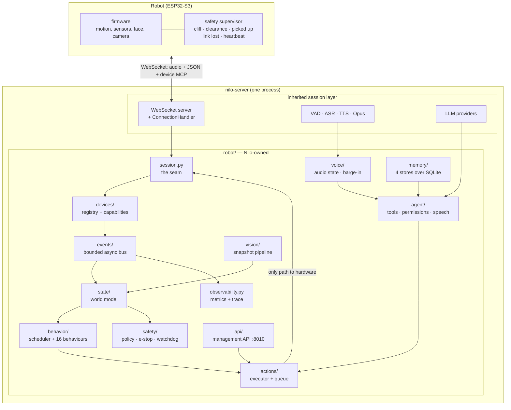
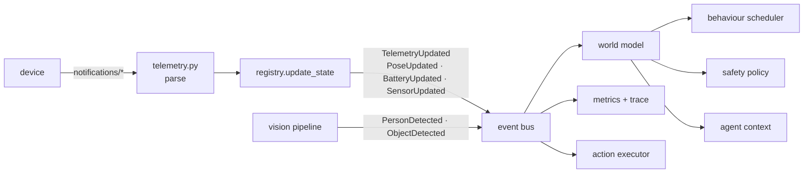
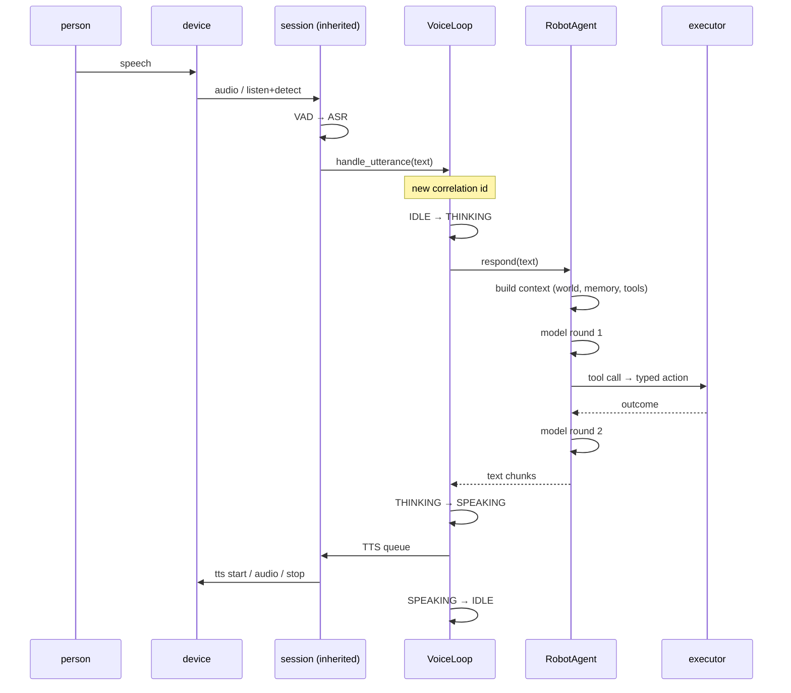
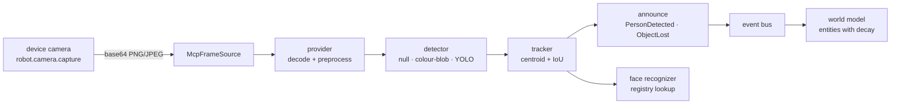
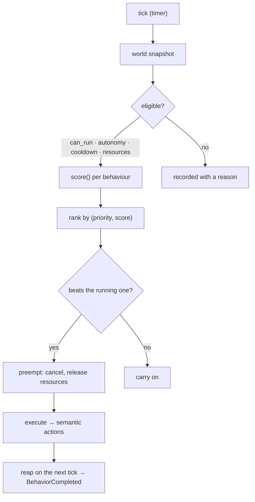
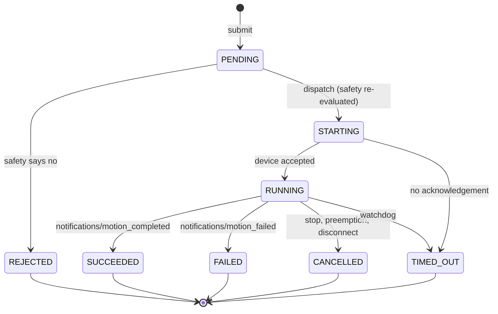
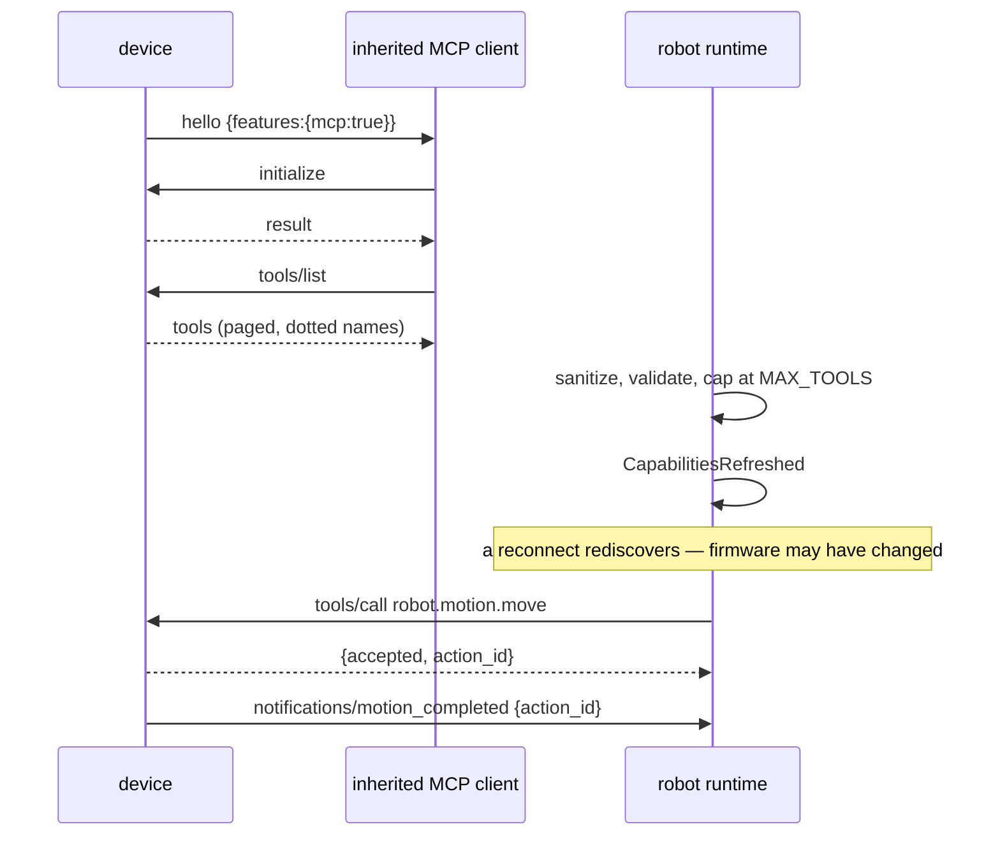
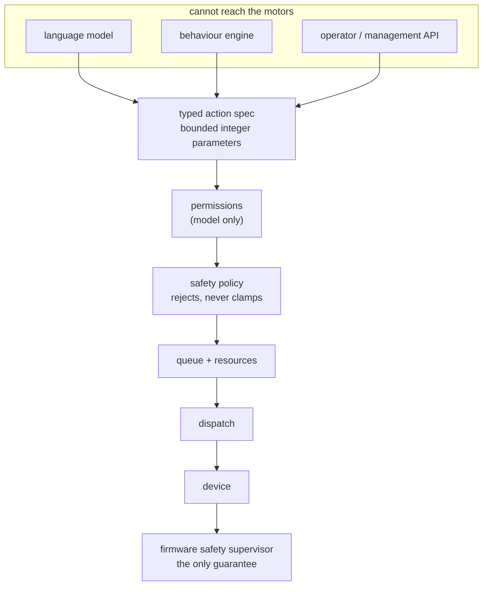

# Architecture

The whole system on one page: what the pieces are, how a request moves through them, where
the safety boundaries are, what happens when each part fails, and where to extend it
without touching anything else.

This is the reference. [architecture.md](architecture.md) is the inherited server's own
shape, [robot-architecture.md](robot-architecture.md) is the layering *rules* and the
reasoning behind them, and the per-subsystem pages
([robot-actions.md](robot-actions.md), [behavior-system.md](behavior-system.md),
[robot-agent.md](robot-agent.md), [robot-voice.md](robot-voice.md),
[robot-vision.md](robot-vision.md), [robot-memory.md](robot-memory.md)) are the detail.
What actually runs today, with the test that proves each line, is
[`PROJECT_STATUS.md`](../PROJECT_STATUS.md).

## 1. The system

**One process, one runtime.** [`RobotRuntime`](../main/nilo-server/robot/runtime.py) owns
the registry, the bus, the world model and every per-robot subsystem. It is constructed,
never discovered: [`robot/bootstrap.py`](../main/nilo-server/robot/bootstrap.py) is the
single place that builds one from configuration, and `app.py` calls it once.

**One path to hardware.** Everything that can move a robot — a model, a behaviour, an
operator — produces a typed action and submits it to the executor. Nothing else calls
`call_tool`. A test parses the import graph to prove it
(`tests/robot/test_layering.py`).

## 2. Data flow

Everything the server believes about a robot is folded from events, and every event
carries the trace it belongs to.

Three properties are load-bearing:

* **The bus is bounded and drop-oldest.** A slow subscriber cannot delay a fast one and
  cannot delay the publisher; a full queue loses its oldest event and counts the drop. The
  inherited audio queue is unbounded and backlogs silently under load; this does not.
* **A patch that changes nothing publishes nothing.** Telemetry blocks are compared by
  value, ignoring their timestamps, so a device re-sending identical numbers five times a
  second wakes nobody.
* **Frozen models everywhere.** Everything published is an immutable record, so no
  subscriber can mutate what it merely observed.

## 3. Voice flow

**Barge-in is a transition, not a cancellation.** `SPEAKING → INTERRUPTED → LISTENING`:
the speech stream is cancelled, the conversation is kept, the partial reply is recorded as
said, and the robot is listening again before the person has finished their sentence.
`SPEAKING → LISTENING` is deliberately not a legal edge, so "was that reply cut off?" is a
question the history can answer.

**One mouth.** Every sentence the robot says — an answer, a greeting a behaviour asked
for, a safety warning — goes through the speech arbiter and one sink behind one lock. Two
simultaneous streams is not a race this code can lose.

## 4. Vision flow

Snapshot-based, not a video stream: one capture, one pass, on a timer. Coordinates are
normalized 0.0–1.0, never pixels. Frames are ephemeral by default — the bytes are dropped
the moment detection finishes, because a camera frame is a photograph of somebody's living
room and keeping one has to be a decision somebody made.

Every provider is optional and lazily imported. The default detector finds nothing,
successfully: a deployment with no model gets a pipeline that runs and leaves every
behaviour that needs a person quiet.

## 5. Behaviour flow

Sixteen built-in behaviours, from `go_to_charger` at CRITICAL down to `idle` at the floor.
The engine **never consults a language model**, never reads the wall clock (its clock is
injected) and never has a number written into a scoring function — tuning lives in one
file and a test parses the source to prove it. That is what keeps a robot alive when the
model is down, the network is out, or the deployment has no model at all.

Every decision is explainable: what was selected, what else was eligible, what each one
scored and why. `python -m robot.behavior explain --situation person_arrives` prints it.

## 6. Action flow

* **Safety is evaluated twice** — on submission and again immediately before dispatch,
  because the world may have changed under the queue.
* **A terminal transition happens once.** A duplicate completion, a cancel racing a
  timeout and a disconnect racing a cancel all resolve to "the first one won".
* **Stop is never queued.** Its latency is not a function of queue depth: it preempts
  whatever holds the drive and goes out.
* **The watchdog is a thread.** An event loop that is busy is exactly when a deadline must
  still fire, so it runs off-loop and hands its work back to the loop.
* **Resources serialize.** Exactly one action may command the drive, the head, the lift,
  the display, the audio or the camera at a time.

## 7. MCP flow

Discovery runs **off the read loop**: the inherited loop awaits every message handler
inline, so anything that waits on a device would stall ingestion of all later frames, audio
included.

Tool names are dotted on the wire and sanitized by the server; the original is kept and
used when calling back. A tool the device did not publish is refused before the call leaves
the process. The full frame-by-frame contract is [robot-protocol.md](robot-protocol.md).

## 8. Safety boundaries

Four boundaries, in order of how much they are worth:

1. **The model never gets a motor.** It requests semantic actions with bounded integer
   parameters and a unit in every name. There is no tool that sets a PWM, a servo or a
   voltage, and a test asserts the vocabulary contains no such parameter.
2. **Permissions narrow; they never widen.** Four classes, gated on what kind of turn asked.
   A permit is not a safety decision — everything permitted still goes through the policy.
3. **The backend policy rejects, never clamps.** A move beyond the ceiling comes back
   `REJECTED` with the number that failed, so the bug that produced it is visible. It gates
   on sensor freshness, heartbeat, cliff, bump, lifted, obstacle distance, battery, rate
   and TTL.
4. **The firmware is the guarantee.** Five protections belong to the device and the backend
   cannot relax any of them: cliff, clearance, picked up, link lost, heartbeat expired. The
   backend's policy is a filter; the frame that would stop a robot travels on a network
   that has just failed. Nothing in this repository may claim the backend stops a robot.

The full split, and what firmware must implement, is [safety-model.md](safety-model.md).

## 9. Failure modes

| What fails | What happens | What still works |
| :--- | :--- | :--- |
| The language model is slow | the turn times out at 30 s and a fallback line is spoken | everything |
| The model is gone entirely | `respond` returns a fallback sentence, never raises | sensing, safety, behaviours, operator commands |
| A device tool call hangs | the call times out, the action fails, the link stays up | every other tool on the same channel |
| A completion never arrives | the watchdog settles the action `TIMED_OUT` | the queue drains normally |
| A duplicate completion arrives | dropped with a log line | the action keeps its first terminal state |
| The socket dies mid-motion | actions cancelled; **the device stops itself** after its grace period | reconnect, rediscovery, a fresh session |
| Telemetry stops | motions are refused `sensor_data_stale` within `max_sensor_age_s` | the session, and a stop |
| A behaviour raises | caught, reported `failed`, resources released | the next tick |
| Vision fails or has no model | `VisionFrameProcessed` with an error; no entities | every behaviour that does not need a person |
| The memory database is unavailable | memory tools fail with a sentence | conversation, safety, behaviour |
| A subscriber is slow | its queue drops its oldest event and counts it | every other subscriber |
| The management API port is taken | supervised task logs it loudly | the device-facing server |
| Malformed frames from a device | dropped; the session continues | everything |
| A device publishes 500 tools | truncated at `MAX_TOOLS` with a warning | everything |

Every row is a test — `tests/e2e/test_robustness.py`, `tests/e2e/test_scenarios.py` or
`tests/robot/`.

## 10. Extension points

Where to add something without touching anything else.

| To add | Add | Never |
| :--- | :--- | :--- |
| A device capability | an `ActionSpec` in `robot/actions/model.py` + firmware tool | a new call site that talks to a device |
| A behaviour | a `Behavior` subclass; register it in `default_behaviors` | a number inside `score()` — tuning is a file |
| An animation | a YAML file under `robot/animation/library/` or `data/animations/` | a Python change |
| A tool the model may call | a spec in `robot/agent/tools.py` with a permission class | a tool that bypasses the executor |
| A vision detector | an object with `detect(frame)`; name it in `vision.detector` | a required dependency |
| A memory kind | a store method + a migration in `robot/memory/store.py` | a blind overwrite; use `merge_fact` |
| An AI provider | `core/providers/<kind>/<name>.py` + a config block | a second LLM stack |
| A metric | an event in `robot/events/types.py`; fold it in `observability.py` | instrumentation in a subsystem |
| A management route | `robot/api/` | a route in `core/http_server.py` |
| A device protocol path | `robot/protocol/` | a path spelled into `core/` |
| A configuration value | a field on a model in `robot/config.py` | a sixth loader |

## 11. Where the seams into inherited code are

Nine hooks, each an import and one to three calls, each into a function that never raises.
They are listed line by line — and mechanically enforced — in
[upstream-changes.md](upstream-changes.md).

## 12. What this architecture does not do

Named here so the diagram is not read as a promise:

* There is no navigation, mapping or localization beyond odometry.
* There is no path planning: obstacles stop a motion, nothing routes around one.
* There is no cross-process fleet layer — one process, one set of robots, one config file.
* There is no face embedder; recognition works against embeddings something else produced.
* The agent cannot carry a plan across turns.

[`PROJECT_STATUS.md`](../PROJECT_STATUS.md) is the complete version of this list, with the
test that backs every claim in the other direction.
