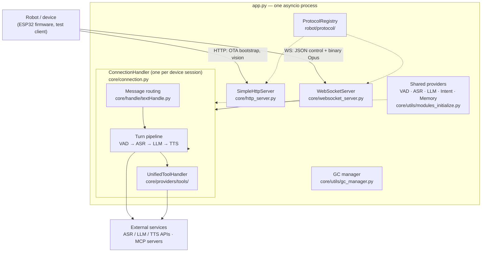
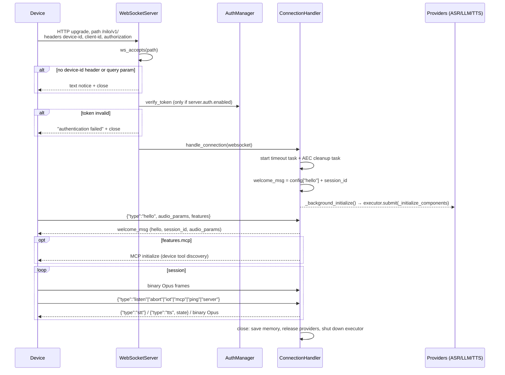
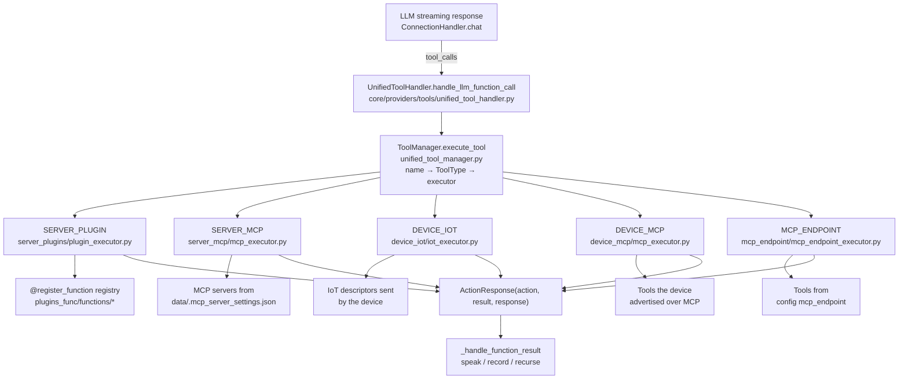

# Architecture

How nilo-server works **today**. Everything on this page is **Implemented** unless a heading says
otherwise; the final section lists the robot layers that are **Planned** and points at
[robot-architecture.md](robot-architecture.md).

The backend is a single Python 3.12 asyncio process. It terminates device WebSocket sessions,
runs a voice turn (VAD → ASR → LLM with tools → TTS) and streams Opus audio back. It also serves a
small HTTP API for device bootstrap (OTA) and vision.

Source root: `main/nilo-server/`. All paths below are relative to it.

---

## 1. Process and entry points

`app.py` is the only server entry point (the scripts under `performance_tester/` are standalone
benchmarks). In order, `app.py:main` does:

| Step | Code | Notes |
|---|---|---|
| Load the Opus shared library | `config/opus_loader.py:setup_opus` (called at import time in `app.py`) | Hard failure with a per-platform hint if it is missing |
| Verify ffmpeg | `core/utils/util.py:check_ffmpeg_installed` | TTS decoding needs it |
| Load configuration | `config/settings.py:load_config` → `config/config_loader.py` | See [configuration.md](configuration.md) |
| Resolve the auth secret | `app.py:resolve_auth_key` | `server.auth_key` → `manager-api.secret` → a fresh `uuid4().hex` per process |
| Start the GC manager | `core/utils/gc_manager.py:GlobalGCManager` | Periodic `gc.collect()`, 300 s interval, started from `app.py` |
| Start the WebSocket server | `core/websocket_server.py:WebSocketServer.start` | `asyncio` task |
| Start the HTTP server | `core/http_server.py:SimpleHttpServer.start` | `asyncio` task |
| Log the endpoints | `app.py:main` | One WebSocket line per enabled protocol — plus an OTA line when `read_config_from_api` is false — and the vision URL |
| Block until SIGINT/SIGTERM | `app.py:wait_for_exit` | Then stops the GC manager and cancels the stdin, WebSocket and HTTP tasks with a 3 s grace period |

Both listeners live in the same process and share the same provider instances; there is no worker
pool, no message broker and no database.



### Ports and routes

| Listener | Config key | Default | Serves |
|---|---|---|---|
| WebSocket | `server.port` (`NILO_SERVER_PORT`) | 8000 | Device sessions on every enabled protocol's `ws_path` |
| HTTP | `server.http_port` (`NILO_HTTP_PORT`) | 8003 | `/nilo/ota/`, `/nilo/ota/download/{filename}`, `/mcp/vision/explain` |

Bind address is `server.ip` (`NILO_SERVER_HOST`), default `0.0.0.0`. Neither listener is created
with TLS — terminate `wss://`/`https://` in a reverse proxy ([deployment.md](deployment.md)).

Routes are not hard-coded. `robot/protocol/base.py:ProtocolRegistry` is built from the `protocols:`
config block and both servers ask it which paths exist:

| Protocol | `ws_path` | `ota_path` | Defined in |
|---|---|---|---|
| `nilo` | `/nilo/v1/` | `/nilo/ota/` | `robot/protocol/nilo.py` |

`nilo` is the only protocol — `robot/protocol/__init__.py:ALL_PROTOCOLS` is `(NILO,)` — and it is
enabled by default. The spec also derives the firmware download route
`/nilo/ota/download/{filename}` from its `ota_path` (`ProtocolSpec.ota_download_path`), which is the
route `SimpleHttpServer` registers. What travels over all of this is in [protocol.md](protocol.md).
The indirection is kept so a future revision of the wire protocol can be added as a second
`ProtocolSpec` without touching either server.

`WebSocketServer._http_response` is the `websockets` `process_request` hook and does two things:

* a request **without** `Connection: upgrade` gets `200 nilo-server is running` — the cheapest
  liveness probe for port 8000;
* an upgrade request is passed to `ProtocolRegistry.ws_accepts`. A path matching no enabled
  protocol gets `404 unknown protocol path`: `protocols.strict` defaults to **true** and `config.yaml`
  ships it true, so a route this server no longer serves is genuinely gone rather than quietly
  upgraded. Setting `protocols.strict: false` restores the inherited permissive behaviour of
  accepting any path.

`SimpleHttpServer._build_app` registers `GET`/`POST`/`OPTIONS` on each enabled protocol's OTA path
and `GET`/`OPTIONS` on the firmware download route, and always registers `/mcp/vision/explain`. The
OTA routes are skipped entirely when `read_config_from_api` is true (see §9).

---

## 2. Connection lifecycle

One `core/connection.py:ConnectionHandler` instance per WebSocket session. It owns a deep copy of
the config, a `session_id` (`uuid4`), a `ThreadPoolExecutor(max_workers=5)`, a
`threading.Event` stop flag, and its own Opus decoder, dialogue history and TTS instance.



### Handshake details

* **Identity** comes from the request headers `device-id`, `client-id` and `authorization`. If
  `device-id` is absent, `WebSocketServer._handle_connection` falls back to the URL query string
  (`?device-id=…&client-id=…&authorization=…`) and copies those values into the headers. With
  neither, the server sends a one-line notice and closes.
* **Authentication** runs only when `server.auth.enabled` is true. Device IDs listed in
  `server.auth.allowed_devices` skip the check. Otherwise an `Authorization: Bearer <token>` header
  is required and verified by `core/auth.py:AuthManager.verify_token`.
* **Tokens** are HMAC-SHA256 over `"{client_id}|{username}|{ts}"` with the resolved
  `server.auth_key`, encoded as `<urlsafe-b64-signature>.<unix-ts>` — no plaintext identity in the
  token. Default lifetime is 30 days (`server.auth.expire_seconds`). The same secret signs OTA
  tokens and the vision endpoint's token (`core/api/vision_handler.py`), so an unset `auth_key`
  means every restart invalidates previously issued tokens.
* **`hello`** is handled by `core/handle/helloHandle.py:handleHelloMessage`: it records the client's
  `audio_params` (format, sample rate) and `features`, sets `conn.client_aec` when the device asks
  for server-side echo cancellation, creates an `MCPClient` when `features.mcp` is set, then sends
  the per-connection welcome message (`config["hello"]` plus this session's `session_id`). When the
  device supports MCP, the server then initiates MCP discovery against it.
* **Provider initialization is off the hot path.** `handle_connection` fires
  `_background_initialize()`, which submits `_initialize_components` to the connection's thread
  pool: TTS instance, ASR instance, voiceprint provider, memory, intent, the tool handler and the
  enhanced system prompt. The read loop starts accepting messages immediately.

### Timeouts and close paths

`_check_timeout` wakes every 10 s and closes the connection when there has been no activity for
`close_connection_no_voice_time` + 60 seconds (default 120 + 60). A separate, earlier check —
`core/handle/receiveAudioHandle.py:no_voice_close_connect` — says goodbye after
`close_connection_no_voice_time` of silence.

A session ends through `_save_and_close` → `close`:

1. memory is persisted in a daemon thread with its own event loop (`memory.save_memory(dialogue, session_id)`) so the socket does not wait for it;
2. `close` releases per-connection VAD resources and the Opus decoder, cancels the timeout and AEC tasks, runs `UnifiedToolHandler.cleanup()` (which closes server-side MCP and the MCP endpoint client), sets the stop event, drains the TTS queues, closes the WebSocket, then `tts.close()` / `asr.close()`, and finally `executor.shutdown(wait=False)`.

`close` is idempotent enough to be reached from three directions: normal disconnect, timeout task,
and an explicit exit intent (`chat_and_close`, `check_direct_exit`).

---

## 3. Message routing

`ConnectionHandler._route_message` splits by frame type:

* **`str`** → `core/handle/textHandle.py:handleTextMessage`, which delegates to a module-level
  `TextMessageProcessor` over a `TextMessageHandlerRegistry`. The processor parses JSON, reads
  `type`, looks up the handler and awaits it. Unknown types are logged and dropped; non-JSON text
  and bare integers are echoed back.
* **`bytes`** → decoded from Opus to PCM at the entry point by `_decode_opus_packet` (a dedicated
  16 kHz mono `opuslib_next.Decoder`, 960-sample frames) and pushed onto `conn.asr_audio_queue`.
  Frames arriving before VAD/ASR exist are dropped. Connections tagged as coming from an MQTT
  gateway carry a 16-byte header and go through `_process_mqtt_audio_message`, which strips the
  header and optionally applies server-side AEC before enqueueing.

Registered text handlers (`core/handle/textMessageHandlerRegistry.py`, types in
`core/handle/textMessageType.py`):

| `type` | Handler | What it does |
|---|---|---|
| `hello` | `textHandler/helloMessageHandler.py` | Handshake, audio params, feature negotiation, MCP init |
| `listen` | `textHandler/listenMessageHandler.py` | `start`/`stop`/`detect` state, listen mode (`auto` by default; `manual` is the value the pipeline special-cases), wake-word text |
| `abort` | `textHandler/abortMessageHandler.py` | Barge-in: stop speaking, clear queues |
| `iot` | `textHandler/iotMessageHandler.py` | Device capability `descriptors` → tools; `states` updates |
| `mcp` | `textHandler/mcpMessageHandler.py` | JSON-RPC payload for the device-side MCP client |
| `server` | `textHandler/serverMessageHandler.py` | Remote config update / restart; requires `manager-api.secret` and is inert in standalone mode |
| `ping` | `textHandler/pingMessageHandler.py` | Replies `pong` only when `enable_websocket_ping` is true |

Message types already taken on the wire are listed in
`robot/protocol/nilo.py:RESERVED_MESSAGE_TYPES`; new Nilo types must not reuse them.

---

## 4. The voice turn

A full turn crosses three threads: the asyncio loop, the per-connection ASR thread, and the
connection's thread pool. Detail (VAD tuning, streaming vs batch ASR, TTS chunking, flow control)
is in [audio.md](audio.md); the control flow is:

1. **Ingest** — binary frames are decoded and queued (§3).
2. **ASR thread** — `core/providers/asr/base.py:ASRProviderBase.asr_text_priority_thread` (started
   by `open_audio_channels`) pops the queue and schedules
   `core/handle/receiveAudioHandle.py:handleAudioMessage` back on the event loop, which keeps
   frames strictly ordered.
3. **VAD** — `handleAudioMessage` calls `conn.vad.is_vad(conn, pcm_frame)`. With server-side AEC
   enabled, detected speech during playback triggers `handleAbortMessage` (barge-in). The frame is
   then passed to `asr.receive_audio`.
4. **End of utterance** — for non-streaming ASR, `receive_audio` buffers PCM and calls
   `handle_voice_stop` once VAD reports silence and enough audio has accumulated.
   `handle_voice_stop` runs speech-to-text and, when a voiceprint provider is configured, speaker
   identification concurrently via `asyncio.gather`.
5. **Intent gate** — the transcript goes to `receiveAudioHandle.startToChat`, which runs
   `core/handle/intentHandler.py:handle_user_intent` first (exit commands, wake words, and — in
   `intent_llm` mode — an LLM intent pass that can answer without reaching the chat loop).
6. **Plugins** — `plugins/manager.py:PluginManager.process_text` may `RELEASE`, `INTERCEPT` (speak a
   canned reply) or `CLOSE` the session (`plugins/base.py:PluginAction`).
7. **Chat** — `conn.executor.submit(conn.chat, text)` moves the blocking LLM stream off the event
   loop.
8. **Speak** — `ConnectionHandler.chat` pushes text into the TTS queue as sentences complete;
   `core/handle/sendAudioHandle.py` sends `{"type":"tts","state":"sentence_start"|"stop"}` control
   messages plus binary Opus frames, rate-controlled by `core/utils/audioRateController.py`.
   `send_stt_message` sends the recognized text and flips `client_is_speaking`.

```
device ──opus──▶ asr_audio_queue ──ASR thread──▶ VAD ──▶ ASR ──▶ intent ──▶ plugins
                                                                              │
                            device ◀──opus + tts state── sendAudioHandle ◀── TTS ◀── LLM (+ tools)
```

### The LLM loop

`ConnectionHandler.chat(query, depth=0)` is a recursive streaming loop:

* At `depth == 0` it mints a `sentence_id`, appends the user message to `core/utils/dialogue.py:Dialogue`
  and queues a `SentenceType.FIRST` marker so TTS can start a new utterance.
* In `function_call` intent mode it passes `func_handler.get_functions()` to
  `llm.response_with_functions`; otherwise it uses plain `llm.response`. The dialogue sent to the
  model is built by `Dialogue.get_llm_dialogue_with_memory`, which injects the memory block and, on
  a speaker's first turn, a `<speakers_info>` section.
* A virtual `direct_answer` tool (`connection.py:DIRECT_ANSWER_TOOL`) is appended at depth 0 only.
  It is not a real tool: it turns "call a tool or not" into "which tool", which stops small models
  from mis-triggering real tools.
* Tool results are dispatched by `_handle_function_result` according to
  `plugins/register.py:Action`: `RESPONSE`/`NOTFOUND`/`ERROR` are spoken directly, `RECORD` writes
  the assistant→tool→assistant chain into history without another model call, and `REQLLM`
  recurses into `chat(None, depth+1)`.
* `MAX_DEPTH = 5`. At that depth tools are withheld and the model is instructed to answer from what
  it already has.

---

## 5. Tool calling

Every callable the model sees — server plugins, device IoT commands, device MCP tools, remote MCP
endpoint tools, server-side MCP servers — is normalised into one OpenAI-format function list.



`UnifiedToolHandler` is created per connection by `_initialize_intent` (only when intent is not
`nointent`). It constructs a `ToolManager`, instantiates the five executors and registers each one
under its `ToolType`. `ToolManager` merges `get_tools()` from every executor into one
name→`ToolDefinition` map, caches it (invalidated by `refresh_tools()` when, for example, IoT
descriptors arrive), and dispatches `execute_tool` by looking the name up in that map. A name
collision between two sources logs a warning and last-registered wins.

### Two `ToolType` enums

They are unrelated and easy to confuse:

| Enum | Members | Purpose |
|---|---|---|
| `core/providers/tools/base/tool_types.py:ToolType` | `SERVER_PLUGIN`, `SERVER_MCP`, `DEVICE_IOT`, `DEVICE_MCP`, `MCP_ENDPOINT` | **Where** a tool lives → which executor runs it |
| `plugins/register.py:ToolType` | `NONE`, `WAIT`, `CHANGE_SYS_PROMPT`, `SYSTEM_CTL`, `IOT_CTL`, `MCP_CLIENT` | **How** a server plugin is invoked (calling convention) |

The second one is re-exported unchanged by `plugins_func/register.py` for backward compatibility, so
both import paths give the same object. `ServerPluginExecutor.execute` branches on its numeric
`code`: `SYSTEM_CTL` (4), `IOT_CTL` (5) and `CHANGE_SYS_PROMPT` (3) receive the connection as their
first argument; `WAIT` (2) and everything else are called with the arguments only. A coroutine
result is awaited.

### Writing a server plugin

Decorate a function with `@register_function(name, desc, type)` from `plugins/register.py` (or the
`plugins_func/register.py` alias) and drop the module in `plugins_func/functions/`. Registration is
global: `all_function_registry` maps name→`FunctionItem`, and `module_func_map` maps module name→
function names so config can enable a whole file by its module name. Modules are auto-imported at
import time of `core/connection.py` and again in `UnifiedToolHandler._initialize`
(`plugins_func/loadplugins.py:auto_import_modules`).

### Exposure gate

Registration is not exposure. `server_plugins/plugin_executor.py:ServerPluginExecutor.get_tools`
decides what the model actually sees:

* always: `handle_exit_intent` and `get_lunar`;
* everything listed under `Intent.<selected Intent>.functions`, after module names are expanded to
  function names by `_expand_plugin_names`;
* plus any registered function whose plugin `ToolType.code == 5` (`IOT_CTL`), which is how MCP
  functions from `plugins/` subdirectories are auto-discovered.

Descriptions can be overridden per function or per module from the `plugins:` config block.

MCP in all its shapes — device-side, server-side and remote endpoint — is covered in
[mcp.md](mcp.md).

---

## 6. Provider system

Providers are selected by **name** and loaded by **filename**. `selected_module.<Kind>` names a key
under the `<Kind>:` config block; that block's `type` must equal a module filename under
`core/providers/<kind>/`.

| Kind | Factory | Module resolved | Class expected |
|---|---|---|---|
| VAD | `core/utils/vad.py:create_instance` | `core/providers/vad/<type>.py` | `VADProvider` |
| ASR | `core/utils/asr.py:create_instance` | `core/providers/asr/<type>.py` | `ASRProvider` |
| TTS | `core/utils/tts.py:create_instance` | `core/providers/tts/<type>.py` | `TTSProvider` |
| VLLM | `core/utils/vllm.py:create_instance` | `core/providers/vllm/<type>.py` | `VLLMProvider` |
| LLM | `core/utils/llm.py:create_instance` | `core/providers/llm/<type>/<type>.py` | `LLMProvider` |
| Memory | `core/utils/memory.py:create_instance` | `core/providers/memory/<type>/<type>.py` | `MemoryProvider` |
| Intent | `core/utils/intent.py:create_instance` | `core/providers/intent/<type>/<type>.py` | `IntentProvider` |

Each factory does `os.path.exists` on a **relative** path, so the server must be started with
`main/nilo-server` as the working directory. An unknown `type` raises
`Unsupported <Kind> type: … - check the 'type' field of that config block`. Adding a provider means
adding one file and one config block — no registry edit. The catalogue is in
[providers.md](providers.md).

**Where instances live:**

* `WebSocketServer.__init__` calls `core/utils/modules_initialize.py:initialize_modules` once for
  VAD, ASR, LLM, Intent and Memory (note `init_tts=False`) and keeps them as `_vad`, `_asr`, `_llm`,
  `_intent`, `_memory`. `initialize_modules` also memoises instances in the config cache
  (`core/utils/cache/manager.py`) keyed by the provider's config block, so an identical
  configuration reuses the object.
* Each `ConnectionHandler` then decides what to share: the VAD, LLM, Intent and Memory objects are
  used as-is; **TTS is always per connection** (`_initialize_tts`, falling back to
  `core/providers/tts/default.py:DefaultTTS`); **ASR is shared only when its `interface_type` is
  `InterfaceType.LOCAL`** — a remote ASR owns a socket and a receive thread, so each connection gets
  its own (`_initialize_asr`).
* VLLM is not created at startup at all; `core/api/vision_handler.py` builds it per request.

---

## 7. Threading model

Almost all of the server is asyncio, with three deliberate exceptions per connection:

| Thread | Created by | Why |
|---|---|---|
| ASR priority thread | `ASRProviderBase.open_audio_channels` | Serialises audio frames and hands each back to the loop with `run_coroutine_threadsafe` |
| `ThreadPoolExecutor(max_workers=5)` | `ConnectionHandler.__init__` | Runs `_initialize_components` and every `chat()` call, keeping blocking LLM/TTS SDK calls off the loop |
| Memory-save / title daemon threads | `_save_and_close` | Each opens its own event loop so closing the socket never waits on a remote memory write |

The deprecated remote-config mode adds one more per connection: the reporting thread started by
`_init_report_threads` (§9).

Code running in those threads reaches the loop only through `asyncio.run_coroutine_threadsafe(...,
conn.loop)`, where `conn.loop` is captured in `handle_connection`.

---

## 8. Configuration

`config.yaml` ships defaults; `data/.config.yaml` (or `$NILO_CONFIG`) overrides them by a recursive
merge; a small set of `NILO_*` environment variables wins over both
(`config/config_loader.py:ENV_OVERRIDES` — `NILO_SERVER_HOST`, `NILO_SERVER_PORT`, `NILO_HTTP_PORT`,
`NILO_LOG_LEVEL`, plus `NILO_CONFIG` which selects the override file itself). Placeholder values
still carrying `<your…` are detected by `config/placeholders.py:is_placeholder` and treated as
unset. There are no top-level key aliases left — `config/config_loader.py:DEPRECATED_KEYS` is an
empty dict, and the welcome-message block is spelled `hello:`. Full reference: [configuration.md](configuration.md).

---

## 9. Session state and the deprecated remote-config mode

**Session state.** `session_id` is a per-connection `uuid4`, echoed in the welcome message and
stamped on every outgoing `stt` and `tts` message. Conversation state lives in `conn.dialogue`
(`core/utils/dialogue.py:Dialogue`) and is not shared between connections. Long-term memory is
namespaced by `device_id`, not `session_id` — `_initialize_memory` calls
`init_memory(role_id=self.device_id, …)`, so a device keeps its memory across sessions. Memory is
written once, on close. Nothing else is persisted server-side: restart the process and every
session is gone.

**Remote-config mode is deprecated.** Setting `manager-api.url` makes `load_config` fetch the whole
configuration from an HTTP API instead of merging local files and sets `read_config_from_api = True`.
That flag still changes three things — OTA routes are not registered
(`core/http_server.py:SimpleHttpServer._build_app`), each connection fetches a per-device config and
may block on device binding (`_initialize_private_config_async`), and the ASR/TTS/tool reporting
thread starts (`_init_report_threads`, `core/handle/reportHandle.py`). The management console those paths
talked to is not part of Nilo ([migration.md](migration.md)); leave `manager-api.url` unset. As a
guard, `config/settings.py:check_config_file` refuses a user config that sets both `manager-api` and
`selected_module`.

---

## 10. Nilo robot layers

`robot/` is Nilo-owned code that attaches to the inherited server through a handful of explicit
seams. What exists today:

| Piece | Module | Page |
|---|---|---|
| Device protocol registry (§1) | `robot/protocol/` | [protocol.md](protocol.md) |
| Domain models, world state, the store | `robot/state/` | [robot-domain.md](robot-domain.md) |
| Typed events and the bounded async bus | `robot/events/` | [robot-domain.md](robot-domain.md) |
| Robot registry and MCP capability discovery | `robot/devices/` | [robot-domain.md](robot-domain.md) |
| Telemetry ingestion (`notifications/*` → world state) | `robot/telemetry.py` | [robot-simulator.md](robot-simulator.md) |
| Control plane and the session seam | `robot/runtime.py`, `robot/session.py` | [robot-domain.md](robot-domain.md) |
| A simulated robot on a real socket | `robot/simulator/` | [robot-simulator.md](robot-simulator.md) |
| Ten semantic actions, lifecycle, queue, executor | `robot/actions/` | [robot-actions.md](robot-actions.md) |
| Limits, deterministic policy, e-stop, watchdog | `robot/safety/` | [safety.md](safety.md) |
| World model (people, objects, attention, interactions) | `robot/state/world.py` | [robot-behavior.md](robot-behavior.md) |
| Utility-scored autonomy, sixteen behaviours, the explain CLI | `robot/behavior/` | [robot-behavior.md](robot-behavior.md) |

`robot/__init__.py` carries `__version__`, which the logger stamps on every line.

Still **planned**: the personality and emotion model, robot memory, robot vision, the
LLM-facing bridge and the management API. The LLM is
deliberately never given a tool that sets motor, servo or PWM values, and the backend safety
layer is a policy filter rather than a guarantee — firmware owns every guarantee
([safety.md](safety.md)).

The layering, the seams `robot/` is allowed to use into `core/`, and the safety rule are in
[robot-architecture.md](robot-architecture.md); the sequencing is in
[robot-roadmap.md](robot-roadmap.md).

---

## Where to go next

| Question | Page |
|---|---|
| How do I run it? | [getting-started.md](getting-started.md), [deployment.md](deployment.md) |
| What can I configure? | [configuration.md](configuration.md) |
| What is on the wire? | [protocol.md](protocol.md) |
| How does audio actually flow? | [audio.md](audio.md) |
| Which providers exist? | [providers.md](providers.md) |
| How do tools and MCP fit together? | [mcp.md](mcp.md) |
| How do I work on the code? | [development.md](development.md), [testing.md](testing.md), [`main/nilo-server/CLAUDE.md`](../main/nilo-server/CLAUDE.md) |
| Which code is inherited? | [upstream.md](upstream.md), [migration.md](migration.md) |
