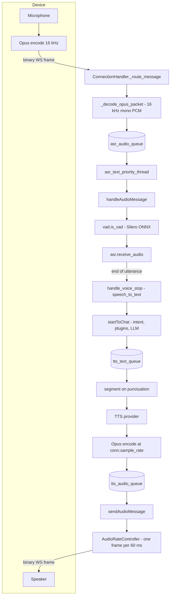
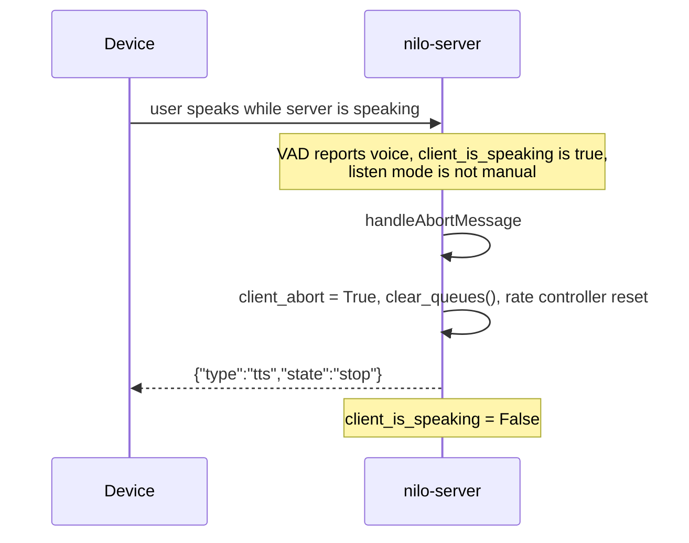

# Audio pipeline

How nilo-server turns microphone audio from a device into text, and text back into
audio the device plays. Everything on this page is **Implemented** — it runs in the
current tree — unless a section says otherwise.

Related pages: [protocol.md](protocol.md) for the message envelope and routes,
[providers.md](providers.md) for the individual ASR/TTS/VAD backends,
[configuration.md](configuration.md) for how config files are merged.

## The loop



Three queues and three threads per connection separate the stages: the ASR thread
(`core/providers/asr/base.py:ASRProviderBase.asr_text_priority_thread`), the TTS text
thread and the audio-play thread (both started in
`core/providers/tts/base.py:TTSProviderBase.open_audio_channels`). Actual sending happens
back on the connection's event loop via `asyncio.run_coroutine_threadsafe`.

## Transport

A device WebSocket carries two kinds of frame:

| Frame type | Contents | Handler |
|---|---|---|
| Text | JSON control messages (`hello`, `listen`, `abort`, `iot`, `mcp`, `server`, `ping`) | `core/handle/textHandle.py:handleTextMessage` |
| Binary | One Opus packet, optionally behind a 16-byte gateway header | `core/connection.py:ConnectionHandler._route_message` |

Binary frames are rejected silently until both VAD and ASR have finished background
initialisation (`_route_message` returns early when `self.vad is None or self.asr is None`),
and while the device still needs to be bound.

### Gateway framing

The gateway keys under `server:` in the config tree are not all backed by code. What exists:

| Config key | What the server actually does |
|---|---|
| `server.mqtt_gateway` | **Not an MQTT client.** When set, the OTA response returns an `mqtt` block (endpoint, client id, username, password) instead of the `websocket` block (`core/api/ota_handler.py`). The server itself never opens an MQTT connection. |
| `server.mqtt_signature_key` | Used only to sign the MQTT password placed in that same OTA response (`core/api/ota_handler.py:OTAHandler.generate_password_signature`). |
| `server.udp_gateway` | **Not implemented.** The key is declared in `config.yaml` and no Python module reads it; nothing in `core/` or `robot/` opens a UDP audio path. |

A connection is treated as gateway-framed when its request path ends with
`?from=mqtt_gateway` (`core/connection.py`, sets `conn_from_mqtt_gateway`). For those
connections only, frames of at least 16 bytes are parsed as a header plus Opus payload,
and outbound packets get the header prepended:

| Byte range | Field |
|---|---|
| 0 | Type, always `1` on outbound packets |
| 2–4 | Payload length, big-endian uint16 |
| 4–8 | Sequence number, big-endian uint32 |
| 8–12 | Timestamp, big-endian uint32 |
| 12–16 | Opus length, big-endian uint32 |

Inbound, only bytes 8–12 are read. When the client advertised `features.aec` in its hello
(`core/handle/helloHandle.py:handleHelloMessage`) and the timestamp is non-zero, the frame
is run through `ConnectionHandler._apply_aec`, a NumPy echo canceller that matches the mic
frame against cached playback PCM by log power-spectrum correlation. The reference cache is
filled on the way out by `core/handle/sendAudioHandle.py:_send_to_mqtt_gateway`, which decodes
each outbound Opus packet at 16 kHz and stores it keyed by timestamp.

Plain WebSocket connections skip all of this: `_do_send_audio` calls `websocket.send(opus_packet)`
with no header.

## Codecs and sample rates

| Direction | Codec | Sample rate | Channels | Frame | Code |
|---|---|---|---|---|---|
| Device to server | Opus | 16000 Hz, fixed | 1 | 960 samples = 60 ms, decoding to 1920 bytes of PCM | `core/connection.py:ConnectionHandler._init_connection_state` creates `opuslib_next.Decoder(16000, 1)`; `_decode_opus_packet` calls `decode(packet, 960)` |
| Server to device | Opus | `hello.audio_params.sample_rate`, default 24000 | 1 | 60 ms | `core/providers/tts/base.py:TTSProviderBase.open_audio_channels` builds `OpusEncoderUtils(sample_rate=conn.sample_rate, channels=1, frame_size_ms=60)` |

The inbound 16 kHz is not configurable — the decoder is constructed with a literal `16000`,
and everything downstream (VAD windows, the WAV wrapper in `ASRProviderBase._pcm_to_wav`,
`save_audio_to_file`, `build_temp_file`) assumes 16 kHz mono 16-bit.

The outbound rate comes from config, not from the device. `ConnectionHandler.handle_connection`
reads `self.config["hello"]["audio_params"]["sample_rate"]` into `conn.sample_rate` before the
client's hello arrives. `handleHelloMessage` copies the client's `audio_params` into the hello
reply that is echoed back and sets `conn.audio_format` from it, but it never updates
`conn.sample_rate` — so the encoder always runs at the configured rate.

`config.yaml` ships:

```yaml
hello:
  type: hello
  version: 1
  transport: websocket
  audio_params:
    format: opus
    sample_rate: 24000
    channels: 1
    frame_duration: 60
```

`hello:` is the only spelling the loader accepts — `config/config_loader.py` still has the
alias machinery (`apply_deprecated_aliases`), but `DEPRECATED_KEYS` is now empty.

### Encoder settings

`core/utils/opus_encoder_utils.py:OpusEncoderUtils` is the streaming encoder used for TTS.
It buffers PCM until a whole frame is available, encodes frame by frame, and zero-pads the
tail frame when `end_of_stream` is set. Fixed settings: `APPLICATION_AUDIO`, bitrate 24000 bps,
complexity 10, `SIGNAL_VOICE`. One instance lives per connection so encoder state stays
continuous across sentences.

### PCM output

If a device's hello says `audio_params.format: pcm`, `conn.audio_format` becomes `"pcm"` and
`TTSProviderBase._process_audio_file_stream` routes file playback through
`audio_to_pcm_data_stream` instead of the Opus path — raw 16-bit little-endian frames go out
on the wire. Note that only the file branch honours this: under the default `delete_audio: true`,
text synthesised through `to_tts_stream` goes straight to the Opus encoder (`is_opus=True`). With
`delete_audio: false` synthesis writes a temp file first and then takes the file branch, which does
honour `pcm`.

### The `.p3` container

`.p3` is a trivial framing for pre-encoded Opus: a repeating 4-byte header
(`>BBH`: type, reserved, payload length) followed by that many bytes of Opus.
`core/utils/p3.py` documents the payload as 16 kHz, 60 ms frames and exposes
`decode_opus_from_file` and `decode_opus_from_bytes`, both returning
`(list_of_opus_packets, total_duration_seconds)`.

**Gap.** The two call sites in the TTS path reference streaming variants that
`core/utils/p3.py` does not define:

* `core/providers/tts/base.py:TTSProviderBase._process_audio_file_stream` calls `p3.decode_opus_from_file_stream`
* `core/utils/util.py:audio_bytes_to_data_stream` calls `p3.decode_opus_from_bytes_stream`

Both raise `AttributeError` at runtime. Playing a `.p3` file through TTS therefore does not
work today; `.wav` and `.mp3` assets go through pydub and are fine.

### Cached assets

Short prompts are loaded by `core/utils/util.py:audio_to_data`, which resamples to mono
16 kHz 16-bit, encodes 60 ms Opus frames with its own `opuslib_next.Encoder(16000, 1)`, and
caches the packet list under `CacheType.AUDIO_DATA`. The rate is hard-coded here, so these
clips are always 16 kHz even when `hello.audio_params.sample_rate` is 24000; the 60 ms frame
duration the rate controller paces on is unchanged.

| Asset | Used for |
|---|---|
| `config/assets/wakeup_words_short.wav` | Fallback wake-word acknowledgement |
| `config/assets/wakeup_words/<md5-of-voice>.wav` | Generated per-voice wake-word acknowledgement |
| `config/assets/bind_code.wav`, `config/assets/bind_code/<digit>.wav` | Device-binding prompt, digits played one at a time |
| `config/assets/bind_not_found.wav` | Unknown device prompt |
| `config/assets/max_output_size.wav` | Daily output quota exceeded |
| `config/assets/tts_notify.mp3` | End-of-speech chime, see `enable_stop_tts_notify` below |

## Voice activity detection

`core/providers/vad/silero.py:VADProvider` runs Silero VAD as an ONNX graph on CPU
(`onnxruntime.InferenceSession`, one inter-op and one intra-op thread). The model is loaded
from `<model_dir>/src/silero_vad/data/silero_vad.onnx`; `models/snakers4_silero-vad` is
vendored in the repository, so no download is needed.

State is stored on the connection, not the provider, because a local VAD instance is shared
across connections: `conn._vad_state`, `conn._vad_context`, `conn.client_audio_buffer`,
`conn.client_voice_window`, `conn.last_is_voice`, `conn.client_have_voice`,
`conn.vad_last_voice_time`, `conn.client_voice_stop`. `release_conn_resources` drops the
per-connection tensors on close.

PCM is consumed in 512-sample (1024-byte) chunks, each concatenated with the previous
64-sample context before inference. The decision is hysteretic:

| Probability | Result |
|---|---|
| `>= threshold` | speech |
| `<= threshold_low` | silence |
| between the two | keep the previous frame's decision (`conn.last_is_voice`) |

Each decision is pushed into a 5-slot sliding window (`deque(maxlen=5)`); the chunk counts as
voiced only when at least 3 of the last 5 are speech (`frame_window_threshold = 3`).

End of utterance: once `conn.client_have_voice` is set and the window stops reporting voice,
the provider measures the gap since `vad_last_voice_time`; when it reaches
`min_silence_duration_ms` it sets `conn.client_voice_stop = True`, which is what the ASR layer
watches for.

| Config key (`VAD.SileroVAD`) | `config.yaml` value | Code default when unset |
|---|---|---|
| `type` | `silero` | — |
| `model_dir` | `models/snakers4_silero-vad` | — |
| `threshold` | `0.5` | `0.5` |
| `threshold_low` | `0.3` | `0.2` |
| `min_silence_duration_ms` | `200` | `1000` |

Raise `min_silence_duration_ms` if speakers who pause mid-sentence get cut off.

In `manual` listen mode `is_vad` returns `True` immediately without running the model, so all
audio is buffered and segmentation is left to the device.

## Speech recognition

`core/providers/asr/base.py:ASRProviderBase` owns the flow; providers implement only
`speech_to_text`.

1. `open_audio_channels` starts `asr_text_priority_thread`, a daemon thread that pulls PCM
   frames off `conn.asr_audio_queue` and re-enters the event loop through
   `core/handle/receiveAudioHandle.py:handleAudioMessage`.
2. `handleAudioMessage` runs VAD, applies the just-woken-up suppression, checks the idle
   timeout, and calls `receive_audio`.
3. `receive_audio` appends the frame to `conn.asr_audio`. While neither the current frame nor
   the connection has seen voice, the buffer is trimmed to its last 10 frames — that tail is
   the pre-roll that keeps the first syllable of an utterance.
4. For non-streaming providers, once `conn.client_voice_stop` is set the buffer is joined and
   passed to `handle_voice_stop` — but only if it exceeds `1920 * 15` bytes (15 frames, about
   900 ms). Shorter blips are dropped. `conn.reset_audio_states()` clears VAD and ASR state
   either way.
5. `handle_voice_stop` runs recognition and, when a voiceprint provider is configured, speaker
   identification concurrently via `asyncio.gather` — the PCM is wrapped as WAV by `_pcm_to_wav`
   for the voiceprint call. The result is enqueued for reporting and handed to
   `startToChat`.

`speech_to_text_wrapper` handles the file plumbing around providers: it checks free disk space,
materialises a temp WAV when the provider sets both `requires_file()` and `prefers_temp_file()`,
writes a persistent WAV when `delete_audio_file` is false or the provider requires a file it does not
want as a temp file, and always cleans up in `finally`.
Providers receive an `AudioArtifacts` tuple with the PCM frames, the joined bytes and whichever
paths exist.

### Interface types

| `InterfaceType` | Behaviour | Providers |
|---|---|---|
| `LOCAL` | In-process model, driven by VAD end-of-utterance | `fun_local`, `sherpa_onnx_local`, `vosk` |
| `NON_STREAM` | Whole utterance posted after VAD end-of-utterance | `aliyun`, `baidu`, `doubao`, `fun_server`, `openai`, `qwen3_asr_flash`, `tencent` |
| `STREAM` | Provider holds its own WebSocket and overrides `receive_audio` to forward frames as they arrive; `listen stop` triggers `_send_stop_request()` rather than a local flush | `aliyun_stream`, `aliyunbl_stream`, `doubao_stream`, `xunfei_stream` |

The base class's flush branch is explicitly guarded with
`conn.asr.interface_type != InterfaceType.STREAM`, so streaming providers never go through it.

### Tags in the transcript

FunASR-family models return the transcript prefixed with tags:
`<|language|><|emotion|><|event|><|options|>text`.
`core/providers/asr/utils.py:lang_tag_filter` strips them and returns a dict
`{"content", "language", "emotion"}`, mapping the emotion label to an emoji through
`EMOTION_EMOJI_MAP` (`HAPPY` to 🙂, `SAD` to 😔, and so on; the event tag is parsed but
currently unused). Text with no tags comes back as `{"content": text}` so callers never have
to distinguish the two shapes.

`handle_voice_stop` serialises that dict back to JSON before passing it downstream; a plain-text
provider with a resolved speaker gets wrapped as `{"speaker": ..., "content": ...}` by
`_build_enhanced_text`. Both `startToChat` and `send_stt_message` parse that envelope again,
which is why the speaker name is attached to the model prompt only the first time a given
speaker appears in a session (`conn.introduced_speakers`).

## Listen modes and wake words

The device declares its mode on the `listen` message; the server stores whatever it is sent
into `conn.client_listen_mode` (`core/handle/textHandler/listenMessageHandler.py`).

| Mode | Server behaviour |
|---|---|
| `auto` (default) | Server-side VAD decides where the utterance ends. Barge-in is allowed. |
| `realtime` | Accepted and stored, but the server code only ever branches on `manual`, so this is handled identically to `auto`. |
| `manual` | `is_vad` short-circuits to `True`, the whole buffer is kept, and recognition waits for `listen stop`. Barge-in is suppressed — both interruption checks skip `manual`. |

`listen` message states:

| `state` | Effect |
|---|---|
| `start` | `conn.reset_audio_states()` — clears the VAD buffer, window, flags and the ASR buffer, so audio left over from playback is discarded |
| `stop` | Sets `conn.client_voice_stop`; streaming providers get `_send_stop_request()`, others get an immediate `handle_voice_stop` on the buffered audio |
| `detect` | Carries device-side wake-word or push-to-talk text in `msg_json["text"]` |

On `detect`, text is stripped of punctuation by `remove_punctuation_and_length` and compared
against the `wakeup_words` list in config:

* text starting with `[device_call]` is treated as an inbound call: a new `sentence_id` is
  minted, the remainder is spoken back through TTS and appended to the dialogue as an
  assistant turn.
* a match with `enable_greeting: false` sends the `stt` echo and an immediate `tts stop`, and
  clears `client_is_speaking` — no reply is generated.
* a match with `enable_greeting: true` sets `conn.just_woken_up = True` and starts a chat turn
  with a fixed greeting.
* anything else sets `just_woken_up` and sends the text to the LLM as an ordinary turn.

`just_woken_up` is what keeps the device's own wake-word playback from being detected as user
speech: `handleAudioMessage` forces `have_voice = False` and returns early while the flag is
set, and schedules `resume_vad_detection`, which clears it after 2 seconds.

### Cached wake-word responses

`enable_wakeup_words_response_cache: true` (default) makes wake-ups play a pre-synthesised
clip instead of waiting for TTS. `core/handle/helloHandle.py:checkWakeupWords`, reached from
`core/handle/intentHandler.py:handle_user_intent`, waits up to 3 seconds for TTS to initialise,
confirms the text is in `wakeup_words`, then looks up the clip for the current voice.

The index lives in `data/.wakeup_words.yaml`, managed by
`core/utils/wakeup_word.py:WakeupWordsConfig` under a `portalocker` file lock with a 1-second
read cache. Entries are keyed by the MD5 of the TTS voice name, and a clip is rejected if the
file is missing or smaller than 15 KB, in which case `config/assets/wakeup_words_short.wav`
is played. Whenever the cached entry is older than 10 seconds
(`WAKEUP_CONFIG["refresh_time"]`), a background task picks a random line from the nine canned
responses, synthesises it, converts the Opus frames to WAV with
`opus_datas_to_wav_bytes(..., sample_rate=conn.sample_rate)` and rewrites the entry — so the
cache tracks whatever voice the connection is using. An `asyncio.Lock` keeps only one refresh
in flight.

## Text to speech

`core/providers/tts/base.py:TTSProviderBase` runs two threads per connection.

### Text thread: segmentation

`tts_text_priority_thread` consumes `TTSMessageDTO`s off `tts_text_queue`. Each message carries
a `sentence_id`, a `SentenceType` and a `ContentType`:

| `SentenceType` | Meaning |
|---|---|
| `FIRST` | Start of a turn — resets `processed_chars`, the text buffer, `is_first_sentence` and `tts_audio_first_sentence`, and records `current_sentence_id` |
| `MIDDLE` | A chunk of LLM output, or a file to play |
| `LAST` | End of turn — flushes whatever text remains and pushes a terminal marker onto the audio queue |

| `ContentType` | Meaning |
|---|---|
| `TEXT` | Text to synthesise |
| `FILE` | An audio file to play (flushes pending text first) |
| `ACTION` | Marker only, no payload — how `FIRST`/`LAST` are sent |

Two guards drop stale work: any message whose `sentence_id` differs from `conn.sentence_id`
is skipped, and everything is skipped while `conn.client_abort` is set. `conn.sentence_id` is
minted fresh per turn in `ConnectionHandler.chat`.

`_get_segment_text` decides when enough text has arrived to synthesise. In the unprocessed tail it
takes the *last* occurrence of each punctuation mark in one of two sets and cuts at the earliest of
those positions:

| Set | Characters | When used |
|---|---|---|
| `first_sentence_punctuations` | `，` `~` `、` `,` `。` `？` `?` `！` `!` `；` `;` `：` | First segment of a turn, so the first audio starts as early as the first comma |
| `punctuations` | `。` `？` `?` `！` `!` `；` `;` `：` | Every later segment |

When nothing matches and `tts_stop_request` is set, the remainder is emitted as-is.
`_process_remaining_text_stream` performs the same flush on `LAST`. Before synthesis, text goes
through `MarkdownCleaner.clean_markdown` and the `correct_words` substitution table (built as a
single longest-match-first regex, with a reverse regex used to restore the original wording for
subtitles). `tts_one_sentence` — used by plugins and the device-call path — pre-splits on
`。！？!?；;\n` and enqueues each piece as `MIDDLE`.

### Provider interface types

| `InterfaceType` | Behaviour | Providers |
|---|---|---|
| `NON_STREAM` | Base-class default: synthesise the whole segment, then decode and re-encode it | everything not listed below, e.g. `edge`, `openai`, `doubao`, `fishspeech`, `paddle_speech`, `gpt_sovits_v2`/`v3`, `cozecn`, `siliconflow`, `tencent`, `aliyun`, `minimax_httpstream`, `custom` |
| `SINGLE_STREAM` | HTTP response body consumed chunk by chunk and encoded as it arrives | `index_stream` |
| `DUAL_STREAM` | Text pushed incrementally over a socket, audio returned incrementally | `alibl_stream`, `aliyun_stream`, `huoshan_double_stream`, `xunfei_stream` |

`tts_timeout` (seconds, default 15) is validated in `TTSProviderBase.__init__` — it must be a
positive finite number or construction raises `ValueError` — and each provider applies it to
its own HTTP request or future. Non-streaming synthesis retries up to 5 times per segment
before logging a failure.

Whichever the type, audio reaches the wire the same way: `handle_opus` pushes each Opus packet
onto `tts_audio_queue`, and `_audio_play_priority_thread` forwards it to
`core/handle/sendAudioHandle.py:sendAudioMessage`, which sends the `sentence_start` text
message, the audio, and finally the `tts stop` message on `LAST`.

### Flow control

`core/utils/audioRateController.py:AudioRateController` paces sending so that a device with a
small receive buffer is not flooded. It keeps a virtual playback position, advances it by
`interval_ms` per packet, and sleeps until wall-clock time catches up — measuring against a
fixed start timestamp rather than sleeping a fixed amount, so timing does not drift under
concurrency. When the queue has been empty for longer than one frame (a tool call, say), the
start timestamp is shifted forward so resumed audio is not sent in a burst. Messages added with
`add_message` are sent immediately and consume no playback time, which is how `sentence_start`
stays ordered against the audio it labels.

| Setting | Value | Effect |
|---|---|---|
| `AUDIO_FRAME_DURATION` | 60 ms (`core/handle/sendAudioHandle.py`) | Default pacing interval |
| `PRE_BUFFER_COUNT` | 0 (same file) | No burst-send at the start of a sentence. It is set to 0 deliberately: a pre-buffer burst interrupts playback on ESP32-C3 clients with small receive buffers. |
| `tts_audio_send_delay` | 0 in `config.yaml` | 0 keeps the 60 ms frame pacing. Any value above 0 becomes the pacing interval in milliseconds and disables pre-buffering entirely. |

The controller is created lazily per connection and reset whenever `conn.sentence_id` changes
or its background send task has stopped (`_get_or_create_rate_controller`). The send callback
raises `asyncio.CancelledError` as soon as `conn.client_abort` is set, which tears the loop down
mid-sentence.

`send_tts_message(conn, "stop", ...)` waits for the queue to drain via `queue_empty_event`, then
sleeps two further frame intervals so the last packets finish playing on the device, then stops
the send loop and clears `client_is_speaking`. If the turn has already moved on
(`sentence_id` changed while waiting) it returns without touching the new turn's state.

### End-of-speech chime

`enable_stop_tts_notify` (default `false`) plays `stop_tts_notify_voice`
(default `config/assets/tts_notify.mp3`) through `sendAudio` just before the drain-and-stop
sequence in `send_tts_message`.

## Interruption and barge-in



`core/handle/abortHandle.py:handleAbortMessage` is the single entry point. It clears
`close_after_chat`, sets `conn.client_abort = True`, drains `tts_text_queue`, `tts_audio_queue`
and `report_queue` and resets the rate controller (`ConnectionHandler.clear_queues`), sends
`{"type": "tts", "state": "stop"}` to the device, and clears the speaking flag.

Three things reach it:

1. An explicit `{"type": "abort"}` text message from the device
   (`core/handle/textHandler/abortMessageHandler.py`).
2. Server-side AEC: in `handleAudioMessage`, when `conn.client_aec` is on, VAD reports voice,
   the server is speaking and the mode is not `manual`.
3. A new turn starting while the server is still speaking, again outside `manual`
   (`startToChat`).

`client_abort` then short-circuits the whole downstream chain — the LLM streaming loop in
`ConnectionHandler.chat`, the TTS text thread, the audio-play thread, the per-packet loop in
`_send_audio_with_rate_control` and the rate controller's send callback all check it. It is
cleared again at the start of the next turn in `startToChat`.

## Connection audio state

| Attribute | Initial value | Meaning |
|---|---|---|
| `client_listen_mode` | `"auto"` | Last mode the device declared |
| `client_is_speaking` | `False` | Server is mid-playback; set by `send_stt_message`, cleared by `clearSpeakStatus` |
| `client_abort` | `False` | Current turn has been interrupted |
| `client_aec` | `False` | Device asked for server-side echo cancellation in its hello |
| `audio_format` | `"opus"` | From the device's hello `audio_params.format` |
| `sample_rate` | `24000` | From `hello.audio_params.sample_rate` in config, not from the device |
| `just_woken_up` | unset | Suppresses VAD for 2 seconds after a wake word |
| `client_have_voice` / `client_voice_stop` | `False` | VAD utterance state |
| `sentence_id` | `None` | Identifies the current turn; stale queue items are dropped by comparing against it |
| `last_activity_time` | `0.0` | Milliseconds; refreshed on voiced input and on every audio packet sent |

Two independent timers close idle connections:

| Timer | Source | Behaviour |
|---|---|---|
| `close_connection_no_voice_time` (default 120 s) | `core/handle/receiveAudioHandle.py:no_voice_close_connect` | After this much silence, sets `close_after_chat` and speaks a closing line, unless `end_prompt.enable` is `false`, in which case the connection closes immediately. `end_prompt.prompt` overrides the default line. |
| `close_connection_no_voice_time + 60` | `core/connection.py:ConnectionHandler._check_timeout` | Hard timeout on `last_activity_time` (or `first_activity_time` while the device is unbound), independent of whether a farewell was spoken. |

`reset_audio_states()` clears VAD buffers, the sliding window, the voice flags and the ASR
buffer in one call; it is invoked on `listen start`, on `listen detect`, and after each
utterance is flushed to ASR.

## Configuration reference

Top-level keys in `config.yaml` that affect audio:

| Key | Default | Effect |
|---|---|---|
| `hello.audio_params.format` | `opus` | Advertised outbound format |
| `hello.audio_params.sample_rate` | `24000` | Outbound Opus encoder rate |
| `hello.audio_params.channels` | `1` | Advertised; the encoder is hard-wired to mono |
| `hello.audio_params.frame_duration` | `60` | Advertised; matches `AUDIO_FRAME_DURATION` and the encoder's `frame_size_ms` |
| `close_connection_no_voice_time` | `120` | Silence before the farewell; plus 60 s for the hard timeout |
| `tts_timeout` | `15` | Per-request TTS timeout, seconds; must be positive and finite |
| `tts_audio_send_delay` | `0` | 0 keeps 60 ms frame pacing; above 0 is a fixed millisecond interval |
| `enable_wakeup_words_response_cache` | `true` | Play a cached clip on wake-up instead of synthesising |
| `enable_greeting` | `true` | Reply when a turn opens with a wake word |
| `enable_stop_tts_notify` | `false` | Chime after the assistant finishes speaking |
| `stop_tts_notify_voice` | `config/assets/tts_notify.mp3` | That chime |
| `wakeup_words` | list | Phrases treated as a wake-up rather than speech; `config.yaml` ships `hey nilo`, `hi nilo`, `hello nilo` |
| `delete_audio` | `true` | Passed to both ASR and TTS providers as `delete_audio_file` (`core/utils/modules_initialize.py`); controls whether intermediate audio files are removed after use |
| `VAD.SileroVAD.*` | see table above | VAD thresholds and model path |

Environment variables cannot set audio parameters directly; only `NILO_CONFIG`,
`NILO_SERVER_HOST`, `NILO_SERVER_PORT`, `NILO_HTTP_PORT` and `NILO_LOG_LEVEL` exist. See
[configuration.md](configuration.md).

## Runtime prerequisites

`ffmpeg` must be on `PATH`. `app.py` calls `check_ffmpeg_installed()` before loading config and
raises `ValueError` if `ffmpeg -version` fails. Every decode of a TTS result or asset file goes
through `pydub.AudioSegment.from_file(..., parameters=["-nostdin"])`, which shells out to
ffmpeg; `libopus` must be present for `opuslib_next`. Both are startup failures rather than runtime
ones: the Opus library is loaded by `setup_opus()` at the top of `app.py`, which raises `RuntimeError`
listing the expected `libs/` paths when it is missing. See [getting-started.md](getting-started.md).

## Known gaps

| Gap | Detail |
|---|---|
| `.p3` playback | `p3.decode_opus_from_file_stream` and `p3.decode_opus_from_bytes_stream` are called but not defined — see the `.p3` section above |
| `server.udp_gateway` | Config key with no implementation |
| `realtime` listen mode | Accepted but not distinguished from `auto` anywhere in the code |
| Inbound sample rate | Fixed at 16 kHz; not configurable |
| Test coverage | `tests/` has no audio-pipeline tests — nothing exercises VAD, segmentation, the rate controller or the Opus round trip. See [testing.md](testing.md). |

Robot-side audio — spatial awareness, sound localisation, an `AudioPipeline` bound to embodied
behaviour — is **Planned**, not built. Only the protocol layer of the robot domain exists today;
see [robot-architecture.md](robot-architecture.md) and [robot-roadmap.md](robot-roadmap.md).
