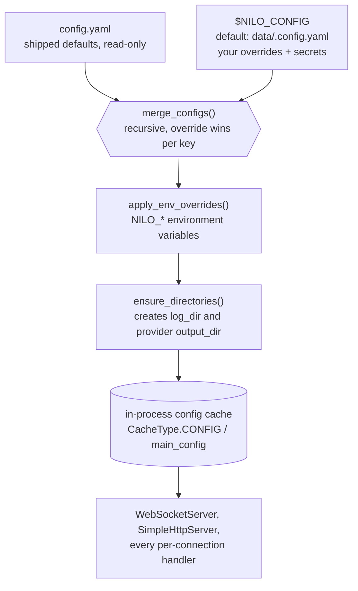
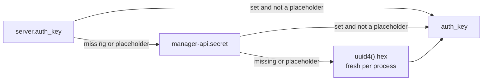
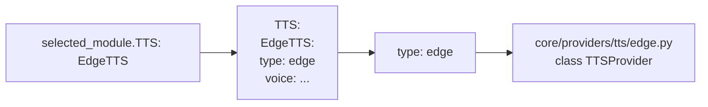

# Configuration

Everything nilo-server does at runtime is driven by one merged configuration dictionary.
This page describes where that dictionary comes from and what each key means.

Unless stated otherwise, every key below is **Implemented**: it is either shipped in
`main/nilo-server/config.yaml` or read by code in `main/nilo-server/`. A key marked
**code only** ships no default value: it takes effect only if you add it to your override
file. Those keys are collected in
[the reference table](#reference-keys-read-by-code-but-not-shipped-in-configyaml) at the
end of this page.

The robot domain (actions, behaviour engine, world model, robot memory, simulator, safety
policy) has **no configuration keys** — those layers are not implemented. The only robot-side
configuration that exists today is the `protocols:` block described below. See
[robot-architecture.md](robot-architecture.md) and [robot-roadmap.md](robot-roadmap.md).

## Files and layering



| Layer | Path | Notes |
|---|---|---|
| Shipped defaults | `main/nilo-server/config.yaml` | Read-only reference. Do not edit; your changes are lost on every upgrade. |
| User overrides | `data/.config.yaml` under the server directory, or the file named by `NILO_CONFIG` | Git-ignored. Must exist (an empty file is fine) or startup aborts. |
| Environment | `NILO_*` variables | Applied last, so they win over both files. |

Layering is implemented in `config/config_loader.py:load_config`. The merge is recursive and
per key (`config/config_loader.py:merge_configs`), so your override file only needs the keys
that differ — a block such as `LLM:` in your file does not replace the whole shipped `LLM:`
block, only the leaf values you set. A non-mapping value replaces a mapping and vice versa.

`config/settings.py:check_config_file` fails fast with a `FileNotFoundError` naming the path
when the override file is missing. The loaded config is cached in-process
(`core/utils/cache/manager.py`), so editing a file requires a restart to take effect.

`config/config_loader.py:ensure_directories` creates the log directory and the `output_dir` of
every configured ASR/TTS provider on startup, so a fresh checkout needs no manual `mkdir`
beyond `data/` itself.

## Environment variables

These five are the complete set. They are defined in `config/config_loader.py` (`ENV_OVERRIDES`
plus `custom_config_path`) and covered by `tests/config/test_nilo_config.py`.

| Variable | Maps to config key | Type | Default when unset |
|---|---|---|---|
| `NILO_CONFIG` | — (selects the override *file*) | path | `<server dir>/data/.config.yaml` |
| `NILO_SERVER_HOST` | `server.ip` | string | `0.0.0.0` from `config.yaml` |
| `NILO_SERVER_PORT` | `server.port` | int (`int(raw)`) | `8000` from `config.yaml` |
| `NILO_HTTP_PORT` | `server.http_port` | int (`int(raw)`) | `8003` from `config.yaml` |
| `NILO_LOG_LEVEL` | `log.log_level` | string | `INFO` from `config.yaml` |

Rules enforced by `config/config_loader.py:apply_env_overrides`:

* An unset **or empty** variable is ignored, so `NILO_SERVER_PORT=""` keeps the file value.
* `port` and `http_port` are converted with `int()`; a non-numeric value raises `ValueError` at
  startup. The other two are used as strings.
* The target section is created if the merged config does not have it.

## Placeholders

`config.yaml` ships unusable example values rather than blanks, and `config/placeholders.py`
recognises them. `PLACEHOLDER_MARKERS` holds exactly two markers, and `is_placeholder(value)` is
true for any string containing either. `<your` is the current spelling, as in `<your-chatglm-api-key>`;
the second marker is a single legacy CJK character from the inherited config, kept so existing
`data/.config.yaml` files that were written against the upstream template keep working.

Code that treats a placeholder as "unset" rather than as a value:

| Key | Consumer | Effect when still a placeholder |
|---|---|---|
| Any provider API key | `core/utils/util.py:check_model_key` | Returns a `Configuration error: the API key for <type> is not set` message that providers log |
| `server.websocket` | `core/http_server.py:SimpleHttpServer._get_websocket_url`, `core/api/ota_handler.py:OTAHandler._get_websocket_url` | URL is generated from the detected local IP and the default protocol route instead |
| `server.vision_explain` | `core/utils/util.py:get_vision_url` | URL is generated as `http://<local-ip>:<http_port>/mcp/vision/explain` |
| `server.auth_key` | `app.py:resolve_auth_key` | Falls through to the next source (see [Secrets](#secrets-and-authentication)) |
| `manager-api.secret` | `app.py:resolve_auth_key`, `config/manage_api_client.py` | Same fall-through; remote config refuses to initialise |
| `mcp_endpoint` | `app.py:main`, `core/providers/tools/unified_tool_handler.py`, `core/providers/tools/mcp_endpoint/mcp_endpoint_handler.py` | The MCP endpoint client is not started |

## Server, ports and advertised URLs

Block: `server:` in `config.yaml`. Both listeners run as asyncio tasks in the single
`python app.py` process.

| Key | Default | Read by | Meaning |
|---|---|---|---|
| `server.ip` | `0.0.0.0` | `core/websocket_server.py:WebSocketServer.start`, `core/http_server.py:SimpleHttpServer.start` | Bind address for both listeners |
| `server.port` | `8000` | `core/websocket_server.py:WebSocketServer.start`, and `core/api/ota_handler.py` for the URL it advertises | WebSocket session port |
| `server.http_port` | `8003` | `core/http_server.py:SimpleHttpServer.start`, `core/utils/util.py:get_vision_url` | HTTP port: OTA bootstrap, firmware download, vision endpoint |
| `server.websocket` | `ws://<your-host-or-domain>:<port>/nilo/v1/` (placeholder) | `core/api/ota_handler.py`, `core/http_server.py` | WebSocket URL **advertised to devices** in the OTA response |
| `server.vision_explain` | `http://<your-host-or-domain>:<port>/mcp/vision/explain` (placeholder) | `core/utils/util.py:get_vision_url` | Vision endpoint URL advertised to devices; also the base for firmware download URLs |
| `server.timezone_offset` | `+8` | `core/api/ota_handler.py:OTAHandler.handle_post` | Sent to devices as `server_time.timezone_offset`, multiplied by 60 (minutes) |
| `server.mqtt_gateway` | `null` | `core/api/ota_handler.py:OTAHandler.handle_post` | When set (`host:port`), OTA returns an `mqtt` block instead of a `websocket` block |
| `server.mqtt_signature_key` | `null` | same | Signing key used to derive the MQTT password |
| `server.udp_gateway` | `null` | shipped in `config.yaml`, not read by the Python server | Reserved for an external gateway |

`server.websocket` and `server.vision_explain` do not change what the server binds — only what
it tells devices to connect to. Leave them at the placeholder for a LAN test and the server
derives both from the local IP it detects (`core/utils/util.py:get_local_ip`, which opens a UDP
socket toward `8.8.8.8`). That detection is wrong inside Docker, behind NAT, or behind a TLS
terminator, which is when you must set them explicitly. The firmware download URL is built by
taking the vision URL and substituting the OTA download path of the protocol the request arrived
on (`core/api/ota_handler.py:OTAHandler.handle_post`), so a wrong `server.vision_explain` breaks
OTA downloads too — the server says so in its log line.

Related: `firmware_cache_ttl` (top level, **code only**, default `30`) is how long
`core/api/ota_handler.py:OTAHandler._refresh_bin_cache_if_needed` caches its scan of `data/bin/`.
Newly dropped firmware files take up to that long to be offered. See [deployment.md](deployment.md)
and [protocol.md](protocol.md).

## Protocols

Block: `protocols:` in `config.yaml`, parsed by `robot/protocol/base.py:ProtocolRegistry.from_config`
via `robot/protocol/__init__.py:registry_from_config`. There is exactly one protocol — `nilo`,
the only entry in `robot/protocol/__init__.py:ALL_PROTOCOLS` — and it owns one WebSocket route
and one OTA route. It is enabled by default.

| Key | Default | Routes |
|---|---|---|
| `protocols.nilo.enabled` | `true` | `/nilo/v1/` (WebSocket), `/nilo/ota/` + `/nilo/ota/download/{filename}` (HTTP) |
| `protocols.strict` | `true` | A WebSocket path matching no known protocol is answered with `404 unknown protocol path` (`core/websocket_server.py:WebSocketServer._http_response`). Set it to `false` to accept unknown paths instead. A path belonging to a *disabled* protocol is rejected either way (`ProtocolRegistry.ws_accepts`) |

`nilo` is also the *default* protocol: it supplies the WebSocket URL the OTA endpoint advertises
when `server.websocket` is unset or still a placeholder
(`robot/protocol/base.py:ProtocolRegistry.default` and `.ws_url`).
Disabling it registers no device routes at all, and `ProtocolRegistry.default()` then raises
`RuntimeError: no device protocol is enabled`. Details in [protocol.md](protocol.md).

## Secrets and authentication

### `server.auth_key`

Resolved once at startup by `app.py:resolve_auth_key` and written back into
`config["server"]["auth_key"]` before any server starts:



`server.auth_key` is **code only** — no value ships in `config.yaml`, so an unconfigured server
gets a new random key on every restart. It is the shared secret behind
`core/auth.py:AuthManager` for two of its three uses: the WebSocket tokens the OTA endpoint issues
(`core/api/ota_handler.py`) and the token the WebSocket server verifies
(`core/websocket_server.py:WebSocketServer._handle_auth`). The third use, the vision endpoint's
bearer token (`core/api/vision_handler.py`, `core/providers/tools/device_mcp/mcp_handler.py`), is a
JWT signed with the same key by `core/utils/auth.py:AuthToken`. Set it explicitly in your override
file for any deployment where tokens must survive a restart.

### `server.auth`

| Key | Default | Source | Meaning |
|---|---|---|---|
| `server.auth.enabled` | `false` | `config.yaml` | Turn device authentication on. When `false`, the OTA endpoint issues an empty token and the WebSocket server skips verification. |
| `server.auth.allowed_devices` | one example MAC | `config.yaml` | Device IDs that skip the token check entirely, on both the OTA and WebSocket paths |
| `server.auth.expire_seconds` | 30 days (`60*60*24*30`) | code only | Token lifetime; a missing, zero or negative value falls back to the 30-day default (`core/auth.py:AuthManager.__init__`) |

A token is `<urlsafe-base64 HMAC-SHA256 of "client_id|device_id|timestamp">.<timestamp>`; it
carries no plaintext identifiers, and the device sends `device-id`, `client-id` and
`Authorization: Bearer <token>` separately. With `auth.enabled: true` and a non-empty
`allowed_devices`, listed devices receive an empty token and are let through by device ID; every
other device is issued and then checked against a real token. See [safety-model.md](safety-model.md).

## Logging

Block: `log:` in `config.yaml`, applied by `config/logger.py:setup_logging` on first call.

| Key | Default | Meaning |
|---|---|---|
| `log.log_format` | see `config.yaml` | loguru format for stdout |
| `log.log_format_file` | see `config.yaml` | loguru format for the log file |
| `log.log_level` | `INFO` | Level for both sinks; also settable via `NILO_LOG_LEVEL` |
| `log.log_dir` | `tmp` | Directory for the log file, created at startup |
| `log.log_file` | `server.log` | File name inside `log_dir` |
| `log.data_dir` | `data` | Created at startup; the directory holding `.config.yaml`, `.mcp_server_settings.json` and `bin/` |

Both formats accept `{version}`, which `setup_logging` replaces with `robot.__version__` before
handing the string to loguru, and `{selected_module}` / `{extra[selected_module]}`, a 14-character
abbreviation of the selected VAD/ASR/LLM/TTS/Memory/Intent/VLLM providers built by
`config/logger.py:build_module_string` (each connection gets its own via
`create_connection_logger`). `log.selected_module` is read as the initial value but is not shipped
in `config.yaml`; it defaults to `00000000000000`.

The file sink is configured with `rotation="10 MB"`, `retention="30 days"`, no compression, UTF-8
and `enqueue=True`, so the log directory holds at most 30 days of 10 MB files. Rotation and
retention are hard-coded in `config/logger.py`, not configurable.

## Session and audio behaviour

Top-level keys, all shipped in `config.yaml`.

| Key | Default | Read by | Meaning |
|---|---|---|---|
| `delete_audio` | `true` | `core/utils/modules_initialize.py`, `core/providers/tts/paddle_speech.py` | Delete generated audio files after use. Compared as a lowercased string, so `true`/`1`/`yes` all enable it. |
| `close_connection_no_voice_time` | `120` | `core/handle/receiveAudioHandle.py`, `core/connection.py` | Seconds of silence before the connection is closed. The connection's own timeout task uses this value plus 60 s. |
| `tts_timeout` | `15` | `core/providers/tts/base.py`, `core/utils/modules_initialize.py` | Per-request TTS timeout in seconds. A TTS block may override it locally; the top-level value is the default. |
| `tool_call_timeout` | `30` | `core/connection.py`, `core/handle/intentHandler.py` | Seconds a single tool call may take |
| `enable_wakeup_words_response_cache` | `true` | `core/handle/helloHandle.py:checkWakeupWords` | Cache and replay the wake-word response to shorten wake-up latency |
| `enable_greeting` | `true` | `core/handle/textHandler/listenMessageHandler.py` | Speak a greeting when a conversation opens with a wake word |
| `enable_stop_tts_notify` | `false` | `core/handle/sendAudioHandle.py` | Play a notification sound when the assistant finishes speaking |
| `stop_tts_notify_voice` | `config/assets/tts_notify.mp3` | `core/handle/sendAudioHandle.py` | Sound file used for that notification |
| `enable_websocket_ping` | `false` | `core/handle/textHandler/pingMessageHandler.py` | Answer WebSocket-level ping messages as a keep-alive |
| `tts_audio_send_delay` | `0` | `core/handle/sendAudioHandle.py` | Interval between outgoing audio packets. `0` tracks the audio frame rate at runtime; a positive value is a fixed delay in milliseconds. |
| `exit_commands` | `exit`, `quit`, `goodbye` plus two legacy Chinese phrases kept from the inherited config | `core/connection.py` | Post-ASR phrases that end the conversation. Read with `config["exit_commands"]`, so the key must exist. |
| `wakeup_words` | `hey nilo`, `hi nilo`, `hello nilo` | `core/handle/helloHandle.py`, `core/handle/textHandler/listenMessageHandler.py` | Recognised wake phrases, used to tell a wake-up apart from speech |

### `hello:` — the server hello message

`core/connection.py` copies the whole `hello:` block per connection, adds `session_id`, and sends
it as the server's reply to the device hello.

| Key | Default |
|---|---|
| `hello.type` | `hello` |
| `hello.version` | `1` |
| `hello.transport` | `websocket` |
| `hello.audio_params.format` | `opus` |
| `hello.audio_params.sample_rate` | `24000` (Opus accepts 8000, 12000, 16000, 24000, 48000) |
| `hello.audio_params.channels` | `1` |
| `hello.audio_params.frame_duration` | `60` (ms) |

`hello.audio_params.sample_rate` is the server's output sample rate: `core/connection.py` reads it
into `self.sample_rate` at connect time. A device may override the whole `audio_params` object in
its own hello (`core/handle/helloHandle.py`). Frame sizes and encoding are covered in
[audio.md](audio.md).

## Provider selection

Every processing stage is chosen by name, then loaded by type:



1. `selected_module.<Kind>` names a key under the `<Kind>:` block.
2. That block's `type` field names a module file under `core/providers/<kind>/`.
3. The factory (`core/utils/tts.py:create_instance` and its siblings for `asr`, `llm`, `vllm`,
   `vad`, `intent`, `memory`) looks for that module under `core/providers/<kind>/` — in one of the
   two shapes below — with a **working-directory relative** `os.path.exists`, so the server must be
   started from `main/nilo-server/`. An unknown type raises
   `ValueError: Unsupported <Kind> type: ...`.
4. `core/utils/modules_initialize.py:initialize_modules` caches each instantiated provider keyed by
   its config block, so an unchanged block is not rebuilt.

`VAD`, `ASR`, `TTS` and `VLLM` resolve to a flat file, `core/providers/<kind>/<type>.py`. `LLM`,
`Intent` and `Memory` resolve to a directory, `core/providers/<kind>/<type>/<type>.py`.

Shipped defaults (`selected_module:` in `config.yaml`):

| Stage | Default | Block that must exist |
|---|---|---|
| `VAD` | `SileroVAD` | `VAD.SileroVAD` (`type: silero`) |
| `ASR` | `FunASR` | `ASR.FunASR` (`type: fun_local`, local model) |
| `LLM` | `ChatGLMLLM` | `LLM.ChatGLMLLM` (`type: openai`, `model_name: glm-4-flash`) |
| `VLLM` | `ChatGLMVLLM` | `VLLM.ChatGLMVLLM` (`type: openai`, `model_name: glm-4v-flash`) |
| `TTS` | `EdgeTTS` | `TTS.EdgeTTS` (`type: edge`) |
| `Memory` | `nomem` | `Memory.nomem` (`type: nomem`, memory disabled) |
| `Intent` | `function_call` | `Intent.function_call` |

Only the selected providers are instantiated, so unrelated placeholder API keys elsewhere in
`config.yaml` are harmless. The catalogue of available providers per stage is in
[providers.md](providers.md).

### Representative blocks

One example per stage; `config.yaml` ships many more entries of the same shape.

```yaml
VAD:
  SileroVAD:
    type: silero
    threshold: 0.5              # speech starts at or above this probability
    threshold_low: 0.3          # speech ends at or below it
    model_dir: models/snakers4_silero-vad
    min_silence_duration_ms: 200

ASR:
  FunASR:
    type: fun_local             # -> core/providers/asr/fun_local.py
    model_dir: models/SenseVoiceSmall
    output_dir: tmp/            # created by ensure_directories()
    language: auto

LLM:
  ChatGLMLLM:
    type: openai                # -> core/providers/llm/openai/openai.py
    model_name: glm-4-flash
    url: https://open.bigmodel.cn/api/paas/v4/
    api_key: <your-chatglm-api-key>

VLLM:
  ChatGLMVLLM:
    type: openai                # -> core/providers/vllm/openai.py
    model_name: glm-4v-flash
    url: https://open.bigmodel.cn/api/paas/v4/
    api_key: <your-chatglm-api-key>

TTS:
  EdgeTTS:
    type: edge                  # -> core/providers/tts/edge.py
    voice: zh-CN-XiaoxiaoNeural
    output_dir: tmp/

Memory:
  mem_local_short:
    type: mem_local_short       # -> core/providers/memory/mem_local_short/mem_local_short.py
    llm: ChatGLMLLM             # dedicated summariser; the main LLM is used if the name is not under LLM:

Intent:
  function_call:
    type: function_call         # -> core/providers/intent/function_call/function_call.py
    functions:                  # modules under plugins_func/functions/ exposed as callable tools
      - change_role
      - web_search
      - get_weather
      - get_news_from_newsnow
      - play_music
```

Notes that apply across blocks:

* `output_dir` on ASR and TTS blocks is created at startup by `ensure_directories`.
* `Intent.<name>.llm` and `Memory.<name>.llm` name an entry under `LLM:` to use instead of
  `selected_module.LLM` for that job (`core/connection.py`), which lets a cheap model do intent or
  summarisation work.
* `Intent.function_call.functions` selects which plugins become tools
  (`core/providers/tools/server_plugins/plugin_executor.py`). `handle_exit_intent` and `get_lunar`
  are always added to that list, so there is no point naming them.
* An `api_key` left at its `<your-...>` placeholder is reported by
  `core/utils/util.py:check_model_key` rather than silently sent to the provider.

## Persona and prompts

| Key | Default | Read by |
|---|---|---|
| `prompt` | multi-line Nilo persona text | `core/connection.py` — the user-facing system prompt |
| `prompt_template` | `agent-base-prompt.txt` | `core/utils/prompt_manager.py` — path, relative to the working directory, of the template the prompt is rendered into. A missing file logs a warning and leaves the template empty. Point it at `data/.agent-base-prompt.txt` to keep a custom copy out of the source tree. |
| `system_error_response` | `Sorry, I am a bit busy right now. Let us try again in a moment.` | `core/utils/util.py` — spoken when the pipeline errors |
| `end_prompt.enable` | `true` | `core/handle/receiveAudioHandle.py` |
| `end_prompt.prompt` | a short goodbye instruction | `core/handle/sendAudioHandle.py`, `core/handle/receiveAudioHandle.py` — the LLM instruction used to produce a closing remark |
| `module_test.test_sentences` | three sentences | `performance_tester/performance_tester_llm.py`, `performance_tester/performance_tester_tts.py` — prompts for the benchmark scripts only; the server itself never reads them ([testing.md](testing.md)) |

## MCP

| Key | Default | Meaning |
|---|---|---|
| `mcp_endpoint` | `<your-mcp-endpoint-websocket-url>` (placeholder) | WebSocket URL of an MCP endpoint, `ws://<host>:<port>/mcp/?token=<token>` |

`app.py:main` validates it with `core/utils/util.py:validate_mcp_endpoint`. On success it logs the
endpoint and rewrites the in-memory value by replacing `/mcp/` with `/call/` — the configured value
is the endpoint's `/mcp/` URL and the server dials its `/call/` twin. On failure it logs an error
and resets the value to the placeholder, which disables the feature.

MCP *servers* the backend starts itself are configured in a separate JSON file, not in
`config.yaml`: `core/providers/tools/server_mcp/mcp_manager.py` reads
`<server dir>/data/.mcp_server_settings.json`. `main/nilo-server/mcp_server_settings.json` is the
annotated template to copy — it documents the `mcpServers` map and the three supported transports
(`stdio`, `sse`, `streamable-http`). The file is optional; without it no server-side MCP servers are
started. See [mcp.md](mcp.md).

## Plugins

Block: `plugins:` in `config.yaml`. A plugin only runs when it is listed in
`Intent.<selected>.functions` (or is one of the built-in defaults); the block below supplies its
settings. Each is read as `conn.config["plugins"]["<name>"]` by the matching module under
`plugins_func/functions/`.

| Plugin | Keys | Read by |
|---|---|---|
| `get_weather` | `api_host`, `api_key`, `default_location` | `plugins_func/functions/get_weather.py` |
| `get_news_from_chinanews` | `default_rss_url`, `society_rss_url`, `world_rss_url`, `finance_rss_url` | `plugins_func/functions/get_news_from_chinanews.py` |
| `get_news_from_newsnow` | `url`, `news_sources` (semicolon-separated source names) | `plugins_func/functions/get_news_from_newsnow.py` |
| `home_assistant` | `devices` (one `area,name,entity_id` per line), `base_url`, `api_key` | `plugins_func/functions/hass_init.py`, `core/providers/intent/intent_llm/intent_llm.py` |
| `play_music` | `music_dir`, `music_ext`, `refresh_time` | `plugins_func/functions/play_music.py` |
| `search_from_ragflow` | `description`, `base_url`, `api_key`, `dataset_ids` | `plugins_func/functions/search_from_ragflow.py` |
| `web_search` | `provider` (`metaso` or `tavily`), `description`, `max_results`, `api_key` | `plugins_func/functions/web_search.py` |

## Voiceprint

Block: `voiceprint:`, consumed by `core/utils/voiceprint_provider.py` and attached per connection
in `core/connection.py`. It identifies which configured speaker is talking and injects that into
the system prompt.

| Key | Default | Meaning |
|---|---|---|
| `voiceprint.url` | empty | URL of an external voiceprint service, including its `key` query parameter. Only its scheme and host are used: the provider derives the `/voiceprint/identify` call and a `/voiceprint/health` probe from them. Empty, or missing `key`, disables the feature. |
| `voiceprint.speakers` | three examples | List of `"speaker_id,name,description"` strings |
| `voiceprint.similarity_threshold` | `0.4` | 0.0–1.0; higher is stricter |

The service itself is external and is not part of nilo-server.

## Context providers

Block: `context_providers:`, a list consumed by `core/utils/context_provider.py:ContextDataProvider`.
Each entry has `url` and optional `headers`; the server adds a `device-id` header and issues a 3-second
`GET`, expecting `{"code": 0, "data": {...}}`. The returned fields are formatted into the system
prompt. Entries without a `url` are skipped, and the shipped default is a single empty entry, so the
feature is off until you fill it in.

## Deprecated: remote configuration

**Deprecated.** The `manager-api` console this path served is not part of Nilo; the keys are still
honoured by `config/config_loader.py` and `config/manage_api_client.py` but nothing in this
repository provides the API. See [migration.md](migration.md).

| Key | Effect |
|---|---|
| `manager-api.url` | Present and non-empty in your override file ⇒ `load_config` **skips the local merge entirely** and fetches the whole configuration over HTTP, setting `read_config_from_api: true` |
| `manager-api.secret` | Sent as `Authorization: Bearer <secret>`; also the second candidate for `server.auth_key` |
| `read_config_from_api` | Set by the loader, never by you. When true the OTA routes are not registered (`core/http_server.py`) and per-connection ASR/TTS/tool reporting to the remote API is enabled (`core/connection.py`, `core/handle/reportHandle.py`) |

In remote mode only `server.ip`, `server.port`, `server.http_port`, `server.vision_explain` and
`server.auth_key` still come from the local file; `server.auth.enabled` is taken from the API
response, and `prompt_template` falls back to the local value only when the API returns none.
Setting both
`manager-api` and `selected_module` in the override file is rejected by
`config/settings.py:check_config_file` with a `ValueError`. Leave `manager-api` unset.

## Reference: keys read by code but not shipped in `config.yaml`

Add these to your override file when you need them.

| Key | Default in code | Where |
|---|---|---|
| `server.auth_key` | random `uuid4().hex` per process | `app.py:resolve_auth_key` |
| `server.auth.expire_seconds` | 30 days | `core/auth.py:AuthManager` |
| `firmware_cache_ttl` | `30` (seconds) | `core/api/ota_handler.py:OTAHandler` |
| `log.selected_module` | `00000000000000` | `config/logger.py:setup_logging` |
| `manager-api.url`, `manager-api.secret` | unset | `config/config_loader.py` (deprecated) |

## The robot subsystem's configuration

The robot's numbers live in **one document of their own**, `data/robot.yaml` (or wherever
`NILO_ROBOT_CONFIG` points), and deliberately not in `config.yaml`. The reason is the
deprecated remote-configuration mode above: it replaces the local configuration wholesale
with the API response and only the `server` and `manager-api` blocks survive, so a speed
ceiling stored there would silently vanish in exactly the deployment that has the most
robots in it.

Audio, the language model and the whole provider stack stay in `config.yaml`, because those
are the inherited server's and it owns their lifecycle.

### One file, six sections

```yaml
# data/robot.yaml
robot:                         # the control plane
  autonomy: normal             # off | passive | normal | full
  autostart_behaviors: false   # a robot must not start moving because it was plugged in
  behavior_interval_s: 0.5
  discovery_timeout_s: 10.0
  animation_dir: ""            # extra animations, on top of the built-in library

safety:                        # every number the policy compares against
  max_distance_mm: 1000
  max_angle_deg: 180
  max_speed_mmps: 300
  min_obstacle_distance_mm: 250
  max_sensor_age_s: 2.0
  heartbeat_timeout_s: 5.0

behavior:                      # the scoring weights and cooldowns
  greet_cooldown_s: 300
  boredom_onset_s: 120

personality:
  traits:
    curiosity: 0.6
    sociability: 0.7
  store_dir: data/robot_personality   # empty keeps personality in memory only

memory:
  enabled: false               # off by default: a runtime must not create a database by existing
  path: data/robot_memory.sqlite3
  consolidation_interval_s: 0

vision:
  enabled: false
  interval_s: 1.0
  detector: "null"             # null | colour-blob | yolo
  model_path: ""
```

Every section is optional, and every field has a conservative default. A deployment with no
`data/robot.yaml` at all gets a robot that connects, obeys safety, decides for itself, has
no long-term memory and sees nothing — which is the right thing for a first run.

### The hierarchy

Lowest precedence first:

1. the built-in defaults
2. `data/robot.yaml`, or `$NILO_ROBOT_CONFIG`
3. the legacy per-area files — `data/robot_limits.yaml`, `data/robot_behavior.yaml`,
   `data/robot_personality.yaml` — for a section the main document does not mention. Each
   one logs a warning naming the key to move it under; they still work, and they are the
   migration path rather than the destination.
4. environment variables, named after the section and the field —
   `NILO_ROBOT_SAFETY_MAX_SPEED_MMPS` sets `safety.max_speed_mmps`
5. a secret file, for the one secret there is

An unknown key in the file is an error, not a silently ignored line, and a variable with
that prefix that names no field is a warning — because the failure it otherwise
produces is "I set the speed limit and nothing happened".

### Environment overrides

The section comes first, except `robot`, which is addressable without repeating itself:

| Variable | Sets |
|---|---|
| `NILO_ROBOT_CONFIG` | the path of the document itself |
| `NILO_ROBOT_AUTONOMY` | `robot.autonomy` |
| `NILO_ROBOT_AUTOSTART_BEHAVIORS` | `robot.autostart_behaviors` |
| `NILO_ROBOT_BEHAVIOR_INTERVAL_S` | `robot.behavior_interval_s` |
| `NILO_ROBOT_DISCOVERY_TIMEOUT_S` | `robot.discovery_timeout_s` |
| `NILO_ROBOT_ANIMATION_DIR` | `robot.animation_dir` |
| `NILO_ROBOT_SAFETY_MAX_SPEED_MMPS` | `safety.max_speed_mmps` |
| `NILO_ROBOT_SAFETY_MAX_DISTANCE_MM` | `safety.max_distance_mm` |
| `NILO_ROBOT_MEMORY_ENABLED` | `memory.enabled` |
| `NILO_ROBOT_MEMORY_PATH` | `memory.path` |
| `NILO_ROBOT_MEMORY_CONSOLIDATION_INTERVAL_S` | `memory.consolidation_interval_s` |
| `NILO_ROBOT_VISION_ENABLED` | `vision.enabled` |
| `NILO_ROBOT_VISION_INTERVAL_S` | `vision.interval_s` |
| `NILO_ROBOT_VISION_DETECTOR` | `vision.detector` |
| `NILO_ROBOT_VISION_MODEL_PATH` | `vision.model_path` |
| `NILO_ROBOT_PERSONALITY_STORE_DIR` | `personality.store_dir` |

The rule is mechanical rather than a list: any scalar field on any section can be set this
way, and the table is the useful subset.

### Secrets

There is exactly one secret in the robot subsystem — the management API's admin token —
and it never belongs in a file that is committed:

| Variable | Meaning |
|---|---|
| `NILO_ROBOT_ADMIN_TOKEN_FILE` | read the token from this path. **Preferred**: what every orchestrator mounts, and it does not appear in `ps`, an image layer or a crash dump of the environment |
| `NILO_ROBOT_ADMIN_TOKEN` | the token itself. Convenient for a developer |

The file wins when both are set. With neither, the management API refuses every
authenticated route — it fails closed, which is the right behaviour for a surface that can
move a robot and delete its memory ([robot-api.md](robot-api.md)).

### Where it is assembled

One place: [`robot/bootstrap.py`](../main/nilo-server/robot/bootstrap.py), called once from
`app.py` before the WebSocket server starts, so the first device to connect finds a
configured runtime rather than a default one.

## Verifying a change

```bash
cd main/nilo-server
python -m pytest tests/config -q      # config loader, env overrides, NILO_CONFIG
python -m pytest tests/robot/test_config.py -q   # the robot hierarchy and the composition root
python -m pytest -q                   # full suite
python app.py                         # startup prints the resolved endpoints
```

The startup log prints one OTA and one WebSocket line per enabled protocol, the vision endpoint,
and the MCP endpoint when configured — the fastest way to confirm which URLs your configuration
actually advertises. See [getting-started.md](getting-started.md) for first-run setup,
[development.md](development.md) for the test tooling, and [deployment.md](deployment.md) for
container and reverse-proxy concerns.
