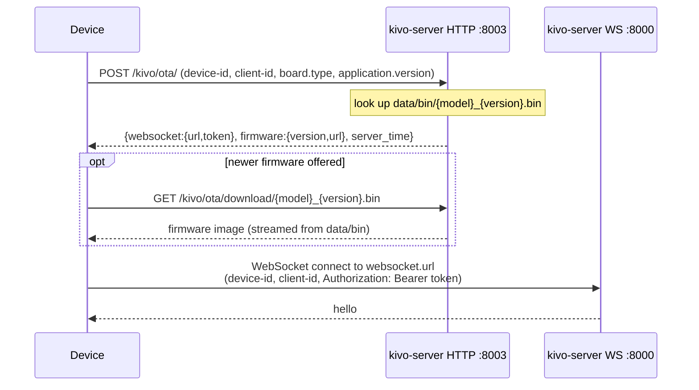

# Deployment

kivo-server is a single Python process (`main/kivo-server/app.py`) that listens on two TCP ports:
a WebSocket server for device sessions and an aiohttp HTTP server for OTA bootstrap and the
vision endpoint. It needs no database, message broker or second service of its own. Everything on
this page is **Implemented** unless marked otherwise.

Three supported ways to run it:

| Path | Use it for | Source of truth |
|---|---|---|
| Python process | development, bare-metal hosts, systemd | `main/kivo-server/app.py` |
| Docker image | reproducible runtime, CI-built images | `Dockerfile-server-base`, `Dockerfile-server` |
| Docker Compose | single-host deployment | `main/kivo-server/docker-compose.yml` |

Kubernetes manifests, a Helm chart and a management console are **not** part of this repository.

## Ports and endpoints

Both servers bind `server.ip` (default `0.0.0.0`); see `core/websocket_server.py:WebSocketServer.start`
and `core/http_server.py:SimpleHttpServer.start`.

| Port | Config key | Serves |
|---|---|---|
| 8000 | `server.port` | WebSocket sessions: `/kivo/v1/`, `/xiaozhi/v1/` (one route per enabled protocol) |
| 8003 | `server.http_port` | `GET/POST /kivo/ota/`, `GET /kivo/ota/download/{filename}`, the same pair under `/xiaozhi/ota/`, and `GET/POST /mcp/vision/explain` |

A plain HTTP `GET` to the WebSocket port (no `Connection: upgrade`) answers `200` with
`kivo-server is running` — the cheapest liveness probe (`core/websocket_server.py:WebSocketServer._http_response`).
Which routes exist is decided by the `protocols:` config block; see [protocol.md](protocol.md).

The process terminates TLS nowhere: `websockets.serve` and `aiohttp.web.TCPSite` are started
without an SSL context. Public deployments put a reverse proxy in front of both ports.

## Prerequisites

| Requirement | Why | Checked by |
|---|---|---|
| Python 3.12 | CI runs lint, types and the suite on 3.12 | `.github/workflows/test.yml` |
| `ffmpeg` on `PATH` | audio decoding; startup aborts without it | `app.py` → `core/utils/util.py:check_ffmpeg_installed` |
| Opus shared library | Opus frames on the wire; the system library is tried first, then `libs/<platform>/<arch>/` — which ships only `mac` and `win`, so Linux hosts need a packaged `libopus` (`libopus0` in the base image) | `config/opus_loader.py:setup_opus`, abort message in `app.py` |
| A user config file | `data/.config.yaml` (or `$KIVO_CONFIG`) must exist, even empty | `config/settings.py:check_config_file` |
| `models/SenseVoiceSmall/model.pt` | only when `selected_module.ASR` is the local FunASR provider | `config.yaml` (`ASR.FunASR.model_dir`), `core/providers/asr/fun_local.py` |

The Silero VAD model **is** in the repository (`models/snakers4_silero-vad/src/silero_vad/data/silero_vad.onnx`)
and runs on onnxruntime, so the default VAD needs no download.

### Working directory

Run the process with its working directory set to `main/kivo-server`. Several paths are resolved
against the current directory rather than the package root:

* firmware directory — `os.path.join(os.getcwd(), "data", "bin")` in `core/api/ota_handler.py:OTAHandler.__init__`
* log directory — `log.log_dir` (default `tmp`) in `config/logger.py:setup_logging`
* provider model directories — e.g. `ASR.FunASR.model_dir: models/SenseVoiceSmall`
* the provider factories, which test for the adapter module with a path relative to the current
  directory before importing it and otherwise raise `Unsupported <kind> type`
  (`core/utils/asr.py:create_instance`, `core/utils/llm.py:create_instance`)

`make run` and the Docker image both get this right (`WORKDIR /opt/kivo-server` in `Dockerfile-server`).

## Option 1: Python process

```bash
cd main/kivo-server
python3.12 -m venv .venv && source .venv/bin/activate
pip install -r requirements.txt
python app.py
```

From the repository root, `make run` does the same thing. The startup log prints the OTA and
WebSocket endpoint for every enabled protocol, plus the one vision endpoint.

Environment overrides are applied after both config files and win over them
(`config/config_loader.py:apply_env_overrides`). These five variables are the whole set:

| Variable | Overrides | Default |
|---|---|---|
| `KIVO_CONFIG` | path of the user config file | `data/.config.yaml` |
| `KIVO_SERVER_HOST` | `server.ip` | `0.0.0.0` |
| `KIVO_SERVER_PORT` | `server.port` | `8000` |
| `KIVO_HTTP_PORT` | `server.http_port` | `8003` |
| `KIVO_LOG_LEVEL` | `log.log_level` | `INFO` |

Everything else is configured in YAML; see [configuration.md](configuration.md).

For a service manager, the process needs: the working directory above, the virtualenv interpreter,
and `SIGTERM` to stop — `app.py` installs handlers for `SIGINT` and `SIGTERM`, then stops the GC
manager and cancels the WebSocket, HTTP and stdin tasks with a 3 second grace period
(`app.py:wait_for_exit`, `app.py:main`).
A generic systemd unit therefore looks like:

```ini
[Service]
Type=simple
WorkingDirectory=/opt/kivo/main/kivo-server
Environment=KIVO_LOG_LEVEL=INFO
ExecStart=/opt/kivo/main/kivo-server/.venv/bin/python app.py
Restart=on-failure
KillSignal=SIGTERM
TimeoutStopSec=15
```

The unit file is an example, not a shipped artefact; this repository contains no systemd units.

## Option 2: Docker image

Two Dockerfiles at the repository root, both built with the **repository root as build context**
(`Dockerfile-server` copies `main/kivo-server`):

| File | Contents | Rebuild when |
|---|---|---|
| `Dockerfile-server-base` | `python:3.12-slim` + `libopus0` + `ffmpeg` + `pip install -r requirements.txt` | `main/kivo-server/requirements.txt` changes |
| `Dockerfile-server` | `FROM ${BASE_IMAGE}` + the application code, `EXPOSE 8000 8003`, `CMD ["python", "app.py"]` | any code change |

`Dockerfile-server` takes one build argument, `BASE_IMAGE`, defaulting to
`ghcr.io/aa-box/kivo-server:base`. Point it elsewhere to build against a local or pinned base:

```bash
docker build -f Dockerfile-server-base -t ghcr.io/aa-box/kivo-server:base .
docker build -f Dockerfile-server --build-arg BASE_IMAGE=ghcr.io/aa-box/kivo-server:base \
  -t ghcr.io/aa-box/kivo-server:latest .
```

`make docker-build` runs exactly those two builds with the default tags.

### Published tags

| Tag | Produced by |
|---|---|
| `ghcr.io/aa-box/kivo-server:base` | `.github/workflows/build-base-image.yml` |
| `ghcr.io/aa-box/kivo-server:latest` | `.github/workflows/docker-image.yml` (every run) |
| `ghcr.io/aa-box/kivo-server:X.Y.Z` | `.github/workflows/docker-image.yml`, only when the ref is a tag matching `v<major>.<minor>.<patch>` |

Both workflows push `linux/amd64` and `linux/arm64` and authenticate to `ghcr.io` with the
workflow's `GITHUB_TOKEN`.

| Workflow | Triggers |
|---|---|
| Build Base Image | push to `main` touching `main/kivo-server/requirements.txt`, `Dockerfile-server-base` or the workflow file; `workflow_dispatch` |
| Release Docker Image | push of a `v*.*.*` tag; `workflow_dispatch`; successful completion of *Build Base Image* (`workflow_run`) |

So a dependency bump rebuilds the base image and then automatically rebuilds `:latest` on top of it.

Because `.dockerignore` excludes `main/kivo-server/data/` and `main/kivo-server/tmp/`, the image
contains **no** configuration and no logs: a container started without a mounted
`data/.config.yaml` aborts at startup with the `FileNotFoundError` from `config/settings.py:check_config_file`.
`models/SenseVoiceSmall` *is* in the image except for `model.pt`, which is git-ignored.

Running the image directly:

```bash
docker run -d --name kivo-server \
  -p 8000:8000 -p 8003:8003 \
  -v "$PWD/data:/opt/kivo-server/data" \
  -e KIVO_LOG_LEVEL=INFO \
  ghcr.io/aa-box/kivo-server:latest
```

## Option 3: Docker Compose

`main/kivo-server/docker-compose.yml` defines one service, `kivo-server`:

| Field | Value |
|---|---|
| `image` | `ghcr.io/aa-box/kivo-server:latest` |
| `container_name` | `kivo-server` |
| `restart` | `always` |
| `security_opt` | `seccomp:unconfined` |
| `ports` | `8000:8000` (WebSocket), `8003:8003` (HTTP) |
| `environment` | `TZ=UTC`, `KIVO_SERVER_HOST=0.0.0.0`, `KIVO_SERVER_PORT=8000`, `KIVO_HTTP_PORT=8003`, `KIVO_LOG_LEVEL=INFO` |
| `volumes` | `./data:/opt/kivo-server/data`, `./models/SenseVoiceSmall/model.pt:/opt/kivo-server/models/SenseVoiceSmall/model.pt` |

```bash
cp main/kivo-server/docker-compose.yml /srv/kivo/
cd /srv/kivo && mkdir -p data models/SenseVoiceSmall
# write data/.config.yaml, and place model.pt if you use the local FunASR ASR
docker compose up -d
docker compose logs -f
```

Create `models/SenseVoiceSmall/model.pt` **before** the first `up`, or drop that volume line if you
use a cloud ASR — Docker creates a directory in place of a missing bind-mount source, and FunASR
then fails to load the model. `TZ` sets the container clock only; the `timezone_offset` value the
OTA response hands to devices is the separate `server.timezone_offset` config key, sent in minutes
(`core/api/ota_handler.py:OTAHandler.handle_post`).

Validate a modified file without starting anything: `make compose-validate`
(`docker compose -f docker-compose.yml config --quiet`). CI runs the same check, and
`tests/test_compose.py` asserts the service name, image, ports, `KIVO_*` variables and data mount.

## Configuring a real deployment

Two config values decide what devices are told to connect to. Both ship as placeholders
(`<your-host-or-domain>`), and any value still containing `<your` is treated as unset
(`config/placeholders.py:is_placeholder`).

| Key | Handed to the device by | Fallback when unset |
|---|---|---|
| `server.websocket` | the OTA response and the OTA GET page | `ws://<detected-ip>:<server.port><default protocol ws_path>` |
| `server.vision_explain` | the device MCP vision tool, and the firmware download URL | `http://<detected-ip>:<server.http_port>/mcp/vision/explain` |

The fallback IP comes from `core/utils/util.py:get_local_ip`, which opens a UDP socket toward
`8.8.8.8` and reads the local address. Inside Docker or behind NAT that address is the container's,
not one a device can reach — so set both keys explicitly for anything beyond a laptop.

Behind TLS termination, set them to the public URLs: `wss://robot.example.com/kivo/v1/` and
`https://robot.example.com/mcp/vision/explain`. The proxy must forward WebSocket upgrades to port
8000 and the OTA/vision paths to port 8003, and must preserve the `device-id`, `client-id` and
`Authorization` request headers, which the server reads on both the WebSocket handshake
(`core/websocket_server.py:WebSocketServer._handle_connection`) and the OTA POST.

**The firmware download URL is derived from `server.vision_explain`.** `OTAHandler.handle_post`
calls `get_vision_url(config)` and replaces the literal substring `/mcp/vision/explain` with
`{ota_path}download/{filename}`. Consequences worth knowing:

* `server.vision_explain` must end in `/mcp/vision/explain`. With any other path the substring
  replacement does not match and the device receives the vision URL as its firmware URL.
* Getting `server.vision_explain` right is what makes both vision and OTA updates work. The log
  line that announces a firmware update prints the resulting URL and names that key as the thing
  to check when the prefix looks wrong.



When `server.mqtt_gateway` is a non-empty string, the OTA response carries an `mqtt` block instead
of the `websocket` block. Leave it `null` (the shipped default) unless you actually run such a
gateway — this repository does not contain one.

## Authentication

Off by default (`server.auth.enabled: false`). When enabled:

| Step | Code |
|---|---|
| OTA mints an HMAC-SHA256 token for `(client_id, device_id, timestamp)` | `core/api/ota_handler.py:OTAHandler.handle_post`, `core/auth.py:AuthManager.generate_token` |
| The device sends it as `Authorization: Bearer <token>` on the WebSocket handshake | `core/websocket_server.py:WebSocketServer._handle_auth` |
| Devices listed in `server.auth.allowed_devices` skip the token check on both sides | same two files |
| `server.auth.expire_seconds` bounds token age; unset means 30 days | `core/auth.py:AuthManager.__init__` |

The signing key is resolved once at startup: `server.auth_key`, else `manager-api.secret`, else a
**random UUID generated per start** (`app.py:resolve_auth_key`). Set `server.auth_key` explicitly in
any deployment you restart — otherwise every restart invalidates the tokens already handed out, and
devices must re-run the OTA bootstrap to get a new one.

The same key signs the one-hour JWT the device MCP vision tool uses; `POST /mcp/vision/explain`
rejects a request whose token is missing, expired, or minted for a different device
(`core/api/vision_handler.py:VisionHandler.handle_post`, `core/utils/auth.py:AuthToken`).

Note what auth does *not* cover: with `server.auth.enabled: false` any client that supplies a
`device-id` header (or `?device-id=` query parameter) gets a session. Do not expose port 8000 to the
internet without either enabling auth or restricting access at the proxy.

## Firmware hosting (OTA)

Drop firmware images into `data/bin/` on the server. The handler scans that directory and matches
`^(.+?)_([0-9][A-Za-z0-9\.\-_]*)\.bin$`, so `kivo-v1_1.4.2.bin` is model `kivo-v1`, version `1.4.2`.

| Behaviour | Detail |
|---|---|
| Model of the requesting device | `device-model` / `device_model` / `model` header, else `board.type` or `model` in the POST body, else `default` |
| Current version | `device-version`, `device_version`, `firmware-version`, `app-version` or `application-version` header, else `application.version` in the body, else `0.0.0` |
| Selection | highest available version for that model that compares greater numerically; when there is none, `firmware.url` stays empty and the log says the device is up to date |
| Directory cache | refreshed at most every `firmware_cache_ttl` seconds — a top-level config key, default 30, absent from the shipped `config.yaml` |
| Download route | `{ota_path}download/{filename}` for each enabled protocol, i.e. `/kivo/ota/download/…` and `/xiaozhi/ota/download/…` |
| Download guard | basename only, must match `^[A-Za-z0-9\.\-_]+\.bin$`, real path must stay inside `data/bin`, streamed via `web.FileResponse` |

Scanning and serving live in `core/api/ota_handler.py` (`_refresh_bin_cache_if_needed`,
`handle_download`); the routes are registered in `core/http_server.py:SimpleHttpServer._build_app`.

## Data directory

`data/` is the only directory that must persist across restarts and image upgrades. It is
git-ignored and excluded from the Docker image.

| Path | Written or read by | Purpose |
|---|---|---|
| `data/.config.yaml` | `config/config_loader.py:custom_config_path` | your configuration; must exist (override the location with `KIVO_CONFIG`) |
| `data/bin/` | `core/api/ota_handler.py` | firmware images; created on first scan if missing |
| `data/.mcp_server_settings.json` | `core/providers/tools/server_mcp/mcp_manager.py` | server-side MCP servers ([mcp.md](mcp.md)); template at `main/kivo-server/mcp_server_settings.json` |
| `data/.memory.yaml` | `core/providers/memory/mem_local_short/mem_local_short.py` | per-role conversation summaries, when `selected_module.Memory` is the local provider |
| `data/.wakeup_words.yaml` | `core/utils/wakeup_word.py` | cached wake-word responses |

## Logs

Logging is configured in `config/logger.py:setup_logging` from the `log:` block:

* console sink at `log.log_level`, plus a file sink at `<log.log_dir>/<log.log_file>` — by default
  `tmp/server.log`, relative to the working directory
* rotation at **10 MB**, retention **30 days**, no compression, `enqueue=True`
* `KIVO_LOG_LEVEL` overrides `log.log_level` without touching the config file

Under Docker, `tmp/` is inside the container and is lost on `docker rm`; use `docker compose logs`
for the console sink, or mount a volume over `/opt/kivo-server/tmp` if you want the rotated files.

## Sizing

| Fact | Source |
|---|---|
| `requirements.txt` pins `torch==2.2.2` and `torchaudio==2.2.2` (for `funasr==1.2.7`), so the base image and the virtualenv are large regardless of which ASR you select | `main/kivo-server/requirements.txt`, `Dockerfile-server-base` |
| The local FunASR provider logs an error when total system memory is under 2 GB | `core/providers/asr/fun_local.py` |
| The FunASR weights (`models/SenseVoiceSmall/model.pt`) are neither committed nor in the image | `.gitignore`, `docker-compose.yml` mount |
| A GC pass runs every 300 seconds | `app.py` → `core/utils/gc_manager.py` |

To run on a small host, select a cloud ASR: only the provider named in `selected_module.ASR` is
instantiated (`core/utils/modules_initialize.py:initialize_asr`), and the FunASR module — with its
`torch` import and model load — is never imported. The VAD, LLM and TTS stay unchanged; the options
are listed in [providers.md](providers.md). With a cloud ASR you can also drop the `model.pt` volume
from the Compose file.

## Verifying a deployment

```bash
curl http://<host>:8000/                 # -> kivo-server is running
curl http://<host>:8003/kivo/ota/        # -> the WebSocket URL devices will be given
make smoke HOST=<host> WS_PORT=8000 HTTP_PORT=8003
```

`make smoke` runs `scripts/smoke_check.py`, which exercises `GET` and `POST` on every protocol's OTA
route, opens a WebSocket and exchanges a `hello`, reports how an unknown WebSocket path is treated,
and exits non-zero if an enabled route fails. The OTA `GET` page is the fastest way to confirm that
`server.websocket` resolves to an address your devices can actually reach.

Related pages: [getting-started.md](getting-started.md) for a first local run,
[configuration.md](configuration.md) for the full key reference, [protocol.md](protocol.md) for the
device-facing routes and messages, and [testing.md](testing.md) for what CI checks.
