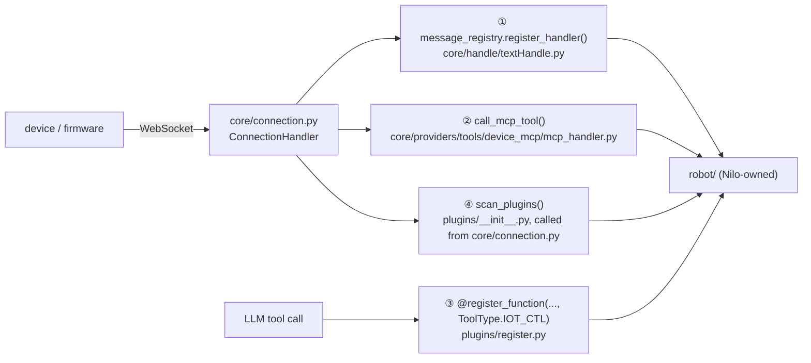

# Development

How to set up, run, test and extend `nilo-server`. Deployment (Docker, Compose, images) is in
[deployment.md](deployment.md); a first-run walkthrough is in
[getting-started.md](getting-started.md).

## Repository layout

```
Nilo/                           repository root
├── Makefile                    every command in this page has a target here
├── Dockerfile-server           runtime image (FROM the base image)
├── Dockerfile-server-base      base image: python:3.12-slim + system deps
├── README.md                   product overview and status
├── LICENSE
├── docs/                       this documentation tree
├── scripts/
│   ├── check_docs.py           validates docs links, repo paths, env vars and branding (run in CI)
│   ├── smoke_check.py          probes a running server on every protocol route (stdlib + websockets)
│   └── sync-upstream.sh        advances the vendored `upstream` branch
├── .github/
│   ├── workflows/              test.yml, docker-image.yml, build-base-image.yml
│   ├── PULL_REQUEST_TEMPLATE.md
│   ├── ISSUE_TEMPLATE/         bug_report, feature_request, documentation, config
│   └── dependabot.yml          weekly pip updates for main/nilo-server, monthly Actions
└── main/nilo-server/           the Python server
```

Inside `main/nilo-server/`:

| Path | Owner | What it holds |
|---|---|---|
| `app.py` | Nilo | Entry point: loads config, starts the WebSocket server and the HTTP server as two asyncio tasks, logs the enabled routes |
| `config/` | inherited, edited | `config_loader.py` (YAML layering, `NILO_*` overrides; `DEPRECATED_KEYS` is empty — there are no config aliases left), `settings.py`, `logger.py`, `opus_loader.py`, `placeholders.py`, `assets/` (prompt audio) |
| `core/` | inherited | `connection.py`, `websocket_server.py`, `http_server.py`, `api/` (OTA, vision), `handle/` (text and audio message handling), `providers/` (ASR/TTS/LLM/VLLM/VAD/memory/intent/tools), `utils/` |
| `plugins/` | inherited | Unified plugin system: `BasePlugin` interceptors and `@register_function` tools ([plugins/README.md](../main/nilo-server/plugins/README.md)) |
| `plugins_func/` | inherited | Shipped tool functions (`get_time`, `get_weather`, `play_music`, …) plus back-compat re-exports of `plugins.register` |
| `robot/` | Nilo | Nilo-owned package: `protocol/` (route registry), `state/` (domain models, freshness, state store), `events/` (typed events, async bounded bus), `devices/` (robot registry, tool and capability registries, MCP discovery), `runtime.py` (the control plane), `session.py` (the seam onto a live session) and `logging.py`. See [robot-domain.md](robot-domain.md) |
| `tests/` | Nilo | pytest suite; `conftest.py` sets `NILO_CONFIG`; `fixtures/test_config.yaml` is an empty override |
| `performance_tester/` | inherited | Standalone latency benchmarks for ASR, TTS, LLM and vision-LLM providers |
| `models/` | vendored | Silero VAD source and SenseVoiceSmall configuration; weights are not tracked (`model.pt` is gitignored) |
| `libs/` | vendored | Prebuilt Opus shared libraries (`win/x64`, `mac/x64`, `mac/arm64`) |
| `config.yaml` | Nilo | Shipped defaults; user overrides go in `data/.config.yaml` (gitignored) |
| `.ruff.toml`, `mypy.ini`, `pyproject.toml` | see below | Lint, type-check and pytest configuration |
| `data/` | runtime | User config, firmware uploads under `data/bin/`, runtime state. Gitignored in full |

Which parts are inherited from the upstream project and how they are synced:
[upstream.md](upstream.md). What was renamed and deleted during the migration:
[migration.md](migration.md).

## Development environment

Requirements: **Python 3.12**, `ffmpeg` on the PATH (`app.py` calls `check_ffmpeg_installed()`
at startup), and an Opus shared library — bundled in `libs/` for Windows and macOS, installed
as `libopus0` on Linux.

```bash
cd main/nilo-server
python3.12 -m venv .venv && . .venv/bin/activate
```

There are two dependency tiers, and which one you need depends on what you are doing:

| File | Size | Installs | Enough for |
|---|---|---|---|
| `requirements-dev.txt` | 10 pins | pytest, pytest-asyncio, freezegun, ruff, mypy, plus PyYAML, httpx, cnlunar, pydantic, loguru | `make lint`, `make typecheck`, and most of `make test` |
| `requirements.txt` | 39 pins | The full runtime: torch/torchaudio 2.2.2, funasr, modelscope, silero_vad, opuslib_next, aiohttp, websockets, openai, mcp, … | Running the server, and the tests that touch aiohttp/websockets/numpy |

```bash
pip install -r requirements-dev.txt                      # fast slice: lint, types, most tests
pip install -r requirements.txt -r requirements-dev.txt  # everything
```

The dev slice exists because installing torch and funasr takes minutes and hundreds of
megabytes; the test suite is deliberately written so that the useful part of it runs without
them (see [Tests](#tests)).

**macOS:** `requirements.txt` pins `vosk==0.3.45; sys_platform != "darwin"` because vosk
publishes no macOS wheels. pip skips it automatically — no editing required; the `vosk` ASR
provider is simply unavailable on macOS.

**Version pins:** `torch`/`torchaudio` are pinned together because funasr requires that pair,
`numpy` is left unpinned so the resolver can solve, and `websockets` is held at `14.2` because
`cozepy` requires `<15`. Dependabot proposes weekly pip updates against `main/nilo-server`.

## Running locally

The server needs a user override file. In normal use that is `data/.config.yaml`; for a
throwaway run, point `NILO_CONFIG` at any YAML file instead:

```bash
cd main/nilo-server
echo '{}' > /tmp/nilo-dev.yaml
NILO_CONFIG=/tmp/nilo-dev.yaml python app.py
```

If neither exists, startup fails fast with a `FileNotFoundError` naming the path
(`config/settings.py:check_config_file`, reached through `config/logger.py:setup_logging`).
An empty file is valid — every key then comes from `config.yaml`.

Run from `main/nilo-server`, not from the repository root. The provider factories test for a
provider module with a **relative** path (`os.path.join('core', 'providers', 'llm', …)` in
`core/utils/llm.py`), so a different working directory makes every provider look unsupported.
`make run` does the `cd` for you.

Five environment variables are recognised; they override both config files
([configuration.md](configuration.md)):

| Variable | Overrides |
|---|---|
| `NILO_CONFIG` | Path of the user override file (default `data/.config.yaml`) |
| `NILO_SERVER_HOST` | `server.ip` |
| `NILO_SERVER_PORT` | `server.port` (WebSocket, default 8000) |
| `NILO_HTTP_PORT` | `server.http_port` (HTTP/OTA, default 8003) |
| `NILO_LOG_LEVEL` | `log.log_level` |

Against a running server, `scripts/smoke_check.py` checks the OTA endpoint, the WebSocket
handshake and the hello exchange on every enabled protocol route, and separately checks that
the routes this server retired answer 404. It also reports how an unknown WebSocket path is
handled — rejected unless `protocols.strict` is false:

```bash
make smoke                       # HOST=127.0.0.1 WS_PORT=8000 HTTP_PORT=8003 by default
python scripts/smoke_check.py --host 127.0.0.1 --ws-port 8000 --http-port 8003
```

## Make targets

The `Makefile` at the repository root is the short form of every command below. `PY` defaults
to `python`; override it to use a specific interpreter (`make test PY=.venv/bin/python`).

| Target | Runs |
|---|---|
| `make test` | `cd main/nilo-server && python -m pytest -q` |
| `make lint` | `cd main/nilo-server && ruff check .` |
| `make typecheck` | `cd main/nilo-server && mypy` |
| `make check-docs` | `python scripts/check_docs.py` — links, repo paths, `NILO_*` names, branding |
| `make run` | `cd main/nilo-server && python app.py` |
| `make compose-validate` | `cd main/nilo-server && docker compose -f docker-compose.yml config --quiet` |
| `make docker-build` | Builds `ghcr.io/aa-box/nilo-server:base` and `:latest` |
| `make smoke` | `python scripts/smoke_check.py` against a running server |
| `make help` | Lists the above |

## Formatting and linting

Ruff, configured in `main/nilo-server/.ruff.toml` — a separate file rather than a
`[tool.ruff]` block, because `pyproject.toml` is vendored from upstream and every line added
there is a line that can conflict on the next sync.

```bash
make lint          # or: cd main/nilo-server && ruff check .
```

The rule set is deliberately narrow. It is a **repo-wide floor**: bug-only rules that are
already green on the inherited tree, so CI can gate on them today without reformatting ~30k
lines of inherited Python.

| Selected | Catches |
|---|---|
| `E9` | Syntax and IO errors |
| `F63` | Comparison and assertion bugs (`is` with a literal, assert on a tuple) |
| `F7` | Misplaced statements (`break` outside a loop, `return` outside a function) |
| `F82` | Undefined names, undefined locals |
| `F811` | Redefinition of an unused name |
| `PLE` | Pylint errors (bad string format, invalid `__all__`) |
| `B002`, `B011`, `B018` | `++n` no-ops, `assert False`, useless expressions |

Settings: `target-version = "py312"`, `line-length = 120`; `.venv`, `data`, `tmp`, `models`
and `libs` are excluded. No style or import-order rules are enabled, so Ruff will not reformat
inherited code out from under an upstream merge.

**Planned:** a second tier, `robot/.ruff.toml`, extending this file with the full style and
typing rule set so new Nilo code is held to a higher bar than the vendored tree. It does not
exist yet; see [robot-roadmap.md](robot-roadmap.md).

## Tests

pytest, configured in `pyproject.toml` (`asyncio_mode = "auto"`, `testpaths = ["tests"]`,
`addopts = "-ra"`).

```bash
make test          # or: cd main/nilo-server && python -m pytest -q
```

`tests/conftest.py` does two things before any test imports a project module:

1. Inserts the `main/nilo-server` directory at the front of `sys.path`, so the implicit
   top-level imports the inherited code uses (`from core.utils.textUtils import …`) resolve.
2. Sets `NILO_CONFIG` (via `setdefault`) to `tests/fixtures/test_config.yaml` — a committed,
   empty (`{}`) override file. Tests therefore never read or write your `data/.config.yaml`,
   and the config and logging machinery works on a machine that has never been configured.

With the full dependency set the suite is 232 tests and runs in about two seconds. Coverage
today: the config loader and `NILO_*` overrides, the robot domain layer (models, state store,
event bus, registry, MCP discovery, the session seam — [robot-domain.md](robot-domain.md)),
`robot/protocol`, the HTTP routes and the WebSocket path gate, the plugin registry and loader,
text/dialogue/time utilities, the Compose file, and an import test that walks every
first-party module.

### What skips without the full dependencies

Three modules call `pytest.importorskip` at module scope, so the whole file is skipped when
the heavy runtime packages are missing:

| Test module | Requires |
|---|---|
| `tests/core/test_http_routes.py` | `aiohttp`, `opuslib_next`, `numpy`, `pydub` |
| `tests/core/test_ws_path_gate.py` | `websockets`, `opuslib_next`, `numpy` |
| `tests/plugins_func/test_loadplugins.py` | `opuslib_next`, `numpy` |

`tests/test_imports.py` is parametrized over every module in `config`, `core`, `plugins`,
`plugins_func` and `robot` and skips the individual modules whose optional provider
dependency is not installed, rather than failing.

CI runs the suite twice for exactly this reason — once with `requirements.txt` +
`requirements-dev.txt`, once with `requirements-dev.txt` alone — so a change that silently
makes the fast slice unrunnable is caught.

## Type checking

mypy, configured in `main/nilo-server/mypy.ini` (again a separate file, same reason as
`.ruff.toml`).

```bash
make typecheck     # or: cd main/nilo-server && mypy
```

`files = robot`, so the bare `mypy` command checks only the Nilo-owned package — `mypy .` is
not a goal and would report thousands of errors on untyped inherited code.

| Scope | Settings |
|---|---|
| `robot.*` | Strict: `disallow_untyped_defs`, `disallow_incomplete_defs`, `disallow_untyped_calls`, `disallow_any_generics`, `no_implicit_optional`, `warn_return_any`, `strict_equality` |
| `core.*`, `config.*`, `plugins.*`, `plugins_func.*` | `ignore_errors = True`, `follow_imports = skip` — robot code may import them without inheriting their errors |
| `opuslib_next`, `funasr`, `silero_vad`, `cnlunar`, `loguru`, `ormsgpack`, `aioconsole` | `ignore_missing_imports = True` (no stubs published) |

New code under `robot/` is written fully annotated from the start. Both `ruff check .` and
`mypy` are green on the current tree.

## Continuous integration

`.github/workflows/test.yml` runs on pushes to `main`/`develop` and on every pull request,
with `working-directory: main/nilo-server`:

| Job | What it does |
|---|---|
| Lint and type-check | `pip install -r requirements-dev.txt`, then `ruff check .`, `mypy`, and `python scripts/check_docs.py` from the repository root |
| Python 3.12, full dependencies | Installs both requirements files, runs `pytest -q` |
| Python 3.12, dev dependencies only | Installs `requirements-dev.txt` alone, runs `pytest -q` |
| Docker Compose validates | `docker compose -f docker-compose.yml config --quiet` |

Two more workflows build images: `docker-image.yml` and `build-base-image.yml`
(see [deployment.md](deployment.md)).

## Where Nilo-specific code goes

The rule, stated in [`main/nilo-server/CLAUDE.md`](../main/nilo-server/CLAUDE.md) and expanded
in [robot-architecture.md](robot-architecture.md):

> New robot functionality goes under `robot/`; attach to `core/` through the smallest possible
> hook. Every line changed in `core/` is a line that conflicts on the next upstream port.

`robot/` is the only Nilo-owned Python package. It is strictly typed, product-neutral in its
vocabulary (see [branding.md](branding.md)), and today contains the protocol registry and the
robot domain layer — models, state store, event bus, robot registry and MCP capability
discovery ([robot-domain.md](robot-domain.md)). Actions, behaviour, personality, robot
memory, the simulator and the safety policy are **Planned**, not implemented.

The inherited server offers four extension points that need no edit to `core/`:



| Seam | Code | Use it for |
|---|---|---|
| ① Inbound message types | `core/handle/textHandle.py:message_registry` → `core/handle/textMessageHandlerRegistry.py:TextMessageHandlerRegistry.register_handler` | New JSON `type` values on the device WebSocket. The registry keys on `handler.message_type.value` with no `isinstance` check, so a robot-owned enum works. Do not reuse the names in `robot/protocol/nilo.py:RESERVED_MESSAGE_TYPES` |
| ② Outbound device calls | `core/providers/tools/device_mcp/mcp_handler.py:call_mcp_tool` | Invoking a tool the device published over MCP. Pass an explicit short `timeout`; the default is 30 s |
| ③ LLM-visible tools | `plugins/register.py:register_function` with `ToolType.IOT_CTL` | `core/providers/tools/server_plugins/plugin_executor.py:ServerPluginExecutor.get_tools` exposes a function to the LLM if its name is in `necessary_functions`, in `config["Intent"][selected]["functions"]`, or if its type code is `IOT_CTL` — the last is the only branch that needs no config edit |
| ④ Bootstrap | `plugins/__init__.py:scan_plugins`, called at import of `core/connection.py` | A new `plugins/<name>/__init__.py` directory is never a merge conflict. It runs at import time, before the event loop exists, so defer async work |

Two traps worth repeating: `ToolType` exists twice with different members — import it from
`plugins.register`, not from `core.providers.tools.base` — and plugin import failures are
swallowed and printed by `plugins/__init__.py:_import_module_safe`, so a new plugin should assert its own
registration rather than trust the log.

When a `core/` edit really is unavoidable, keep it to a few lines, wrap it so a failure cannot
break a voice session, and list it under "Inherited-code changes" in the pull request.

## Plugin development

Full guide: [`plugins/README.md`](../main/nilo-server/plugins/README.md). In short, one
directory per plugin under `plugins/`, each with an `__init__.py`, which may contain either or
both of:

* **An interceptor** — a `plugins/base.py:BasePlugin` subclass whose
  `async def pre_process_text(self, conn, text)` returns `(text, PluginAction)`.
  `RELEASE` passes the text on, `INTERCEPT` speaks the returned text and skips the LLM,
  `CLOSE` does that and then closes the connection. Its `__init__` must accept a `logger`
  keyword — `plugins/__init__.py:register_plugins_to_conn` instantiates it with `logger=conn.logger`.
* **Tool functions** — decorated with `@register_function(name, openai_function_schema, ToolType.…)`
  from `plugins/register.py`, returning an `ActionResponse(Action.…, result, response)`.
  `ToolType` is one of `NONE`, `WAIT`, `CHANGE_SYS_PROMPT`, `SYSTEM_CTL`, `IOT_CTL`,
  `MCP_CLIENT`; `Action` is one of `ERROR`, `NOTFOUND`, `NONE`, `RESPONSE`, `REQLLM`, `RECORD`.

`scan_plugins()` treats every subdirectory with an `__init__.py` as a plugin, skipping names
that begin with `_` or `.` and the `functions/` directory. Every discovered plugin is enabled
at priority 100, because the server constructs `PluginManager()` without a config path. The
tools that ship with the server live in `plugins_func/functions/` and are loaded separately by
`core/connection.py` via `auto_import_modules("plugins_func.functions")`. How tools reach the
LLM alongside device IoT, device MCP and remote MCP tools: [mcp.md](mcp.md).

## Adding a provider

Providers are resolved by filename. Drop a module into the right directory and add a config
block whose `type` matches that filename — no registry to edit. The factory is
`create_instance` in the matching `core/utils/<kind>.py`, and it looks for the module relative
to the working directory, so it only resolves when the process was started from
`main/nilo-server`.

| Kind | Module path | Class the module must define | Config section |
|---|---|---|---|
| ASR | `core/providers/asr/<type>.py` | `ASRProvider` | `ASR` |
| TTS | `core/providers/tts/<type>.py` | `TTSProvider` | `TTS` |
| VAD | `core/providers/vad/<type>.py` | `VADProvider` | `VAD` |
| Vision LLM | `core/providers/vllm/<type>.py` | `VLLMProvider` | `VLLM` |
| LLM | `core/providers/llm/<type>/<type>.py` | `LLMProvider` | `LLM` |
| Intent | `core/providers/intent/<type>/<type>.py` | `IntentProvider` | `Intent` |
| Memory | `core/providers/memory/<type>/<type>.py` | `MemoryProvider` | `Memory` |

Each kind has a `base.py` with the abstract base to subclass. The config block's name is what
`selected_module` points at; its `type` field (defaulting to the block name) is what selects
the module. An unknown type raises `ValueError: Unsupported <kind> type: … - check the 'type'
field of that config block`. Provider inventory and per-provider keys:
[providers.md](providers.md) and [configuration.md](configuration.md).

## Performance testing

`performance_tester/` holds standalone benchmarks that instantiate the providers your config
selects and measure latency. They are inherited code, and they are **not** part of the pytest
suite.

| Module | Measures |
|---|---|
| `performance_tester_llm.py` | LLM first-token and total latency, using `module_test.test_sentences` and the prompt template |
| `performance_tester_asr.py` | Batch ASR over the WAV files it finds |
| `performance_tester_stream_asr.py` | Streaming ASR |
| `performance_tester_tts.py` | Batch TTS |
| `performance_tester_stream_tts.py` | Streaming TTS |
| `performance_tester_vllm.py` | Vision LLM |

Run them as modules from `main/nilo-server` — they use the same implicit top-level imports as
the rest of the server, so running the file by path fails with `ModuleNotFoundError: No module
named 'core'`:

```bash
cd main/nilo-server
python -m performance_tester.performance_tester_llm
```

They need the full `requirements.txt`, real credentials in your config for the providers you
want measured, and `tabulate`, which is imported for the report table but is not pinned in
either requirements file — `pip install tabulate` before the first run.

## Commit and pull request conventions

`.github/PULL_REQUEST_TEMPLATE.md` asks for a summary, a checklist, an explicit list of
inherited-code changes, and the commands you ran. The checklist:

- [ ] `make lint` and `make typecheck` pass
- [ ] `make test` passes (full dependencies, or the dev slice with the relevant tests un-skipped)
- [ ] Devices still connect on `/nilo/v1/`, if this touches the protocol or server startup
- [ ] Docs under `docs/` updated for any behaviour, config key, route or command that changed
- [ ] No new Chinese-language strings, no product branding in domain code (see [branding.md](branding.md))
- [ ] Changes to inherited `core/` code are minimal and noted below

The last two are the ones that are easy to trip over. English only in code, comments, log
lines and docs; the product name belongs at product boundaries (process name, env vars,
routes, logs) and never in domain class or module names. If you did touch `core/`, `config/`
or `plugins_func/`, list the files and say why a `robot/`-side hook was not enough.

Branch targets are `main` and `develop`; `upstream` is a vendor branch that must never receive
Nilo commits.

## Porting upstream changes

Inherited code is synced by merging the vendored `upstream` branch, not by cherry-picking:

```bash
./scripts/sync-upstream.sh          # advance `upstream` to upstream main
./scripts/sync-upstream.sh v0.9.6   # or a specific tag
git merge upstream
```

The expected conflict classes and how to resolve each of them — renames, deleted components,
comment-only hunks, `config.yaml`, `requirements.txt` — are documented in
[upstream.md](upstream.md). Read it before the first merge.

## Frontend and management API

There are none. The inherited Java management console (`manager-api`), its Vue web UI
(`manager-web`), the mobile client (`manager-mobile`) and the browser test client were all
removed during the migration; `nilo-server` is a single Python process configured by YAML
files. Details and rationale: [migration.md](migration.md). A Nilo management API is
**Planned** ([robot-roadmap.md](robot-roadmap.md)).
