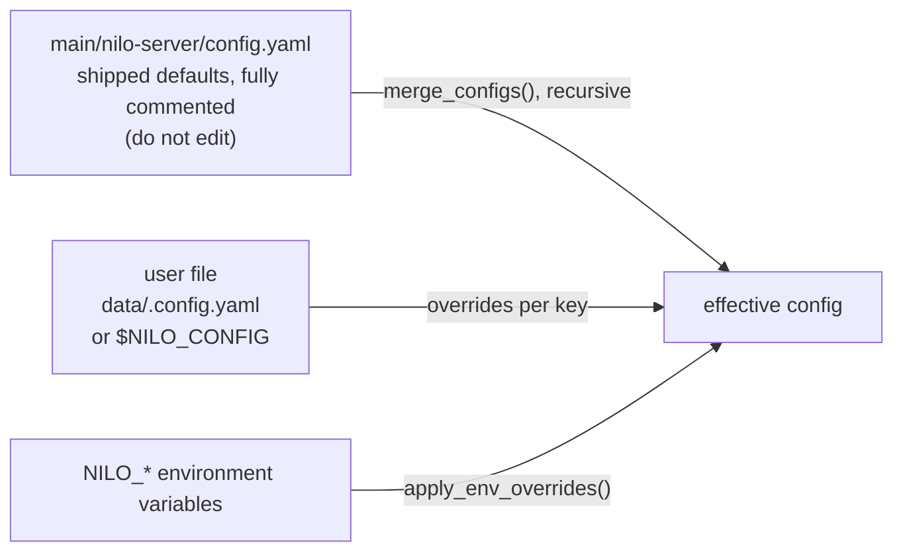
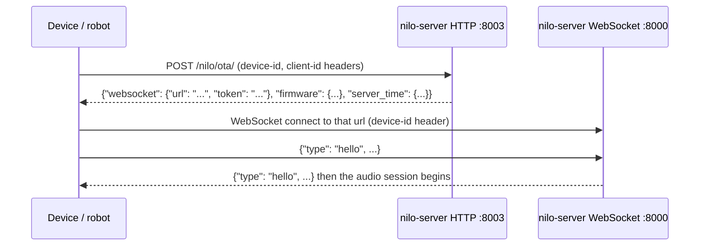

# Getting started

This page takes you from a clean machine to a running Nilo Server that a device can connect to,
and lists the errors you are most likely to hit on the way.

What you get at the end: **a voice session server**. A device opens a WebSocket, streams Opus
audio, and the server runs voice activity detection, speech recognition, an LLM with tool calling,
and text-to-speech, streaming audio back. That part is **Implemented**. The robot domain layer
(actions, behaviour, world model, robot memory, simulator, safety policy) is **Planned** — only
the protocol registry under `robot/` exists today, so nothing on this page moves a motor. See
[robot-architecture.md](robot-architecture.md) and [robot-roadmap.md](robot-roadmap.md) for where
that is going.

---

## 1. Requirements

| Requirement | Why | Notes |
|---|---|---|
| Python 3.12 | The only version that is built and tested | CI (`.github/workflows/test.yml`), the Docker base image (`Dockerfile-server-base`, `python:3.12-slim`), Ruff (`target-version = "py312"`) and mypy (`python_version = 3.12`) all target 3.12 |
| `ffmpeg` on the PATH | Audio decoding/transcoding for TTS output via pydub | Checked at startup by `core/utils/util.py:check_ffmpeg_installed` |
| An Opus shared library | Every audio frame on the wire is Opus | Loaded at import time by `config/opus_loader.py:setup_opus` |
| An LLM API key | Any OpenAI-compatible endpoint works | Configured in section 4 |
| A speech recognition backend | Either the local FunASR model (a download) or a cloud ASR key | Section 3 |
| ~2 GB RAM or more | The local FunASR provider logs an error below 2 GB | `core/providers/asr/fun_local.py` |

### Opus per platform

`setup_opus()` tries the system library first (`ctypes.util.find_library`), then falls back to the
libraries bundled in the repository under `libs/<platform>/<arch>/`:

| Platform | System library it looks for | Bundled fallback | Shipped in this repo? |
|---|---|---|---|
| Linux x64 / arm64 | `libopus.so.0`, `libopus.so` | `libs/linux/x64/libopus.so`, `libs/linux/arm64/libopus.so` | **No** — install it yourself |
| macOS arm64 / x64 | `libopus.dylib` | `libs/mac/arm64/libopus.dylib`, `libs/mac/x64/libopus.dylib` | Yes |
| Windows x64 | `opus` | `libs/win/x64/opus.dll` | Yes |

On Linux install the system package before starting the server:

```bash
sudo apt-get install -y libopus0 ffmpeg     # Debian/Ubuntu; what Dockerfile-server-base does
```

On macOS the bundled `libs/mac/<arch>/libopus.dylib` is used automatically; install ffmpeg with
`brew install ffmpeg`.

---

## 2. Install

```bash
git clone https://github.com/AA-Box/Nilo.git nilo
cd nilo/main/nilo-server
python3.12 -m venv .venv && source .venv/bin/activate
pip install -r requirements.txt
```

`main/nilo-server/requirements.txt` pins the runtime: torch/torchaudio 2.2.2 (for FunASR),
`websockets==14.2`, the provider SDKs, `mcp`, `aiohttp`, `loguru`. One entry is conditional:

```
vosk==0.3.45; sys_platform != "darwin"  # no macOS wheels
```

so a macOS install silently skips Vosk — the `VoskASR` provider is simply unavailable there.
Everything else installs on all three platforms.

For tests, lint and type checking, install the dev file as well:

```bash
pip install -r requirements-dev.txt
```

`main/nilo-server/requirements-dev.txt` holds pytest, ruff and mypy plus the small runtime slice
the test suite actually imports (PyYAML, httpx, cnlunar, pydantic, loguru), so `pytest -q` runs
without torch or FunASR installed — tests that need the full runtime skip themselves. See
[testing.md](testing.md) and [development.md](development.md).

---

## 3. Speech recognition: local model or cloud

The shipped default is `selected_module.ASR: FunASR`, which loads a local SenseVoiceSmall model
from `ASR.FunASR.model_dir` (default `models/SenseVoiceSmall`) through `funasr.AutoModel`
(`core/providers/asr/fun_local.py`). The repository ships that directory's config and tokenizer
files but **not** the weights — `models/SenseVoiceSmall/model.pt` is in `.gitignore`.

**Option A — download the weights** (verified against `modelscope download --help`; `repo_id` and
the file list are positional, `--local-dir` writes straight into the directory):

```bash
# from main/nilo-server
modelscope download iic/SenseVoiceSmall model.pt --local-dir models/SenseVoiceSmall
```

**Option B — use a cloud ASR and skip the download.** Add this to your user config file (section 4)
instead; no model file is needed:

```yaml
selected_module:
  ASR: OpenaiASR
ASR:
  OpenaiASR:
    api_key: sk-your-key
```

`OpenaiASR` and `GroqASR` are already defined in `main/nilo-server/config.yaml` with their
`base_url` and `model_name`, so overriding only `api_key` is enough. The full provider list is in
[providers.md](providers.md).

> If you skip both, the server still starts: `funasr.AutoModel` builds the model graph from the
> shipped `config.yaml` without weights and logs nothing unusual. Transcription will just not work.

---

## 4. Configure

Configuration is three layers, later wins (`config/config_loader.py`):



* `config/config_loader.py:custom_config_path` resolves the user file as `$NILO_CONFIG`, or
  `data/.config.yaml` relative to the server directory when that variable is unset.
* `merge_configs()` merges recursively, so your file only needs the keys that differ.
* **The user file must exist**, even if empty — see the first troubleshooting entry.
* Environment overrides are applied last and win over both files:

| Variable | Config key it sets | Default |
|---|---|---|
| `NILO_CONFIG` | *(path of the user config file itself)* | `data/.config.yaml` |
| `NILO_SERVER_HOST` | `server.ip` | `0.0.0.0` |
| `NILO_SERVER_PORT` | `server.port` (WebSocket) | `8000` |
| `NILO_HTTP_PORT` | `server.http_port` (HTTP/OTA) | `8003` |
| `NILO_LOG_LEVEL` | `log.log_level` | `INFO` |

These five are the whole set: the four config overrides in `ENV_OVERRIDES`, plus `NILO_CONFIG`, which
`custom_config_path()` reads to locate the user file itself (both in `config/config_loader.py`).
Everything else is configured in YAML; the full reference is [configuration.md](configuration.md).

### Minimal user config

The default `selected_module` picks `SileroVAD`, `FunASR`, `ChatGLMLLM`, `EdgeTTS`, `nomem` and
`function_call`. VAD and Edge TTS need no credentials, so the smallest useful override is an LLM:

```bash
# from main/nilo-server
mkdir -p data && cat > data/.config.yaml <<'YAML'
selected_module:
  LLM: MyLLM
LLM:
  MyLLM:
    type: openai
    base_url: https://api.openai.com/v1
    model_name: gpt-4o-mini
    api_key: sk-your-key
YAML
```

* `type: openai` selects the OpenAI-compatible adapter, which works against any endpoint that
  speaks the OpenAI chat-completions API (OpenAI, DeepSeek, Doubao, LM Studio, a local gateway…).
* That adapter accepts either `base_url` or `url` for the endpoint
  (`core/providers/llm/openai/openai.py:LLMProvider.__init__` prefers `base_url`).
* The name under `LLM:` is yours; `selected_module.LLM` must reference the same name, and the API
  key must be set on **that** entry — the key on any other provider block is ignored.

One option worth knowing about immediately:

```yaml
TTS:
  EdgeTTS:
    voice: en-US-AriaNeural   # the shipped default voice is a Chinese one
```

---

## 5. Start the server

```bash
# from main/nilo-server, with the virtualenv active
python app.py
```

`make run` from the repository root does the same thing (`Makefile`). A successful start looks
like this — the last block is what you need:

```
260912 19:31:29[0.1.0_00000000000000][config.opus_loader]-INFO-Detected platform/architecture: darwin arm64
260912 19:31:29[0.1.0_00000000000000][config.opus_loader]-INFO-Successfully loaded Opus library: .../libs/mac/arm64/libopus.dylib
260912 19:31:29[0.1.0_00000000000000][__main__]-INFO-nilo-server 0.1.0 starting
260912 19:31:29[0.1.0_00000000000000][core.utils.modules_initialize]-INFO-Initialized component: llm MyLLM
260912 19:31:29[0.1.0_00000000000000][core.utils.modules_initialize]-INFO-Initialized component: intent function_call
260912 19:31:29[0.1.0_00000000000000][core.utils.modules_initialize]-INFO-Initialized component: memory nomem
260912 19:31:29[0.1.0_00000000000000][core.utils.modules_initialize]-INFO-Initialized component: vad SileroVAD
260912 19:31:32[0.1.0_00000000000000][core.utils.modules_initialize]-INFO-Initialized component: asr FunASR
260912 19:31:32[0.1.0_00000000000000][__main__]-INFO-OTA endpoint [nilo]:	http://192.168.1.80:8003/nilo/ota/
260912 19:31:32[0.1.0_00000000000000][__main__]-INFO-WebSocket endpoint [nilo]:	ws://192.168.1.80:8000/nilo/v1/
260912 19:31:32[0.1.0_00000000000000][__main__]-INFO-Vision endpoint:	http://192.168.1.80:8003/mcp/vision/explain
260912 19:31:32[0.1.0_00000000000000][__main__]-INFO-The WebSocket endpoints above are for devices; open the OTA endpoint in a browser to check the server.
```

Reading that:

* One pair of endpoints is printed **per enabled protocol** (`app.py` iterates
  `registry_from_config(config).enabled()`). There is exactly one protocol — `nilo`
  (`robot/protocol/nilo.py`, `ALL_PROTOCOLS` in `robot/protocol/__init__.py`) — so one pair is
  all you should ever see.
* The host in those URLs is the machine's LAN address from `get_local_ip()`. It is informational;
  the server binds `server.ip` (`0.0.0.0` by default) on ports 8000 and 8003.
* The OTA lines are only printed in standalone mode — with a `manager-api` configured
  (`read_config_from_api`), the OTA routes are not registered at all (`core/http_server.py`).
* The log prefix is `<time>[<version>_<module-abbreviations>][<tag>]-<level>-<message>`
  (`config/logger.py`); logs also go to `tmp/server.log` with 10 MB rotation.

Stop with Ctrl-C: `app.py` installs SIGINT/SIGTERM handlers and prints `nilo-server stopped.`

---

## 6. Connect a client

A device never hard-codes the WebSocket URL. It calls the **OTA endpoint** over HTTP and is told
where to connect:



Point a new device at `http://<host>:8003/nilo/ota/`. That is the only OTA bootstrap route the
server serves (`core/api/ota_handler.py`, registered once per enabled protocol by
`core/http_server.py` next to the firmware download route `/nilo/ota/download/{filename}`), and
`/nilo/v1/` is the only WebSocket path the handshake accepts. A device whose firmware bakes in some
other path has to be reflashed against `/nilo/ota/`; no other route answers and nothing falls back.

A `GET` on the same URL is a human health check — open it in a browser:

```
$ curl http://127.0.0.1:8003/nilo/ota/
OTA endpoint is running normally; websocket URL sent to devices: ws://192.168.1.80:8000/nilo/v1/

$ curl -s -X POST http://127.0.0.1:8003/nilo/ota/ \
    -H 'device-id: 00:11:22:33:44:55' -H 'client-id: my-client' -d '{}'
{"server_time":{"timestamp":1789234481373,"timezone_offset":480},
 "firmware":{"version":"0.0.0","url":""},
 "websocket":{"url":"ws://192.168.1.80:8000/nilo/v1/","token":""}}
```

`device-id` and `client-id` headers are mandatory on `POST`; without them the handler answers
`{"success":false,"message":"request error."}`. The `token` is empty until `server.auth.enabled`
is turned on. If the advertised URL is wrong for your network (Docker, a public deployment, TLS),
set `server.websocket` explicitly — see [deployment.md](deployment.md).

### Synthetic client

`scripts/smoke_check.py` is a dependency-light client that exercises every route so you can verify
the server without hardware. It needs only the stdlib plus `websockets`:

```bash
# from the repository root, against a server on the default ports
python scripts/smoke_check.py --host 127.0.0.1 --ws-port 8000 --http-port 8003
```

```
[PASS] nilo            GET /nilo/ota/ -> 200; POST -> 200; ws /nilo/v1/ -> ok
[info] unknown ws path -> rejected (404) (rejected unless protocols.strict is false)
```

Between those two lines it prints one `[PASS] retired …` line per route this server used to serve
and no longer does (the `RETIRED` tuple in the script): the retired OTA route has to answer 404 and
the retired WebSocket path has to be rejected at the handshake, which is how you confirm the removed
routes really are gone.

It exits 0 when every enabled route answers and every retired route is gone, 1 otherwise.
`make smoke` runs it with `HOST`, `WS_PORT` and `HTTP_PORT` environment overrides;
`--expect-disabled <name>` inverts the expectation for a protocol you turned off. The wire format
it speaks is documented in [protocol.md](protocol.md).

---

## 7. Run it in Docker

Two images: a base image with the system libraries and Python dependencies
(`Dockerfile-server-base`), and a thin application image on top of it (`Dockerfile-server`).
`main/nilo-server/docker-compose.yml` runs `ghcr.io/aa-box/nilo-server:latest`, so **that image
has to exist before Compose can start**: either pull it from the registry, or build both images
locally first.

```bash
# from the repository root - builds ghcr.io/aa-box/nilo-server:base then :latest
make docker-build
```

`Dockerfile-server` takes `ARG BASE_IMAGE=ghcr.io/aa-box/nilo-server:base`, so the base must be
built (or published) before the application image; `make docker-build` does them in that order.

```bash
cd main/nilo-server
mkdir -p data models
docker compose up -d
docker compose logs -f
```

What the Compose file sets up:

| | |
|---|---|
| Ports | `8000:8000` (WebSocket), `8003:8003` (HTTP OTA + `/mcp/vision/explain`) |
| Environment | `TZ`, `NILO_SERVER_HOST`, `NILO_SERVER_PORT`, `NILO_HTTP_PORT`, `NILO_LOG_LEVEL` |
| Volumes | `./data` → `/opt/nilo-server/data` (your `.config.yaml` lives here), and `./models/SenseVoiceSmall/model.pt` → the same path in the container |

The model volume is a **file** bind mount: create or download `models/SenseVoiceSmall/model.pt` on
the host first, or delete that volume line if you configured a cloud ASR. Validate the file
without starting anything with `make compose-validate` (`docker compose config --quiet`).

Behind a reverse proxy or on a public host, set `server.websocket` and `server.vision_explain` to
the externally reachable URLs — the auto-generated LAN address will be wrong. Full options:
[deployment.md](deployment.md).

---

## 8. Troubleshooting

Failures happen in a fixed order at startup: the user config file is checked while `app.py` is
still importing modules, then Opus is loaded, then ffmpeg is probed, then providers are built,
then the ports are bound.

### `FileNotFoundError: User config file not found`

```
FileNotFoundError: User config file not found: /path/to/main/nilo-server/data/.config.yaml.
Create it (an empty file is fine) or point NILO_CONFIG at your config file.
See docs/getting-started.md.
```

Raised by `config/settings.py:check_config_file`, which runs from `config/logger.py` before the
first log line — so this traceback appears with no Nilo log output at all. Fix:

```bash
mkdir -p data && touch data/.config.yaml     # an empty file is valid; defaults apply
# or
NILO_CONFIG=/etc/nilo/config.yaml python app.py
```

The same function also raises a `ValueError` for a user config that sets both `manager-api`
(remote configuration) and `selected_module` (local module selection): pick one or the other.

### `RuntimeError: Failed to load the Opus library.`

```
Failed to load the Opus library. Put the Opus shared library for your platform under libs/:
  - Windows: libs/win/x64/opus.dll
  - macOS (Apple Silicon): libs/mac/arm64/libopus.dylib
  - macOS (Intel): libs/mac/x64/libopus.dylib
  - Linux (ARM): libs/linux/arm64/libopus.so
  - Linux (x64): libs/linux/x64/libopus.so
```

Raised at import time in `main/nilo-server/app.py` when `setup_opus()` returns `False`. On Linux
this almost always means the system package is missing — `sudo apt-get install -y libopus0` — or
drop the `.so` into the path the message names. Run with `NILO_LOG_LEVEL=DEBUG` to see every
search path `config/opus_loader.py` tried.

### `ValueError: ffmpeg is not working properly.`

Raised by `core/utils/util.py:check_ffmpeg_installed`, the first statement of `main()`, when
`ffmpeg -version` cannot be run or does not print a version. The message lists suggestions and
appends a specific hint for two cases: a missing `libiconv.so.2`
(`conda install -c conda-forge libiconv`) and an ffmpeg binary that is not on the PATH
(`conda install -c conda-forge ffmpeg`); otherwise it prints the raw error from the subprocess.
Outside conda, install ffmpeg with your OS package manager (`apt-get install ffmpeg`,
`brew install ffmpeg`).

### `Configuration error: the API key for LLM is not set`

```
[core.providers.llm.openai.openai]-ERROR-Configuration error: the API key for LLM is not set (current value: <your-chatglm-api-key>)
```

`core/utils/util.py:check_model_key` flags any value that still contains a template placeholder
(`config/placeholders.py` treats a string containing `<your` as unset). This is **logged, not
raised** — the server keeps running and fails later on the first LLM call. Seeing the shipped
provider's name in the message (`<your-chatglm-api-key>` above) means `selected_module.LLM` still
points at a default entry rather than at your own block. The same check guards TTS, vision-LLM and
memory providers.

### The server prints its endpoints but nothing can connect

The endpoint lines are logged from `app.py` right after the server tasks are created, **before**
the sockets are bound, so they are printed even when binding fails. A port clash looks like this:

```
[core.http_server]-ERROR-HTTP server failed to start: [Errno 48] error while attempting to bind on address ('0.0.0.0', 8003): [errno 48] address already in use
```

The process does **not** exit. Free the port, or move the server:

```bash
NILO_SERVER_PORT=18000 NILO_HTTP_PORT=18003 python app.py
```

Then confirm with `python scripts/smoke_check.py --ws-port 18000 --http-port 18003`.

### `AssertionError: models/... is not registered`

The FunASR model directory does not exist. `funasr.AutoModel` treats an unknown path as a model
name, fails to fetch it, and the assertion aborts startup before any endpoint is printed. Check
`ASR.FunASR.model_dir` and run the `modelscope download` command from section 3, or switch to a
cloud ASR.

Note the asymmetry: a directory that exists but has no `model.pt` does **not** fail — the server
starts normally and only transcription is broken. If ASR returns nothing, verify that
`models/SenseVoiceSmall/model.pt` is really there.

### A connection is refused or immediately closed

* `Connect with a device-id header or ?device-id= query parameter.` — the WebSocket handshake
  carried no device identity; send a `device-id` header or `?device-id=` in the query string
  (`core/websocket_server.py`).
* `authentication failed` — `server.auth.enabled` is on and the token is missing or invalid. Get
  one from the OTA response, or add the device to `server.auth.allowed_devices`.
* `unknown protocol path`, HTTP 404 — the WebSocket path is not an enabled protocol route.
  `protocols.strict` ships as `true`, so `/nilo/v1/` is the only path accepted and the server logs
  `rejected WebSocket path ...` (`core/websocket_server.py:_http_response`). Set it to `false` to
  restore the old permissive behaviour.

---

## Connect a robot without hardware

The quickest way to see the robot layers do something is the simulator: a client that speaks
the whole device protocol, publishes 15 hardware capabilities as device MCP tools, moves over
time and reports telemetry. With the server running, in a second terminal:

```bash
cd main/nilo-server
python -m robot.simulator --server ws://127.0.0.1:8000/nilo/v1/ --robot-id nilo-sim-01 --scenario person_enters_room
```

The server log shows it register and its tools appear; `python -m robot.simulator --status`
prints the robot's own state. Full reference, including scenarios and failure injection:
[robot-simulator.md](robot-simulator.md).

---

## Next steps

* [configuration.md](configuration.md) — every config key, layering rules, provider selection
* [architecture.md](architecture.md) — what runs inside the server today
* [protocol.md](protocol.md) — the device wire protocol, message by message
* [providers.md](providers.md) — every ASR/TTS/LLM/VLLM/memory/intent adapter and its config block
* [audio.md](audio.md) — the VAD → ASR → LLM → TTS pipeline and barge-in
* [mcp.md](mcp.md) — exposing the device's own capabilities to the agent as tools
* [deployment.md](deployment.md) — Docker, reverse proxies, public deployments
* [development.md](development.md) and [testing.md](testing.md) — layout, conventions, the suite
* [robot-simulator.md](robot-simulator.md) — the simulated robot, scenarios and failure injection
* [robot-domain.md](robot-domain.md) — the robot layers that run today
* [robot-architecture.md](robot-architecture.md), [safety-model.md](safety-model.md),
  [robot-roadmap.md](robot-roadmap.md) — the planned robot layers
* [upstream.md](upstream.md), [migration.md](migration.md), [branding.md](branding.md) — provenance
  and naming rules
