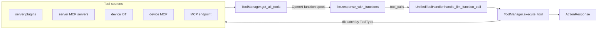
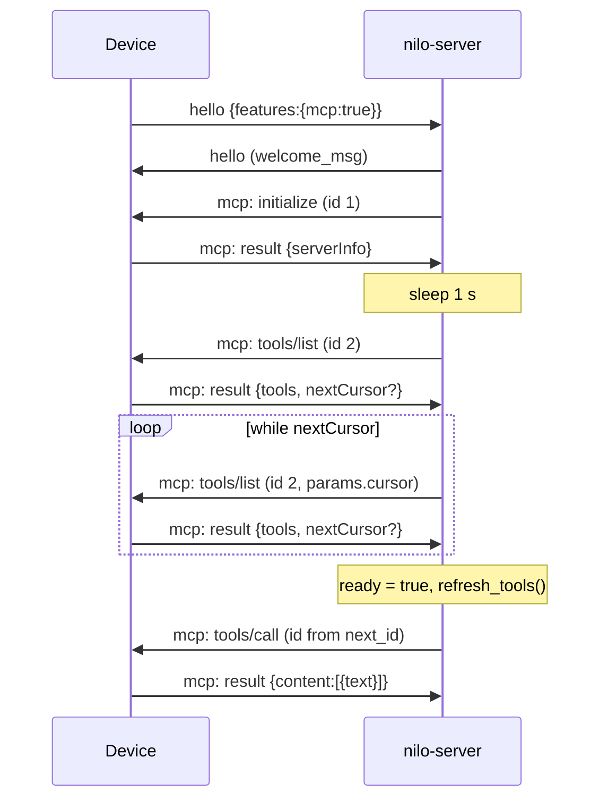
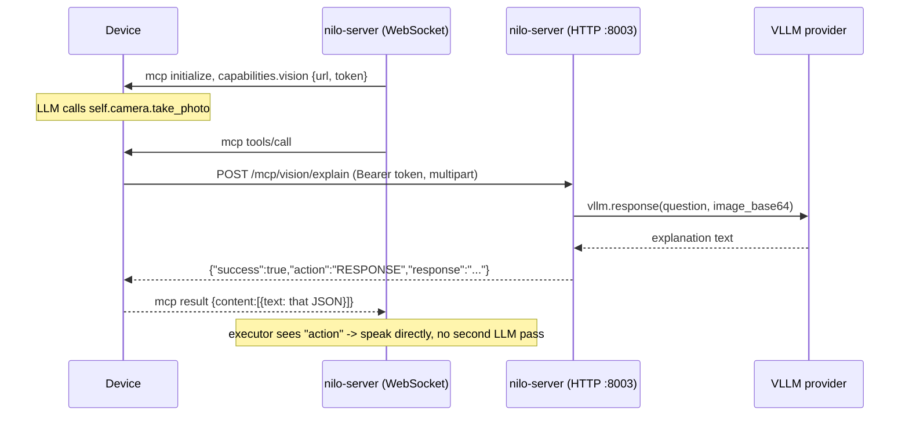

# MCP

nilo-server speaks the Model Context Protocol (JSON-RPC 2.0) in three different directions,
and folds all of them into a single OpenAI-style function list that the LLM sees.

| Direction | Who hosts the MCP server | Transport | Status |
|---|---|---|---|
| **Device MCP** | the connected device (robot / ESP32 firmware) | JSON-RPC tunnelled inside the existing device WebSocket session | Implemented |
| **MCP endpoint** | an external broker service | a second WebSocket that nilo-server dials per device connection | Implemented |
| **Server MCP** | local or remote MCP servers listed in `data/.mcp_server_settings.json` | stdio subprocess, SSE, or Streamable HTTP | Implemented |

A fourth MCP-adjacent surface is the **vision endpoint** (`/mcp/vision/explain`): not MCP
itself, but the device reaches it with a token that nilo-server hands over inside the MCP
`initialize` message.

The robot action layer described at the end of this page (`move`, `look_at`, …) is
**Planned**. Nothing in the current tree exposes motion tools; see
[robot-architecture.md](robot-architecture.md).

---

## 1. The unified tool pipeline

Every tool source is an implementation of `ToolExecutor`
(`core/providers/tools/base/tool_executor.py`), registered against a `ToolType`
(`core/providers/tools/base/tool_types.py`).

| `ToolType` | Executor | Tools come from | MCP? |
|---|---|---|---|
| `SERVER_PLUGIN` | `ServerPluginExecutor` | the `@register_function` registry in `plugins/register.py` | no |
| `SERVER_MCP` | `ServerMCPExecutor` | `data/.mcp_server_settings.json` | yes |
| `DEVICE_IOT` | `DeviceIoTExecutor` | the `iot` descriptors sent by the device | no |
| `DEVICE_MCP` | `DeviceMCPExecutor` | the device's own `tools/list` | yes |
| `MCP_ENDPOINT` | `MCPEndpointExecutor` | the `mcp_endpoint` broker's `tools/list` | yes |

One `UnifiedToolHandler` is created per device connection, at the end of
`core/connection.py:ConnectionHandler._initialize_intent` (itself called from
`_initialize_components`), which then schedules `UnifiedToolHandler._initialize` on the
event loop. Its constructor builds all five
executors and registers them with a `ToolManager` in this order: `SERVER_PLUGIN`,
`SERVER_MCP`, `DEVICE_IOT`, `DEVICE_MCP`, `MCP_ENDPOINT`
(`core/providers/tools/unified_tool_handler.py:UnifiedToolHandler.__init__`).



Key behaviours of `core/providers/tools/unified_tool_manager.py:ToolManager`:

* `get_all_tools` iterates the executors **in registration order** and writes each tool into
  one flat `name -> ToolDefinition` dict. On a duplicate name it logs
  `Tool name conflict: {name}` at WARNING and **keeps the later one** — so an MCP endpoint
  tool shadows a device MCP tool, which shadows an IoT tool, which shadows a server plugin
  of the same name. There is no namespacing and no prefixing.
* `get_function_descriptions` returns each `ToolDefinition.description` verbatim; that list is
  what `core/connection.py` passes to `llm.response_with_functions(...)`, after appending the
  virtual `direct_answer` tool (`core/connection.py:DIRECT_ANSWER_TOOL`) at recursion depth 0.
* Both results are cached until `refresh_tools()` invalidates them. MCP code calls
  `refresh_tools()` after a `tools/list` completes, which is why device tools only appear in
  the function list once discovery finishes.
* `execute_tool` resolves the name to a `ToolType`, dispatches to that executor, and turns any
  escaping exception into `ActionResponse(action=Action.ERROR)`.

The caller-side timeout is separate from the MCP timeouts: both call sites wait on the tool
future for `tool_call_timeout` seconds (top-level config key, default `30`, shipped in
`config.yaml`) — see `core/connection.py` (streaming tool calls) and
`core/handle/intentHandler.py` (intent-triggered calls). On expiry the user hears a canned
error string and the flow continues.

An `ActionResponse` decides what happens next (`plugins/register.py:Action`):

| Action | Effect |
|---|---|
| `RESPONSE` | the text is spoken directly, no further LLM call |
| `REQLLM` | the result is appended as a `tool` message and the LLM is asked again |
| `RECORD` | the tool-call chain is written into history without another LLM call |
| `NOTFOUND` / `ERROR` | the text is spoken as an error |

---

## 2. Device MCP

**Status: Implemented.** Handshake, discovery and calls all live in
`core/providers/tools/device_mcp/`.

### 2.1 Envelope

Every device MCP frame is a normal text message on the device WebSocket session with the
type `mcp` and a JSON-RPC 2.0 object in `payload`:

```json
{"type": "mcp", "payload": {"jsonrpc": "2.0", "id": 2, "method": "tools/list"}}
```

Outbound frames are built by `device_mcp/mcp_handler.py:send_mcp_message`, which refuses to
send at all unless `conn.features.get("mcp")` is true (it logs
`Client does not support MCP; cannot send MCP message`). Inbound frames are routed by
message type (`core/handle/textMessageType.py:TextMessageType.MCP`) to
`core/handle/textHandler/mcpMessageHandler.py:McpTextMessageHandler.handle`, which hands the
payload to `handle_mcp_message` in a fire-and-forget `asyncio.create_task` — MCP traffic never
blocks the receive loop. `mcp` is one of the reserved wire-level message types listed in
`robot/protocol/nilo.py:RESERVED_MESSAGE_TYPES`; see [protocol.md](protocol.md).

### 2.2 Initialization

The device advertises MCP support in its `hello`. `core/handle/helloHandle.py:handleHelloMessage`
stores `msg_json["features"]` on the connection, creates `conn.mcp_client = MCPClient()` when
`features.mcp` is true, sends the server `hello`, and only then schedules
`send_mcp_initialize_message(conn)` — the device is not expected to process MCP frames before
it has the server hello.



`send_mcp_initialize_message` (`device_mcp/mcp_handler.py`) sends:

| Field | Value |
|---|---|
| `id` | `1` (the hard-coded initialize id) |
| `params.protocolVersion` | `"2024-11-05"` |
| `params.capabilities.roots` | `{"listChanged": true}` |
| `params.capabilities.sampling` | `{}` |
| `params.capabilities.vision` | `{"url": <vision URL>, "token": <JWT>}` — see [§4](#4-vision-over-mcp) |
| `params.clientInfo` | `{"name": "nilo-server", "version": "1.0.0"}` |

The `clientInfo.name` is one of the few places the product name legitimately appears on the
wire ([branding.md](branding.md)). Note what is **not** sent: there is no `withUserTools`
parameter and no `notifications/initialized` notification on the device channel (the MCP
endpoint channel does send that notification; see [§5](#5-mcp-endpoint)).

On the `initialize` result `handle_mcp_message` logs the device's `serverInfo`, waits one
second (`await asyncio.sleep(1)`), and then sends `tools/list`.

### 2.3 Tool discovery

`tools/list` uses the hard-coded id `2`, and every continuation page reuses that same id with
`params.cursor` set to the previous `nextCursor`
(`send_mcp_tools_list_request` / `send_mcp_tools_list_continue_request`).

For each entry in `result.tools`, `handle_mcp_message` keeps exactly three fields:

* `name` — stored after sanitizing (see below);
* `description` — a plain string;
* `inputSchema` — rebuilt as `{"type": schema.type or "object", "properties": schema.properties
  or {}, "required": [only string entries]}`.

Everything else in the schema is dropped. nilo-server itself imposes **no restriction on
argument types** — whatever JSON Schema `properties` object the device sends is forwarded to
the LLM unchanged. Any narrower type system (integers-only, no nested objects, page-size caps
on `tools/list`) is a property of the device firmware, not of this server, and is not
expressed anywhere in this repository.

Names are sanitized by `core/utils/util.py:sanitize_tool_name`, which replaces every character
outside `[a-zA-Z0-9_\-]` and CJK with `_`. The sanitized name is the dict key and the name the
LLM sees; the original is kept in `MCPClient.name_mapping` and restored for the actual
`tools/call` (`device_mcp/mcp_client.py:MCPClient.add_tool`). So a firmware tool called
`self.camera.take_photo` reaches the LLM as `self_camera_take_photo`. After **each** page, every
tool *description* collected so far is rewritten by substituting original names with sanitized
names, so descriptions that cross-reference other tools stay callable.

Pagination ends when `nextCursor` is absent or empty. Only then does the client become ready
(`MCPClient.set_ready(True)`) and call `conn.func_handler.tool_manager.refresh_tools()` plus
`current_support_functions()`, which logs `Currently supported functions: [...]` — the line to
grep for when checking whether a device tool actually landed.

### 2.4 Calling a tool

`device_mcp/mcp_handler.py:call_mcp_tool(conn, mcp_client, tool_name, args="{}", timeout=30)`:

1. Refuses if the client is not ready (`RuntimeError`) or the tool is unknown (`ValueError`).
2. Allocates an id from `MCPClient.get_next_id()` and registers an `asyncio.Future` in
   `MCPClient.call_results` under that id.
3. Normalizes arguments: a dict is used as-is; a string is `json.loads`-ed; if that fails it
   falls back to a regex (`\{[^{}]*\}`) that finds multiple flat JSON objects in the string and
   merges them — a tolerance for LLMs that emit two argument blobs in one field. Anything that
   still fails raises `ValueError`.
4. Sends `{"method": "tools/call", "params": {"name": <original name>, "arguments": {...}}}`.
5. Waits with `asyncio.wait_for(..., timeout)`.

Result handling: `isError: true` raises `RuntimeError`; otherwise, if `content` is a non-empty
list whose first element is a dict with a `text` key, that **text is returned as-is** (no JSON
parsing at this layer); anything else is returned as `str(raw_result)`. Only `content[0]` is
read — additional content parts and non-text parts (for example images) are lost.

On timeout the pending future is removed from `call_results` and `TimeoutError` is raised.

### 2.5 Message ids, and a collision to be aware of

Two ids are hard-coded — `1` for `initialize` and `2` for `tools/list` — while
`MCPClient.next_id` also starts at `1` (`device_mcp/mcp_client.py`). The first two tool calls
of a session therefore reuse ids `1` and `2`. `handle_mcp_message` checks
`msg_id in mcp_client.call_results` **before** the `msg_id == 1` / `msg_id == 2` branches, so a
pending tool call always wins the id: in practice a late or duplicated `initialize` /
`tools/list` response arriving after a tool call has started would be delivered to that tool
call's future instead of being treated as a handshake response. The same pattern exists on the
MCP endpoint client (`mcp_endpoint/mcp_endpoint_client.py`, `mcp_endpoint_handler.py`).

Related gotcha for anyone editing this code: `device_mcp/mcp_handler.py` contains a second copy
of the `MCPClient` class, identical apart from a trailing period in its docstring. The package
re-exports the one from
`device_mcp/mcp_client.py` (`device_mcp/__init__.py`), which is the class actually used by
`core/handle/helloHandle.py`. The copy inside `mcp_handler.py` is dead code.

### 2.6 Becoming LLM functions

`device_mcp/mcp_executor.py:DeviceMCPExecutor.get_tools` asks
`conn.mcp_client.get_available_tools()` — which renders each stored tool as
`{"type": "function", "function": {"name", "description", "parameters": {type, properties,
required}}}` and caches the list until a new tool is added — and wraps each entry in a
`ToolDefinition(..., tool_type=ToolType.DEVICE_MCP)` whose `description` **is** that whole dict.
That is what reaches the LLM.

`DeviceMCPExecutor.execute` then:

* returns `ERROR` when `conn.mcp_client` is missing or not ready;
* serializes `arguments` with `json.dumps` and calls `call_mcp_tool` **without** a timeout
  argument, so device tool calls always use the 30 s default;
* if the returned string parses as a JSON object containing an `action` key, returns
  `ActionResponse(action=Action[...], response=...)` — the **short-circuit** that skips the
  second LLM pass (this is how vision answers are spoken immediately);
* otherwise returns `Action.REQLLM` with the raw result;
* maps `ValueError` to `NOTFOUND` and every other exception to `ERROR`.

Note that nilo-server never injects `device_id` into tool arguments, and the LLM cannot supply it
either: `core/utils/prompt_manager.py` hands `device_id` to the template renderer, but the shipped
template (`agent-base-prompt.txt`) never references it, so it never reaches the prompt. A device
tool that needs its own id has to know it firmware-side.

---

## 3. Server-side MCP servers

**Status: Implemented.** `core/providers/tools/server_mcp/` uses the official `mcp` Python
SDK (pinned in `requirements.txt`).

Configuration lives in `data/.mcp_server_settings.json`, resolved as
`get_project_dir() + "data/.mcp_server_settings.json"`
(`server_mcp/mcp_manager.py:ServerMCPManager.__init__`). If the file does not exist the manager
logs a warning and simply contributes no tools. Only the `mcpServers` object is read; the
`des` and `link` keys in the shipped template are documentation and are ignored. A ready-made
template with Home Assistant, filesystem, playwright, windows-cli, SSE and Streamable HTTP
examples ships as `mcp_server_settings.json` at the server root — copy it to
`data/.mcp_server_settings.json` (note the leading dot) and strip what you do not need.

| Entry key | Meaning | Code |
|---|---|---|
| `command` + `args` + `env` | launch as a **stdio** subprocess; `npx` is resolved through `shutil.which`, `env` is merged over `os.environ` | `server_mcp/mcp_client.py:ServerMCPClient._worker` |
| `url` | remote server; **SSE** by default | same |
| `transport` | `streamable-http` or `http` selects the Streamable HTTP client; anything else falls back to SSE | same |
| `headers` | sent with SSE / Streamable HTTP requests | same |
| `timeout` | connect timeout — default `5` for SSE, `30` for Streamable HTTP | same |
| `sse_read_timeout` | default `300` (5 minutes) for both | same |
| `terminate_on_close` | Streamable HTTP only, default `true` | same |
| `API_ACCESS_TOKEN` | **deprecated** for `url` entries: it is turned into `Authorization: Bearer …` and logs a warning telling you to put it in `headers` instead | same |

An entry with neither `command` nor `url` is skipped with a warning
(`ServerMCPManager.initialize_servers`).

Lifecycle:

* All servers are initialized concurrently (`asyncio.gather`), each bounded by a **10 s**
  timeout; a server that times out or throws is cleaned up and contributes no tools.
* Each `ServerMCPClient` runs its session inside one long-lived worker task holding an
  `AsyncExitStack`, calls `session.initialize()` and `session.list_tools()`, sanitizes names
  with the same `sanitize_tool_name`, and exposes tools as OpenAI functions whose `parameters`
  is the **raw** `inputSchema` object (unlike the device and endpoint clients, which rebuild it).
* `ServerMCPManager.execute_tool` retries a failing call up to **3 times**, 2 s apart, tearing
  down and re-creating the client from config between attempts.
* `ServerMCPExecutor.execute` strips a leading `mcp_` from the tool name before dispatch and
  returns `Action.REQLLM` with `str(result)` — the raw SDK `CallToolResult`, stringified.
* `logging_callback` and `progress_callback` forward server logs and progress into the
  nilo-server log at INFO.
* `UnifiedToolHandler.cleanup` calls `ServerMCPExecutor.cleanup`, which closes every client
  with a 20 s timeout per client.

Because the handler is per connection, **each connected device gets its own set of MCP server
processes/sessions**. A stdio server listed here is spawned once per active device session, not
once per server process.

---

## 4. Vision over MCP

**Status: Implemented.**

The photo path is a deliberate detour around the WebSocket: the device takes a picture and
POSTs it over HTTP, so image bytes never travel through the audio session.



**Where the token is minted.** In `send_mcp_initialize_message`
(`device_mcp/mcp_handler.py`), once per connection, at handshake time:
`AuthToken(conn.config["server"]["auth_key"]).generate_token(conn.headers.get("device-id"))`.
`core/utils/auth.py:AuthToken.generate_token` builds an HS256 JWT whose single `data` claim is
an AES-GCM-encrypted blob holding `device_id` and an expiry **one hour** in the future. The
token is never refreshed, so vision calls on a session older than an hour fail with 401.
`server.auth_key` itself is resolved at startup as `server.auth_key` → `manager-api.secret` →
a fresh `uuid4().hex` (`app.py:resolve_auth_key`), so leaving it unset invalidates every token
on restart.

**The URL** comes from `core/utils/util.py:get_vision_url`: `server.vision_explain` if set and
not a placeholder, otherwise `http://<local ip>:<server.http_port>/mcp/vision/explain`
(default port 8003). `app.py` also logs a vision endpoint line at startup, but it always prints
the derived `http://<local ip>:<http_port>/...` form — it never consults `server.vision_explain`.

**The endpoint** is registered unconditionally — with or without `read_config_from_api` —
as GET/POST/OPTIONS `/mcp/vision/explain` (`core/http_server.py:SimpleHttpServer._build_app`,
asserted by `tests/core/test_http_routes.py`). This path predates the Nilo route scheme and is
not one of the `/nilo/...` device routes.

`core/api/vision_handler.py:VisionHandler.handle_post` enforces, in order:

1. `Authorization: Bearer <jwt>` verified with `AuthToken(server.auth_key)`; failure → HTTP 401
   with `{"success": false, "message": ...}`. There is no test-client bypass.
2. The `Device-Id` header must equal the `device_id` inside the token.
3. multipart parts read **positionally**: first the `question` text, then the image file.
4. `MAX_FILE_SIZE` = 5 MB, and a magic-byte check via `core/utils/util.py:is_valid_image_file`
   (JPEG, PNG, GIF, BMP, TIFF, WEBP).
5. The VLLM provider named by `selected_module.VLLM` is instantiated per request through
   `core/utils/vllm.py:create_instance` (see [providers.md](providers.md)); when
   `read_config_from_api` is true the per-device config is fetched first.

The success body is `{"success": true, "action": "RESPONSE", "response": <text>}` — and that
`action` key is exactly what `DeviceMCPExecutor.execute` looks for to skip the second LLM pass.

`GET /mcp/vision/explain` is a health check that returns plain text naming the configured URL,
or tells you to set `server.vision_explain`:

```bash
curl http://localhost:8003/mcp/vision/explain
```

---

## 5. MCP endpoint

**Status: Implemented.** The endpoint is an external broker: instead of the device hosting
tools, nilo-server dials a WebSocket that fronts somebody else's MCP server.

Enabled by the top-level config key `mcp_endpoint` (`config.yaml`). It is ignored when empty,
equal to `"null"`, or still a placeholder (`config/placeholders.py:is_placeholder`, which
matches `<your` and the legacy Chinese marker).

At startup `app.py` validates it with `core/utils/util.py:validate_mcp_endpoint`, which
requires the URL to start with `ws`, to contain `/mcp/`, and to contain neither `key` nor
`call` (case-insensitive). An invalid value is logged as an error and reset to the placeholder.
A valid value is logged and then **rewritten**: `app.py` replaces `/mcp/` with `/call/` before
storing it back into the config, because the URL you are given is the endpoint's management
URL and its `/call/` twin is the one that carries JSON-RPC. So
`ws://host:8004/mcp_endpoint/mcp/?token=…` is dialled as `ws://host:8004/mcp_endpoint/call/?token=…`.

Connection flow, per device connection, in
`core/providers/tools/mcp_endpoint/mcp_endpoint_handler.py:connect_mcp_endpoint` (invoked from
`UnifiedToolHandler._initialize_mcp_endpoint`):

1. `websockets.connect(url)`; the client is stored as `conn.mcp_endpoint_client`.
2. A background `_message_listener` task starts; it sets `ready = False` when the socket closes.
3. `initialize` (id 1) — same `protocolVersion` `2024-11-05` and
   `clientInfo {"name": "nilo-server", "version": "1.0.0"}` as the device channel, but
   **without** the `vision` capability.
4. `notifications/initialized` (a notification, no id).
5. `tools/list` (id 2), with the same `nextCursor` pagination, name sanitizing, description
   rewriting and `refresh_tools()` behaviour as the device channel.

Calls go through `call_mcp_endpoint_tool(mcp_client, tool_name, args, timeout=30)`, which is a
line-for-line twin of `call_mcp_tool` — same argument-merging tolerance, same `content[0].text`
extraction, same `isError` handling. `MCPEndpointExecutor` mirrors `DeviceMCPExecutor`,
including the `{"action": ...}` short-circuit, and never overrides the 30 s default.
`UnifiedToolHandler.cleanup` closes the endpoint WebSocket.

Unlike the device channel, a failed connect is not fatal: `connect_mcp_endpoint` returns `None`
and the handler logs `MCP endpoint initialization failed` and continues without those tools.

---

## 6. Timeouts, limits and error handling

| Thing | Value | Code |
|---|---|---|
| Device `tools/call` | 30 s (default, never overridden) | `device_mcp/mcp_handler.py:call_mcp_tool`, `device_mcp/mcp_executor.py` |
| MCP endpoint `tools/call` | 30 s (default, never overridden) | `mcp_endpoint/mcp_endpoint_handler.py:call_mcp_endpoint_tool` |
| Outer wait on any tool future | `tool_call_timeout`, default 30 s | `config.yaml`, `core/connection.py`, `core/handle/intentHandler.py` |
| Pause between `initialize` and `tools/list` | 1 s | `device_mcp/mcp_handler.py:handle_mcp_message` |
| Server MCP server startup | 10 s per server | `server_mcp/mcp_manager.py:ServerMCPManager._init_server` |
| Server MCP call retries | 3 attempts, 2 s apart, reconnect between | `server_mcp/mcp_manager.py:ServerMCPManager.execute_tool` |
| Server MCP shutdown | 20 s per client | `server_mcp/mcp_manager.py:ServerMCPManager.cleanup_all`, `ServerMCPClient.cleanup` |
| SSE / Streamable HTTP read timeout | 300 s default | `server_mcp/mcp_client.py:ServerMCPClient._worker` |
| Vision upload size | 5 MB | `core/api/vision_handler.py:MAX_FILE_SIZE` |
| Vision token lifetime | 1 hour, not refreshed | `core/utils/auth.py:AuthToken.generate_token` |
| Tool-name sanitizing | non-`[A-Za-z0-9_-]`, non-CJK → `_` | `core/utils/util.py:sanitize_tool_name` |

Error mapping for device MCP and MCP endpoint tools (`mcp_executor.py`, `mcp_endpoint_executor.py`):

| Situation | Result |
|---|---|
| client object missing, or `ready` still false | `ActionResponse(ERROR)` with a "not initialized" / "not ready" message |
| tool name unknown to the client | `ValueError` → `ActionResponse(NOTFOUND)` |
| arguments unparseable after the merge fallback | `ValueError` → `ActionResponse(NOTFOUND)` |
| no response within the tool timeout | `TimeoutError` → `ActionResponse(ERROR)`; the pending future is dropped |
| JSON-RPC `error` frame with a matching id | the future is rejected with `MCP error: <message>` (endpoint channel: `MCP endpoint error: <message>`) → `ActionResponse(ERROR)` |
| `result.isError == true` | `RuntimeError: Tool call error: …` → `ActionResponse(ERROR)` |
| result text parses to an object with `action` | that `Action`, spoken directly |
| anything else | `ActionResponse(REQLLM)` with the stringified result |

Two caveats worth knowing when debugging:

* Pending device tool-call futures are only removed on their own timeout. Closing the session
  does not reject them — `UnifiedToolHandler.cleanup` touches the server MCP clients and the
  endpoint socket but never `conn.mcp_client.call_results`.
* An unexpected `action` string in a tool result raises `KeyError` inside `Action[...]`, which
  the executor's generic `except` turns into `ActionResponse(ERROR)`.

---

## 7. Configuration reference

| Key | Where | Meaning |
|---|---|---|
| `mcp_endpoint` | top-level, `config.yaml` | MCP endpoint WebSocket URL; `/mcp/` is rewritten to `/call/` at startup. Placeholder or `null` disables it |
| `tool_call_timeout` | top-level, `config.yaml` | seconds to wait for any tool call, default `30` |
| `server.vision_explain` | `config.yaml` | URL the device is told to POST photos to; auto-derived from the local IP and `server.http_port` when unset |
| `server.http_port` | `config.yaml` | port serving `/mcp/vision/explain`, default `8003` |
| `server.auth_key` | `config.yaml` | signing key for the vision JWT; falls back to `manager-api.secret`, then a random value per start |
| `selected_module.VLLM` | `config.yaml` | vision model used by `/mcp/vision/explain` |
| `data/.mcp_server_settings.json` | file | server-side MCP servers (`mcpServers` object only) |

Of these, only `server.http_port` has an environment override (`NILO_HTTP_PORT`); the complete
set is `NILO_CONFIG`, `NILO_SERVER_HOST`, `NILO_SERVER_PORT`, `NILO_HTTP_PORT` and
`NILO_LOG_LEVEL`. See [configuration.md](configuration.md).

---

## 8. Robot hardware over MCP

**Status: partly implemented.** The backend half exists — `robot/devices/` discovers a
device's tools, `robot/telemetry.py` turns its `notifications/*` into world state, and
`robot/actions/` plus `robot/safety/` decide what may be dispatched and send it with an
explicit short timeout ([robot-actions.md](robot-actions.md)). The simulator publishes a
full hardware tool table over this channel ([robot-simulator.md](robot-simulator.md)).

What is still design: the LLM-facing `robot_*` tool schemas (Phase 4), the behaviour engine
and the world model beyond per-robot state — see [robot-architecture.md](robot-architecture.md)
and [robot-roadmap.md](robot-roadmap.md).

The intended shape follows directly from what is implemented above, and the design constraints
are worth stating now because they are cheap to honour and expensive to retrofit:

* **Firmware exposes semantic actions, not motors.** Tools such as `move`, `turn`, `look_at`,
  `follow`, `play_animation` and `stop` — each one a complete, interruptible intent with units
  in the parameter names. No `set_motor_pwm`, no per-joint tools: raw actuator control over a
  channel whose round trip is an LLM decision is neither safe nor tunable, and it burns the
  tool-list budget that keeps the prompt cacheable.
* **The backend validates before forwarding.** A planned safety policy sits between
  `ToolManager.execute_tool` and the device MCP `tools/call`, so that every motion request is
  checked (envelope limits, cooldowns, cliff/obstacle state, an always-available stop) rather
  than trusted because the model asked nicely. See [safety.md](safety.md).
* **Perception reuses the vision short-circuit.** The `{"action": "RESPONSE", "response": …}`
  convention already implemented for `/mcp/vision/explain` is the lowest-latency
  perceive-and-react path in the codebase; robot perception tools should return the same shape
  instead of inventing a second one.
* **Naming stays product-neutral and firmware-compatible.** Tool names are device-side
  vocabulary, they get sanitized (`.` → `_`) before the LLM ever sees them, and they must not
  collide with tools from the other four sources — `ToolManager` resolves collisions silently
  except for a WARNING line.

Until that layer exists, a robot built on Nilo can already move: a device that exposes motion
tools through its own MCP server gets them called by the LLM exactly like any other device
tool, with **no validation beyond the JSON Schema the device itself published**.

---

## See also

* [architecture.md](architecture.md) — where the tool layer sits in the server
* [protocol.md](protocol.md) — the device session and its message types
* [configuration.md](configuration.md) — config loading and precedence
* [providers.md](providers.md) — LLM and VLLM provider selection
* [robot-architecture.md](robot-architecture.md), [safety.md](safety.md) — the planned robot layers
* [upstream.md](upstream.md) — provenance of the MCP implementation
