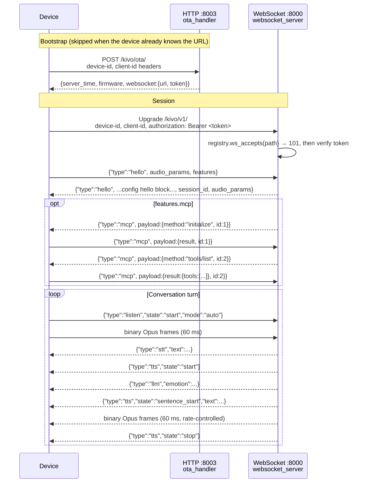

# Device protocol

**Status: Implemented.** Everything on this page exists in `kivo-server` today and is covered by
`tests/robot/test_protocol.py`, `tests/core/test_ws_path_gate.py` and `tests/core/test_http_routes.py`.

A Kivo device talks to the server over one long-lived WebSocket session that carries **JSON control
messages** and **binary Opus audio**, bootstrapped by a plain **HTTP OTA request** that tells the
device where that WebSocket lives. Both halves are served by the single `python app.py` process:
the WebSocket on `server.port` (default 8000), the OTA endpoint on `server.http_port` (default 8003).

---

## 1. The protocol abstraction

Routes are not hard-coded anywhere in the application. `robot/protocol/` owns them, and the rest of
the server asks the registry which routes exist.

| Object | Where | What it is |
|---|---|---|
| `ProtocolSpec` | `robot/protocol/base.py` | A frozen pydantic model: `name`, `ws_path`, `ota_path`, `enabled`. Both paths are validated to start and end with `/`. `ota_download_path` derives `{ota_path}download/{filename}`. |
| `ProtocolRegistry` | `robot/protocol/base.py` | The enabled/disabled view over the known specs. Provides `enabled()`, `default()`, `match_ws_path()`, `ws_accepts()`, `ws_url(host, port)`. |
| `KIVO` | `robot/protocol/kivo.py` | `ProtocolSpec(name="kivo", ws_path="/kivo/v1/", ota_path="/kivo/ota/")` |
| `LEGACY_XIAOZHI` | `robot/protocol/legacy_xiaozhi.py` | `ProtocolSpec(name="legacy_xiaozhi", ws_path="/xiaozhi/v1/", ota_path="/xiaozhi/ota/")` |
| `RESERVED_MESSAGE_TYPES` | `robot/protocol/legacy_xiaozhi.py` | The 15 JSON `type` values already spoken on the wire. New Kivo message types must not reuse them. |
| `registry_from_config(config)` | `robot/protocol/__init__.py` | Builds the registry from the `protocols:` config block. |

### Routes per protocol

| Protocol | WebSocket | OTA | Firmware download |
|---|---|---|---|
| `kivo` | `/kivo/v1/` | `/kivo/ota/` | `/kivo/ota/download/{filename}` |
| `legacy_xiaozhi` | `/xiaozhi/v1/` | `/xiaozhi/ota/` | `/xiaozhi/ota/download/{filename}` |

The vision endpoint `/mcp/vision/explain` is **not** protocol-scoped — it is registered once,
unconditionally, on the HTTP port (`core/http_server.py`). See [mcp.md](mcp.md).

### The `protocols:` config block

```yaml
protocols:
  kivo:
    enabled: true            # /kivo/v1/ and /kivo/ota/
  legacy_xiaozhi:
    enabled: true            # /xiaozhi/v1/ and /xiaozhi/ota/
  strict: false              # true = reject WebSocket paths that match no protocol above
```

| Key | Default | Effect |
|---|---|---|
| `<name>.enabled` | `true` | Disabling a protocol drops its OTA routes from the aiohttp route table and makes its WebSocket path return `404`. |
| `strict` | `false` | With `false`, a WebSocket path matching *no* protocol is still accepted (the inherited behaviour). With `true`, it is rejected. |

Order matters: `default()` returns the **first enabled** spec, and that is the protocol whose
`ws_path` the OTA endpoint advertises when `server.websocket` is unset. With the shipped defaults
that is `kivo`, so devices are steered onto `/kivo/v1/` even when they bootstrapped through the
legacy OTA route. If every protocol is disabled, `default()` raises `RuntimeError`.

Path matching ignores the query string and a missing trailing slash, so `/kivo/v1`,
`/kivo/v1/` and `/kivo/v1/?device-id=aa:bb` all resolve to the same spec
(`robot/protocol/base.py`, `_normalize`).

---

## 2. Transport: the WebSocket session

Served by `core/websocket_server.py` (`websockets.serve`, `ping_interval=None` — protocol-level
WebSocket pings are off; see the application-level `ping` message below).

### Connection credentials

A connecting device must identify itself. Headers are preferred; if the `device-id` **header** is
absent the server falls back to the URL query string for all three values:

| Header | Query parameter | Required | Notes |
|---|---|---|---|
| `device-id` | `device-id` | Yes | Usually the device MAC. Without it the server sends a plain-text notice and closes the socket. |
| `client-id` | `client-id` | No | Per-connection id; part of the token signature. |
| `authorization` | `authorization` | Only when auth is enabled | `Bearer <token>`; the token is the one the OTA response handed out. |

Authentication (`core/auth.py`, `AuthManager`) is off by default (`server.auth.enabled: false`).
When on: a `device-id` listed in `server.auth.allowed_devices` skips the check entirely; otherwise
the `Bearer` token is verified as an HMAC-SHA256 signature over `client_id|device_id|timestamp`,
with an expiry (default 30 days). A failure sends the text `authentication failed` and closes.

### Path gating and plain HTTP probes

`WebSocketServer._http_response` is installed as the `process_request` hook and runs before the
handshake completes:

| Request | Response |
|---|---|
| `Connection: Upgrade` on an enabled protocol path | Handshake proceeds (`101`). |
| `Connection: Upgrade` on a disabled or (under `strict: true`) unknown path | `404 unknown protocol path`, logged as a warning. |
| Any request without an upgrade — e.g. a browser `GET` on port 8000 | `200 kivo-server is running` |

That last row is the quickest liveness check on the WebSocket port. Invalid-handshake noise
(for example HTTPS hitting the plain WebSocket port) is filtered out of the logs by
`SuppressInvalidHandshakeFilter`.

### MQTT gateway sessions

A WebSocket whose request path ends with `?from=mqtt_gateway` is flagged
`conn_from_mqtt_gateway` (`core/connection.py`). Binary frames on such a session carry a 16-byte
header (type, payload length, sequence, timestamp) before the Opus payload, in both directions.
This is the framing an external MQTT/UDP gateway speaks; direct device sessions send bare Opus.

---

## 3. Bootstrap: the OTA endpoint

`core/api/ota_handler.py`, registered per enabled protocol by `core/http_server.py`. The routes are
registered **only** when `read_config_from_api` is `false` (standalone mode); with a management API
configured, bootstrap is that API's job and the HTTP server exposes nothing but the vision endpoint.

### `GET {ota_path}`

Returns `text/plain`: `OTA endpoint is running normally; websocket URL sent to devices: <url>`.
Open it in a browser to confirm what the server will hand devices.

### `POST {ota_path}`

**Request.** Two headers are mandatory — `device-id` and `client-id`. Missing either yields
`{"success":false,"message":"request error."}` (still HTTP 200). The JSON body is optional and is
only used as a fallback for the firmware lookup:

| Value | From headers | Fallback in body | Default |
|---|---|---|---|
| Device model | `device-model`, `device_model`, `model` | `board.type`, then `model` | `"default"` |
| Current firmware version | `device-version`, `device_version`, `firmware-version`, `app-version`, `application-version` | `application.version` | `"0.0.0"` |

**Response.** Always `server_time` and `firmware`, plus **exactly one** of `websocket` or `mqtt`:

```json
{
  "server_time": { "timestamp": 1757635200000, "timezone_offset": 480 },
  "firmware":    { "version": "1.2.3", "url": "" },
  "websocket":   { "url": "ws://192.168.1.10:8000/kivo/v1/", "token": "" }
}
```

| Field | Meaning |
|---|---|
| `server_time.timestamp` | Server epoch milliseconds. |
| `server_time.timezone_offset` | `server.timezone_offset` × 60, in minutes (shipped default `+8` → `480`). |
| `firmware.version` | The offered version, or the device's own version when there is no update. |
| `firmware.url` | Download URL, or `""` when the device is up to date. |
| `websocket.url` | `server.websocket` if set to a real value, otherwise generated as `ws://<local-ip>:<server.port><default protocol ws_path>`. |
| `websocket.token` | An `AuthManager` token when `server.auth.enabled` is true and the device is not allow-listed; otherwise `""`. |

`server.websocket` ships as the placeholder `ws://<your-host-or-domain>:<port>/kivo/v1/`;
`config/placeholders.py` recognises it as unset, so the server generates the URL instead. Behind
Docker, a reverse proxy or TLS the generated address is usually wrong — set `server.websocket`
explicitly. See [configuration.md](configuration.md) and [deployment.md](deployment.md).

**MQTT variant.** If `server.mqtt_gateway` is a non-empty `host:port` string, the response carries
an `mqtt` block *instead of* `websocket`:

| Field | Value |
|---|---|
| `endpoint` | `server.mqtt_gateway` verbatim |
| `client_id` | `GID_{model}@@@{mac}@@@{mac}`; `:` and spaces in the model part and `:` in the MAC become `_` |
| `username` | base64 of `{"ip": "unknown"}` |
| `password` | base64 HMAC-SHA256 over `client_id\|username` keyed with `server.mqtt_signature_key` (empty when the key is unset) |
| `publish_topic` | `device-server` |
| `subscribe_topic` | `devices/p2p/{mac}` |

### Firmware updates

Firmware lives in `data/bin/` and must be named `{model}_{version}.bin`. The directory listing is
cached for `firmware_cache_ttl` seconds (default 30). Versions are compared segment by segment as
integers (non-digits are separators, missing segments count as 0); the highest strictly-higher
version for the device's model wins. The generated download URL reuses the OTA path the request
arrived on, so a device that bootstrapped via the legacy route is sent a legacy download URL.

`GET {ota_path}download/{filename}` serves only basenames matching `^[A-Za-z0-9\.\-_]+\.bin$` whose
real path resolves inside `data/bin`; anything else gets 400/403/404.

---

## 4. Session handshake



The device speaks first. `core/handle/helloHandle.py:handleHelloMessage` reads two optional objects
from the client hello and then replies:

| Client hello field | Effect |
|---|---|
| `audio_params.format` | Sets `conn.audio_format`. `"pcm"` makes TTS emit raw PCM instead of Opus; anything else means Opus. |
| `audio_params` (whole object) | Echoed back inside the server hello. |
| `features.mcp` | Creates the device `MCPClient` and, right after the server hello, sends the MCP `initialize` message. See [mcp.md](mcp.md). |
| `features.aec` | Enables server-side acoustic echo cancellation and real-time barge-in. See [audio.md](audio.md). |
| `features.emoji` | Default `true`. When `false`, the server suppresses the `llm` emotion message and builds the system prompt without emoji instructions. |

The server hello is the `hello:` config block copied per connection, with `session_id` (a UUID4)
added, and the configured `audio_params` replaced by the client's when it sent them:

```yaml
hello:
  type: hello
  version: 1
  transport: websocket
  audio_params:
    format: opus
    sample_rate: 24000      # 8000, 12000, 16000, 24000 or 48000
    channels: 1
    frame_duration: 60
```

`conn.sample_rate` is read from this block and is the rate at which the server **encodes** outgoing
TTS audio. The deprecated spelling of this block is `xiaozhi:`; it still loads, renamed with a
warning by `config/config_loader.py` (`DEPRECATED_KEYS`).

---

## 5. Client → server messages

Dispatched by `core/handle/textMessageProcessor.py` through the registry in
`core/handle/textMessageHandlerRegistry.py`; the enum lives in `core/handle/textMessageType.py`.
An unknown `type` is logged as an error and dropped. A non-JSON text frame, or a bare JSON integer,
is echoed straight back to the client.

| `type` | Fields | Handler | Behaviour |
|---|---|---|---|
| `hello` | `audio_params`, `features` | `core/handle/helloHandle.py` | See above. |
| `listen` | `state`, `mode`, `text` | `core/handle/textHandler/listenMessageHandler.py` | See the state table below. |
| `abort` | — | `core/handle/abortHandle.py` | Sets the abort flag, clears the LLM/TTS queues, replies `{"type":"tts","state":"stop"}`. |
| `iot` | `descriptors`, `states` | `core/handle/textHandler/iotMessageHandler.py` | Registers device capabilities as LLM tools / updates cached device state. |
| `mcp` | `payload` | `core/handle/textHandler/mcpMessageHandler.py` | JSON-RPC 2.0 payload routed into the device MCP client. |
| `server` | `action`, `content.secret` | `core/handle/textHandler/serverMessageHandler.py` | Only honoured when `read_config_from_api` is true and `content.secret` matches `manager-api.secret`. `action` is `update_config` or `restart`. |
| `ping` | — | `core/handle/textHandler/pingMessageHandler.py` | Replies `{"type":"pong","timestamp":...}` — but only when `enable_websocket_ping: true`; otherwise silently ignored. |

### `listen` states

| `state` | Meaning |
|---|---|
| `start` | Device switched from playback back to capture. Clears all audio buffers and VAD/ASR state. |
| `stop` | End of utterance. Streaming ASR gets a stop request; batch ASR runs recognition on the buffered audio. |
| `detect` | Text-only input in `text` — a wake word detected on-device, or typed/injected text. No audio follows. |

`mode` is remembered on the connection (`conn.client_listen_mode`, default `auto`). The value the
rest of the server branches on is `manual`: in manual mode VAD does not end the utterance and
barge-in is disabled — the device is responsible for sending `listen`/`stop`. Any other value
(`auto`, `realtime`) takes the VAD-driven path.

On `state: detect`, a `text` that exactly matches an entry in `wakeup_words` either starts a
greeting turn or, with `enable_greeting: false`, is acknowledged with `stt` + `tts stop` and
nothing else. Any other text goes straight to the LLM as if it had been transcribed.

---

## 6. Server → client messages

Every message below is emitted by `core/`. `hello`, `stt`, `tts` and `llm` carry `session_id`;
`mcp`, `iot`, `server` and `pong` do not.

| `type` | Fields | Emitted by |
|---|---|---|
| `hello` | the `hello:` config block + `session_id` (+ client `audio_params`) | `core/handle/helloHandle.py` |
| `stt` | `text` | `core/handle/sendAudioHandle.py` (`send_stt_message`, `send_display_message`) |
| `tts` | `state`, optional `text` | `core/handle/sendAudioHandle.py`, `core/handle/abortHandle.py` |
| `llm` | `text` (a single emoji), `emotion` | `core/utils/textUtils.py` (`get_emotion`) |
| `mcp` | `payload` (JSON-RPC 2.0) | `core/providers/tools/device_mcp/mcp_handler.py` |
| `iot` | `commands: [{name, method, parameters?}]` | `core/providers/tools/device_iot/iot_executor.py` |
| `server` | `status`, `message`, `content` | `core/handle/textHandler/serverMessageHandler.py`, `core/connection.py` |
| `pong` | `timestamp` | `core/handle/textHandler/pingMessageHandler.py` |

### `tts` states

| `state` | When | `text` |
|---|---|---|
| `start` | A turn begins — sent immediately after `stt`, and on a cached wake-word reply. | absent |
| `sentence_start` | One synthesised sentence is about to stream. | the sentence, emoji stripped |
| `stop` | The turn is over, or an `abort` arrived. Sent after the audio queue has drained. | absent |

There is no `sentence_end` state: kivo-server never emits one, so a client must treat the next
`sentence_start`, or `stop`, as the end of the current sentence. Similarly, five of the names in
`RESERVED_MESSAGE_TYPES` — `notify`, `alert`, `custom`, `system` and `goodbye` — are sent by no
current code path — they exist so a future Kivo message type cannot collide with
what legacy clients already understand.

---

## 7. Binary frames: audio

| Direction | Encoding | Frame | Notes |
|---|---|---|---|
| Device → server | Opus, mono | 60 ms | Decoded at a fixed **16 kHz** (960 samples/frame) in `core/connection.py` (`_decode_opus_packet`) before VAD and ASR see it. Frames are dropped until VAD and ASR are initialised. |
| Server → device | Opus, mono (or raw PCM when the client's hello asked for `format: "pcm"`) | 60 ms | Encoded at `conn.sample_rate`, i.e. `hello.audio_params.sample_rate` from the server config (default 24000). |

Outgoing audio is paced by `AudioRateController` at the 60 ms frame interval rather than flushed
in a burst — `PRE_BUFFER_COUNT` is 0 because some ESP32-C3 receive buffers cannot absorb one.
Set `tts_audio_send_delay` to a fixed millisecond value to override the pacing. Full detail in
[audio.md](audio.md).

On MQTT-gateway sessions each Opus packet is prefixed with the 16-byte header described in §2; on
direct sessions the frame *is* the Opus packet.

---

## 8. The `[device_call]` listen prefix

**Status: legacy, dormant.** A `listen` message with `state: "detect"` whose `text` begins with the
literal `[device_call]` is treated as an inbound call announcement rather than speech: the server
sets `conn.incoming_call`, echoes the remaining text back as `stt`, speaks it through TTS and
appends it to the dialogue history — without ever asking the LLM
(`core/handle/textHandler/listenMessageHandler.py`).

Nothing in kivo-server produces this prefix, and no other code reads `conn.incoming_call`. It is
kept because firmware in the field may still send it. Do not build on it; Kivo's own
out-of-band notifications will use a dedicated message type rather than a text prefix.

---

## 9. Legacy compatibility

Existing Xiaozhi-family ESP32 firmware bakes its OTA URL in at **compile time** as `/xiaozhi/ota/`.
A device flashed that way cannot be pointed at a different OTA path without being re-flashed, so
kivo-server answers on that path too. Everything after bootstrap is negotiated: the device connects
to whatever WebSocket URL the OTA response returned.

**What `legacy_xiaozhi` keeps identical:** the OTA path, its request and response shape, the
WebSocket path, and the entire message vocabulary. `RESERVED_MESSAGE_TYPES` is the written-down
version of that vocabulary, and `robot/protocol/legacy_xiaozhi.py` is the only module in the
application allowed to spell out legacy route names.

**Kivo's own routes are currently wire-identical.** `/kivo/v1/` and `/kivo/ota/` run the same
handlers and speak the same messages as the legacy routes. The separation exists so the handshake
can diverge later — richer `features` negotiation, robot-specific message types — without breaking
devices that were flashed against the legacy paths. Divergence is **Planned**; see
[robot-roadmap.md](robot-roadmap.md).

**Disabling legacy support**, once every device has been re-flashed onto the Kivo routes:

```yaml
protocols:
  legacy_xiaozhi:
    enabled: false
  strict: true          # optional: also reject any other unknown WebSocket path
```

The legacy OTA routes then disappear from the route table and `/xiaozhi/v1/` answers `404`.
Because `kivo` is the first spec in `ALL_PROTOCOLS`, devices bootstrapping through the legacy OTA
route are already being handed the `/kivo/v1/` WebSocket URL, so in practice migration is:
re-point OTA, let devices pick up the new WebSocket URL, then turn the legacy protocol off.

---

## 10. Checking a running server

`scripts/smoke_check.py` exercises the bootstrap and session routes — OTA `GET`, OTA `POST`, and a
real WebSocket handshake followed by a `hello` exchange — for both protocols, plus a rejected
unknown WebSocket path. The firmware download route is not covered:

```bash
python scripts/smoke_check.py --host 127.0.0.1 --ws-port 8000 --http-port 8003
python scripts/smoke_check.py --expect-disabled legacy_xiaozhi   # after turning legacy off
```

The protocol logic itself is unit-tested without binding a port:

```bash
cd main/kivo-server
pytest -q tests/robot/test_protocol.py tests/core/test_ws_path_gate.py tests/core/test_http_routes.py
```

See [testing.md](testing.md) for the full suite, [architecture.md](architecture.md) for how a
session is handled once the handshake is done, and [robot-architecture.md](robot-architecture.md)
for where protocol code sits relative to the rest of `robot/`.
