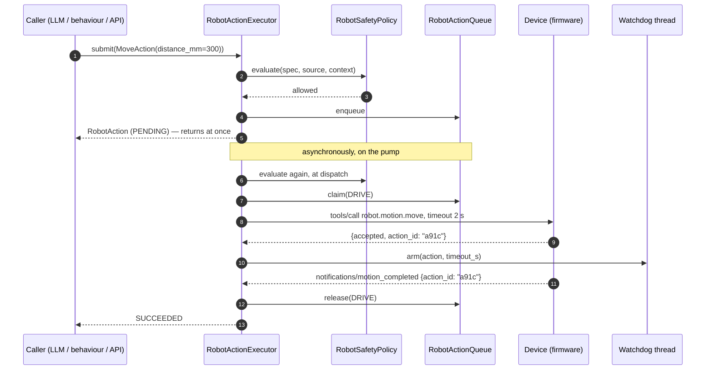

# Robot actions

The layer between anything that wants something and the hardware that does it. This page
is the reference for what is **implemented** in `main/nilo-server/robot/actions/` and
`main/nilo-server/robot/safety/`: the ten semantic actions, their lifecycle, how the queue
arbitrates between them, and what the safety policy will and will not allow.

The design rules behind it are in [robot-architecture.md](robot-architecture.md) §2.8, §2.9
and §3; the safety contract — including **what firmware must implement independently** — is
[safety-model.md](safety-model.md). Read that page before connecting a machine that can move.

```python
from robot.actions import MoveAction, RobotActionExecutor
from robot.state.actions import ActionSource

executor = RobotActionExecutor(runtime)              # or: runtime.actions
action = await executor.submit(MoveAction(distance_mm=300), robot_id, source=ActionSource.LLM)
record = await action.wait()                         # or: executor.query(action.action_id)

await runtime.robot(robot_id).move(distance_mm=300)  # the same thing, semantically
```

---

## 1. The vocabulary

Ten actions, and nothing else reaches a device. Each is a frozen model of *what was asked
for*; parameters are integers with the unit in the name, and no parameter names an
actuator.

| Action | Parameters | Resources | Device tool | Completion |
|---|---|---|---|---|
| `MoveAction` | `distance_mm`, `speed_mmps` | DRIVE | `robot.motion.move` | notification |
| `TurnAction` | `angle_deg`, `speed_dps` | DRIVE | `robot.motion.turn` | notification |
| `StopAction` | `reason` | DRIVE | `robot.motion.stop` | tool reply |
| `FollowTargetAction` | `target_id`, `duration_ms`, `stop_distance_mm` | DRIVE, HEAD, CAMERA | `robot.follow.target` | notification |
| `LookAtAction` | `x_pct`, `y_pct` | HEAD | `robot.head.look_at` | tool reply |
| `HeadAngleAction` | `pitch_deg`, `yaw_deg` | HEAD | `robot.head.set_angle` | tool reply |
| `LiftAction` | `height_pct` | LIFT | `robot.lift.set_position` | tool reply |
| `ExpressionAction` | `emotion`, `intensity_pct` | DISPLAY | `robot.expression.set` | tool reply |
| `AnimationAction` | `name`, `duration_ms` | DISPLAY | `robot.animation.play` | tool reply |
| `CaptureImageAction` | `question` | CAMERA | `robot.camera.capture` | tool reply |

**Two tool names, one tool.** Firmware publishes `robot.motion.move`; the server replaces
every character an LLM function name may not contain and keys everything on
`robot_motion_move` (`robot/devices/mcp.py:sanitize_tool_name`), calling back with the raw
name it remembered. A spec carries both — `device_tool_name` and `tool_name` — and
`tests/robot/test_actions.py` asserts one is the sanitization of the other, so the pair
cannot drift into a capability lookup that silently fails on a robot.

**No floats.** The device MCP type system carries booleans, integers and strings, and the
server forwards the device's `properties` object to the LLM unchanged ([mcp.md](mcp.md)).
A float parameter would be a latent bug nothing on this side would catch, so a test
enumerates every spec field and fails on one.

**Specs do not range-check themselves.** Bounds are configurable policy and belong to the
safety layer, which produces a typed rejection the caller can read rather than an exception
at the call site. `MoveAction(distance_mm=999_999)` constructs fine; it is rejected.

### Resources

Six, fixed by robot-architecture §2.8: `DRIVE`, `HEAD`, `LIFT`, `DISPLAY`, `AUDIO`,
`CAMERA`. A resource has exactly one owner or none, which *is* the mutual exclusion — the
ledger in `robot/actions/queue.py` is a map from resource to the single action holding it.

`DISPLAY` is the face: an expression and an animation contend for it, which is why an
animation cannot run while a different expression is being held. `AUDIO` is declared and
currently unclaimed — speech is Phase 6, and the enum member exists so the claim can be
added without renumbering anything.

---

## 2. The lifecycle

```
PENDING ──▶ STARTING ──▶ RUNNING ──▶ SUCCEEDED | FAILED | CANCELLED | TIMED_OUT
   │            │                         ▲
   │            └─────────────────────────┘  (a tool whose reply is its completion)
   └──▶ REJECTED | CANCELLED | TIMED_OUT | FAILED
```

Illegal transitions **raise** `IllegalTransition`; they are never absorbed. A lifecycle that
silently swallows a bad transition cannot be reasoned about after an incident, and the
executor's "did this already finish?" check would become invisible rather than deliberate.

| Status | Meaning |
|---|---|
| `PENDING` | admitted and queued; nothing has touched hardware |
| `STARTING` | resources claimed, the device call is in flight |
| `RUNNING` | the device acknowledged and gave an action id; the watchdog is armed |
| `SUCCEEDED` | the device reported completion |
| `FAILED` | the device reported a failure, or the call itself failed |
| `CANCELLED` | cancelled, preempted, emergency-stopped, or supervised to a halt |
| `TIMED_OUT` | no acknowledgement, or no completion inside the budget |
| `REJECTED` | safety never admitted it; it never ran |

`PENDING → REJECTED` exists because **safety is evaluated twice** — once on submission and
again immediately before the device call. A cliff that appears while an action waits in the
queue still stops it.

Every action carries the full record:

```python
ActionRecord(
    action_id, robot_id, action_type, source, priority, status,
    parameters, resources, created_at, started_at, finished_at,
    timeout_s, ttl_s, device_action_id, result, error,
)
```

`started_at` is set once, on the first move out of `PENDING`, and never moved.
`finished_at` is set on any terminal state. Everything published on the event bus or
returned to a caller is one of these frozen records, never the live action, so a subscriber
cannot mutate something it merely observed.

### Sources and priorities

`USER`, `LLM`, `BEHAVIOR`, `SYSTEM`, `SAFETY`. The source is recorded on every action so an
incident log says where a motion came from. It does **not** widen what safety permits: the
policy's answer is identical whoever asked, and `tests/robot/test_safety.py` parameterizes
almost every rejection over all five to keep it that way. The one asymmetry is that
`SAFETY` may command a stop while the emergency stop is latched — that is the layer doing
the stopping.

Priorities are a closed enum (`IDLE`, `LOW`, `NORMAL`, `HIGH`, `EMERGENCY`), not an open
integer, so "priority 9999" is not something a caller can invent.

---

## 3. The queue, and what it arbitrates

Dispatch order is **highest priority first, then oldest first**. Head-of-line blocking
applies only to the subsystem actually contended: a `LookAtAction` still runs while a
`TurnAction` waits for the drive, because they claim nothing in common.

**Preemption** is a state transition with an observable outcome, not a dropped request.
When a queued action outranks the running action blocking it, the running one is
`CANCELLED` with `error.code == "preempted"` and a stop is attempted for motion. The
comparison is strictly greater, so two actions at the same priority queue behind each other
instead of cancelling each other in a loop.

**Conflict detection** is exposed, not only enforced: `executor.conflicts(spec, robot_id)`
returns the records of the running actions that would block it, so a caller can name the
holder rather than discovering that something is in the way.

`robot/actions/registry.py` holds every action by id, maps the device's own action ids back
to ours, and keeps retired actions in a **bounded** deque. The inherited server has an
unbounded dialogue list that grows for as long as a session lives
(robot-architecture R12); a robot that is up for a week must not accumulate one dict per
motion command.

---

## 4. Safety

`robot/safety/policy.py` is a **pure function** of its arguments. It reads no clock, opens
no socket, holds no counter and consults no global: the current instant, how long the
request has waited and how many motions were admitted recently all arrive in a
`SafetyContext`. That is what makes "the same request in the same world is decided the same
way" a property a test asserts rather than a hope, and what makes an incident replayable.

Checks run in a fixed order, so the reason a caller is given is the *first* thing that was
wrong rather than an arbitrary one of several:

1. **Emergency stop engaged** → `EMERGENCY_STOP_ENGAGED`, unless the action is a stop or the
   source is `SAFETY`.
2. **The link** → `ROBOT_UNKNOWN`, `DEVICE_DISCONNECTED`, or `UNSUPPORTED_ACTION` when the
   device does not publish the tool. An **allow-list**: only what discovery actually found is
   dispatchable, so a robot that has not finished discovery can do nothing rather than
   everything.
3. **TTL** → `TTL_EXPIRED`. A "come here" that waited twenty seconds behind a queue is not
   the same request.
4. *A stop that reaches here is dispatched.* It is not gated on sensors, battery, limits or
   rate — a robot that will not stop because a cliff sensor is asserted is the wrong failure.
5. **Heartbeat** → `HEARTBEAT_EXPIRED` when the session has been silent past the budget.
6. **Motion gating** (move, turn, follow) → `RATE_LIMIT_EXCEEDED`, `SENSOR_DATA_MISSING`,
   `SENSOR_DATA_STALE`, `CLIFF_HAZARD`, `ROBOT_LIFTED`, `BATTERY_TOO_LOW`, and for *forward*
   motion `BUMP_HAZARD` and `OBSTACLE_TOO_CLOSE`. Reversing away from a bump is allowed:
   refusing it would strand the robot against the thing it hit.
7. **Bounds** → `DISTANCE_LIMIT_EXCEEDED`, `ANGLE_LIMIT_EXCEEDED`, `SPEED_LIMIT_EXCEEDED`,
   `DURATION_LIMIT_EXCEEDED`, `PARAMETER_OUT_OF_RANGE`.

**Rejected, not clamped.** A request beyond a limit comes back `REJECTED` with the number
that failed. Silently clamping to the maximum hides the bug that produced a 40-metre "move"
until the day the ceiling is wrong. (An earlier draft of robot-architecture §3 said
"clamped"; the roadmap's acceptance criterion and this implementation say rejected, and §3
has been corrected.)

The one value the policy adjusts is a caller-supplied **timeout**, and only downwards, to
the configured ceiling — a shorter timeout fires the watchdog *sooner*, so a caller cannot
buy ten minutes of unsupervised motion.

### Limits

`SafetyLimits` (`robot/safety/limits.py`) is frozen, conservative by default, and
constructed per runtime. Two rules about where it may be stored, both properties of the
inherited server rather than preferences:

* **Not the server config dict.** In manager-api mode the local configuration is replaced
  wholesale by the API response and only the `server` and `manager-api` blocks survive
  (`config/config_loader.py`). A speed ceiling stored there would vanish in exactly the
  deployment with the most robots in it.
* **Not a module-level singleton.** Two robots with different chassis can hold different
  ceilings in one process, and a test never inherits another test's numbers.

`load_limits(path)` reads a small YAML document (default `data/robot_limits.yaml`) and falls
back to the built-in defaults when the file is absent. A file that exists but cannot be
parsed **raises**: falling back to defaults after an operator wrote a limits file is worse
than failing to start, and an unknown key is an error rather than a silent no-op.

```yaml
limits:
  max_distance_mm: 800
  max_angle_deg: 180
  max_speed_mmps: 250
  min_obstacle_distance_mm: 300
  heartbeat_timeout_s: 4.0
  action_ttl_s: 10.0
```

### The emergency stop

Three rules, and the code makes them literal:

1. **Always accepted.** Never gated on queue state, capability negotiation, or whether
   anything is running.
2. **Never queued.** `executor.submit(StopAction(), ...)` bypasses the queue entirely,
   cancels whatever holds the drive, and dispatches — anything else makes a stop's latency a
   function of queue depth.
3. **Executed locally.** A backend-originated stop is a *request* to do sooner what the
   firmware watchdog would do anyway.

`executor.emergency_stop(robot_id)` latches the robot, cancels everything pending and
running, and dispatches a stop. The latch is **sticky**: nothing new is admitted until
`clear_emergency_stop` is called explicitly. There is no timeout that lifts it, because a
stop that expires on its own is a stop nobody decided to end. The LLM has no path to either
override the rejection or clear the latch.

### The watchdog

`robot/safety/watchdog.py` runs on **its own thread**, not the session event loop. The loop
runs Silero VAD inference inline, several ASR providers block on it, and
`core/utils/gc_manager.py` walks `gc.get_objects()` twice every 300 seconds holding the GIL.
A timer scheduled there fires when the loop gets round to it, which is not a deadline.
`tests/robot/test_watchdog.py` demonstrates this rather than asserting it: a deadline fires
while the event loop is blocked in a synchronous sleep.

It does two things:

* **Per-action deadlines.** No completion inside the budget → `TIMED_OUT`, claims released,
  and a stop attempted.
* **A supervisory sweep** every 500 ms (`executor.supervise()`, also callable directly).
  Admission checks a *request*; the sweep checks a *robot*, and cancels a running motion when
  the link drops, the heartbeat lapses, a cliff appears or sensor data goes stale. It is
  deliberately narrower than admission: a robot already moving is not stopped for a rate
  limit it was admitted under.

Running on a thread still does not make it authoritative. The GIL stalls this thread too,
and a killed process supervises nothing. See the firmware contract below.

---

## 5. Dispatch, and how completion is correlated



Three details are load-bearing.

**Submit never blocks on hardware.** `chat()` awaits tool futures sequentially on a
five-worker pool with no cancellation (`core/connection.py`), so a tool handler that waited
for motion would pin a worker for the whole `tool_call_timeout`. The semantic handle's
`wait=False` is what the bridge uses.

**Every dispatch carries an explicit short timeout** (2 s). The inherited device-MCP default
is 30 s and the device executor never overrides it
(`core/providers/tools/device_mcp/mcp_handler.py`,
`core/providers/tools/device_mcp/mcp_executor.py`) — two orders of magnitude too long for an
acknowledgement.

**Completion is correlated by the device's own action id.** The device answers a motion
command with *its* id and reports completion against that id, not ours; the registry holds
the mapping. When an action settles, the mapping is dropped — so a **duplicate completion**
resolves to nothing and is logged and discarded, rather than settling a second action.
Firmware that retries a notification and a reconnect that replays one both land here.

An accepted command that returns no `action_id` is `FAILED`, not quietly successful: it
cannot be supervised, and an action nothing can ever end is worse than one that failed.

---

## 6. The semantic surface

```python
handle = executor.robot(robot_id).as_source(ActionSource.LLM)

await handle.move(distance_mm=300, speed_mmps=200)
await handle.turn(angle_deg=90)
await handle.look_at(x_pct=30, y_pct=60)
await handle.head_angle(pitch_deg=15, yaw_deg=-20)
await handle.lift(height_pct=80)
await handle.set_expression("happy", intensity_pct=80)
await handle.play_animation("greet", duration_ms=1500)
await handle.capture_image("who is that?")
await handle.follow("person-1", duration_ms=5000)
await handle.stop()

await handle.emergency_stop("a person stepped in front")
await handle.clear_emergency_stop()
```

Every method returns an `ActionRecord`, **including when safety refused**:
`record.status is ActionStatus.REJECTED` and `record.rejection` is the typed reason. Nothing
raises for a rejection — a refusal is an outcome, and a caller that had to catch it would
end up swallowing it.

`wait=True` (the default) is right for a script or a behaviour. It is the wrong default for
an LLM tool handler, which must return in microseconds; the bridge passes `wait=False` and
tells the model what was *accepted*, not what finished.

`as_source(...)` changes attribution only. It does not buy a different answer from safety —
`tests/robot/test_executor.py` asserts that every source gets the same rejection for the same
over-limit request.

---

## 7. The firmware contract

**Backend safety is a second layer only.** Everything in this page is policy. The
guarantees live on the robot, and firmware must implement them **independently**, with no
dependency on the backend being alive, connected, or unpaused:

| Firmware must implement | What happens when the Python process dies |
|---|---|
| Cliff protection | The backend stops rejecting moves. Nothing else changes — the robot must already refuse to drive off an edge on its own sensors. |
| Motor watchdog | No heartbeat arrives. The motors must stop on their own timer; the last command must not continue. |
| Current / thermal protection where available | No supervision at all from this side. There is no telemetry path to a dead process. |
| Physical motion bounds | The configured ceilings stop being applied. The mechanical and firmware stops are the only ones left. |
| Acceleration constraints | Unenforced from here at any time — the backend never commands a trajectory. |
| Local emergency stop | The latch in this process is gone. A physical or firmware stop must still work. |

Concretely, and verifiable in this tree: the process can vanish mid-motion
(`core/connection.py` calls `os._exit(0)` from a daemon thread on a restart message,
skipping every `finally`), the event loop can stall for an unbounded period
(`core/utils/gc_manager.py`), and a command the device has already accepted cannot be
cancelled from here. A stop that depends on any of those is not a stop.

Do not connect a machine that can hurt someone and rely on this layer to stop it. See
[safety-model.md](safety-model.md) for the full split and the reasoning behind each line.

---

## 8. Testing

| Suite | What it covers |
|---|---|
| `main/nilo-server/tests/robot/test_actions.py` | the ten specs, the exhaustive 64-pair transition table, a seeded random walk over the lifecycle, the record |
| `main/nilo-server/tests/robot/test_queue.py` | ordering, claims, conflicts, preemption, and a 1000-step random interleaving that no subsystem is ever double-booked |
| `main/nilo-server/tests/robot/test_safety.py` | every rejection, parameterized over all five sources; limits as configuration; the emergency stop |
| `main/nilo-server/tests/robot/test_watchdog.py` | deadlines, sweeps, and a deadline firing while the event loop is blocked |
| `main/nilo-server/tests/robot/test_executor.py` | submit through settle against a scriptable device: priority, conflicts, timeouts, disconnect, duplicate completions, cancellation, e-stop |
| `main/nilo-server/tests/robot/test_layering.py` | the import table of robot-architecture §7, parsed from the source |
| `main/nilo-server/tests/integration/test_actions_e2e.py` | the same behaviours against a real server and the real simulator, over a real socket, with the real threaded watchdog |

The simulator grew what these need and nothing more: a `robot.follow.target` tool with
device-side closed-loop tracking, and a `drop_motion_completion` fault that swallows only
the completion notification while the session stays up and telemetry keeps flowing — the
only way to exercise the action watchdog on a live, healthy link. See
[robot-simulator.md](robot-simulator.md).

## Related pages

* [robot-architecture.md](robot-architecture.md) — the layering, the seams, the design rule
* [safety-model.md](safety-model.md) — the full safety split and the firmware contract
* [robot-domain.md](robot-domain.md) — the registry, world state and event bus this sits on
* [robot-simulator.md](robot-simulator.md) — the robot every test runs against
* [robot-roadmap.md](robot-roadmap.md) — what lands next (the LLM seam is Phase 4)
