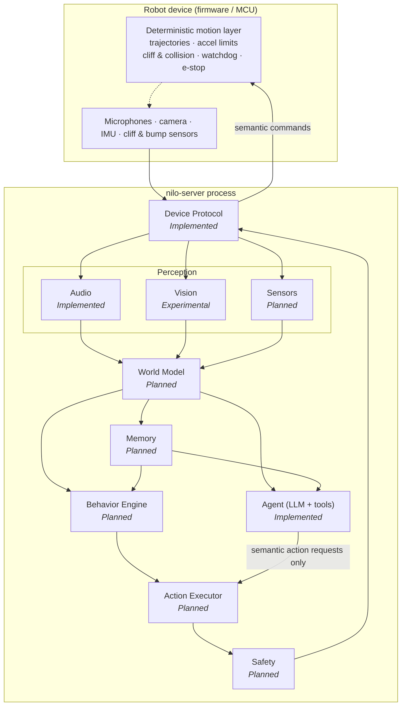
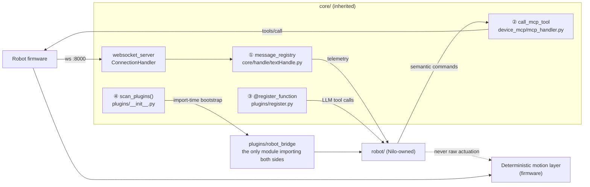
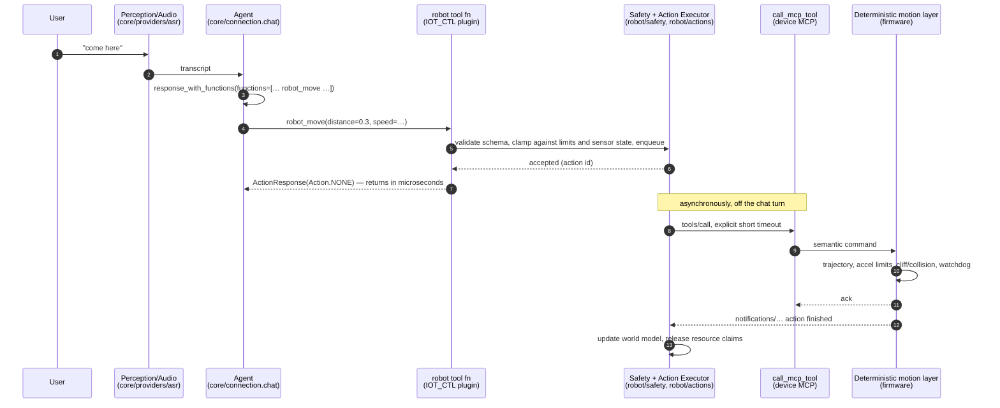
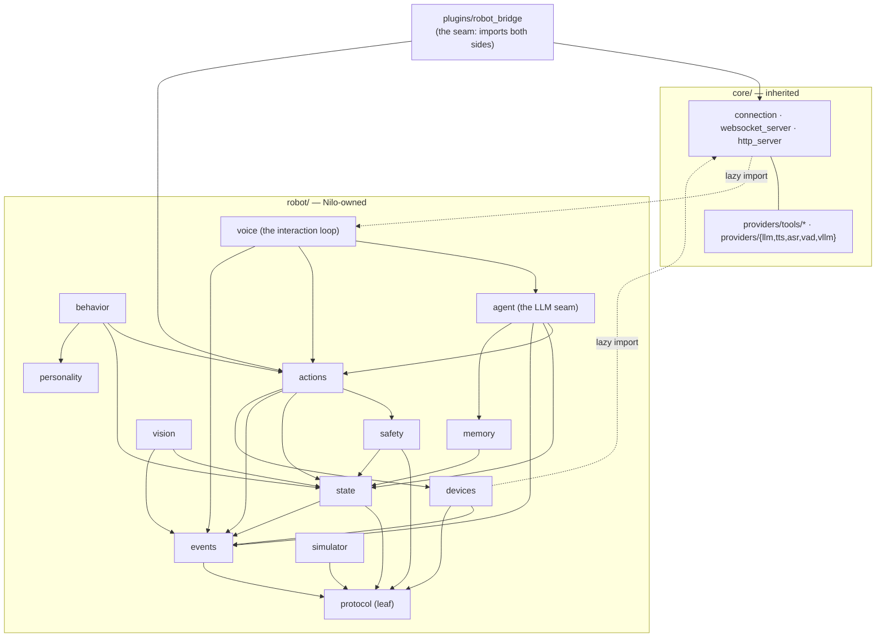

# Robot architecture

The target architecture for the Nilo robot subsystem: what the layers are, where each one
attaches to the server that exists today, and the rules that keep a language model away
from a motor.

## Status

This page describes a **direction**, not a shipped subsystem. Read every heading with the
label in front of it:

| Layer | Status | Where it is |
|---|---|---|
| Device Protocol | **Implemented** | `main/nilo-server/robot/protocol/` — route registry for the `nilo` protocol, plus the inherited session server in `core/` |
| Robot domain (identity, capabilities, registry, events) | **Implemented** | `robot/state/`, `robot/events/`, `robot/devices/`, `robot/runtime.py`, `robot/session.py` — see [robot-domain.md](robot-domain.md) |
| Perception / Audio | **Implemented** (as a voice pipeline, not yet as robot perception) | `core/providers/vad/`, `core/providers/asr/`, `core/handle/receiveAudioHandle.py` |
| Agent | **Implemented** (as a chat agent, not yet as an embodied one) | `core/providers/llm/`, `core/providers/tools/`, `core/connection.py` |
| Perception / Vision | **Implemented** | `robot/vision/` — snapshot pipeline, provider protocols, tracking with stable ids, normalized coordinates, face identity, latency metrics; see [robot-vision.md](robot-vision.md). The VLLM seam (`core/api/vision_handler.py`) is still the inherited one-shot explainer |
| Perception / Sensors | **Planned** | `robot/state/models.py` types the sensor state; nothing produces it yet |
| World Model | **Implemented** | `robot/state/` — per-robot state, plus `robot/state/world.py`: entities with confidence and a decay schedule, attention, interactions, environment; written from events by `robot/state/world_model.py`. See [robot-behavior.md](robot-behavior.md) |
| Memory (robot-scoped) | **Implemented** | `robot/memory/` — working, episodic, semantic and person memory over SQLite with migrations, optional embeddings, budgeted retrieval and provenance-tracked consolidation; see [robot-memory.md](robot-memory.md) |
| Behavior Engine | **Implemented** | `robot/behavior/` — deterministic utility scoring, sixteen behaviours, four autonomy modes, no LLM anywhere in it; see [robot-behavior.md](robot-behavior.md) |
| Personality and internal state | **Implemented** | `robot/personality/` — six stable traits, seven decaying control variables, persisted per robot; see [robot-personality.md](robot-personality.md) |
| Expressive animation | **Implemented** | `robot/animation/` — YAML animations, priority and resource ownership, transitions, the low-energy gate; see [robot-animation.md](robot-animation.md) |
| Action Executor | **Implemented** | `robot/actions/` — ten semantic actions, the lifecycle, the queue and the resource ledger; see [robot-actions.md](robot-actions.md) |
| Safety | **Implemented**, as a policy filter | `robot/safety/` — deterministic policy, configurable limits, emergency-stop latch, supervisory watchdog. Not a guarantee: [safety.md](safety.md) |

Concretely: `main/nilo-server/robot/` holds the protocol registry, the robot domain layer
(`robot/state/`, `robot/events/`, `robot/devices/`), the simulator (`robot/simulator/`), the
action and safety layers (`robot/actions/`, `robot/safety/`), the world model and the
behaviour engine (`robot/state/world.py`, `robot/behavior/`), personality and animation
(`robot/personality/`, `robot/animation/`), vision (`robot/vision/`), memory and the admin
API (`robot/memory/`, `robot/api/`) and the two modules that wire it all into a session
(`robot/runtime.py`, `robot/session.py`). There is no LLM-facing bridge yet. Nothing here is running code unless it
is marked **Implemented**. Planned module paths below are written **without backticks** on
purpose: `scripts/check_docs.py` fails the build when a backticked repository path does not
exist, and these do not exist yet.

Phases and acceptance criteria live in [robot-roadmap.md](robot-roadmap.md); the safety
policy is [safety.md](safety.md); the wire format is [protocol.md](protocol.md) and the
tool channel it rides on is [mcp.md](mcp.md).

---

## 1. The layer tree

```
Robot
│
├── Perception
│   ├── Audio
│   ├── Vision
│   └── Sensors
│
├── World Model
├── Memory
├── Behavior Engine
├── Agent
├── Action Executor
├── Safety
└── Device Protocol
```

Perception flows in from the device; commands flow back out through Safety:



Two things to read off that picture. The Agent and the Behavior Engine are **peers**: both
propose actions, neither executes one, and when the LLM is slow, unavailable or wrong the
Behavior Engine still runs. And every command leaving the server passes through Safety,
then through a second, independent safety implementation in firmware (§3).

---

## 2. Node reference

| Node | Responsibility | In | Out | Module (planned unless noted) |
|---|---|---|---|---|
| Perception / Audio | Voice activity, speech to text, speaker identity | Opus frames from the device | transcripts, VAD edges, speaker hints | reuses `core/providers/vad/` + `core/providers/asr/` |
| Perception / Vision | Frames to symbols: faces, markers, obstacles, tracked targets | JPEG frames, camera tool results | detections in normalised coordinates | robot/vision |
| Perception / Sensors | Normalising IMU, cliff, bump, touch, battery, encoders | device telemetry and notifications | typed sensor events with timestamps | robot/devices + robot/events |
| World Model | The robot's current belief about itself and its surroundings | perception events | pose, battery, obstacle map, tracked entities, each with an age | robot/state |
| Memory | What persists across sessions: people, places, episodes | world-model snapshots, dialogue | recalled facts and episodes | robot/memory |
| Behavior Engine | Autonomous behaviour with no LLM in the loop | world model, memory, personality | action requests | robot/behavior + robot/personality |
| Agent | Language understanding, conversation, deliberate action choice | transcripts, world-model summary, memory | speech and semantic action requests | reuses `core/providers/llm/` + `core/providers/tools/` |
| Action Executor | Admission, queueing, resource arbitration, lifecycle of every action | action requests from Agent and Behavior Engine | one dispatched device command at a time per resource | robot/actions |
| Safety | Clamping, rejection, watchdogs, escalation | every action request; world model | an allowed (possibly clamped) action, or a rejection | robot/safety |
| Device Protocol | Transport, routes, handshake, framing, tool channel | WebSocket and HTTP from devices | typed messages both ways | `robot/protocol/` (**Implemented**) + `core/websocket_server.py`, `core/connection.py`, `core/http_server.py` |

### 2.1 Perception / Audio — **Implemented**, as a voice pipeline

Turns an audio stream into speech events. In: 16 kHz mono Opus frames decoded at the socket
in `core/connection.py`. Out: voice-activity edges and transcripts, which today feed
`startToChat` in `core/handle/receiveAudioHandle.py` and nothing else.

Reused as-is: Silero VAD (`core/providers/vad/silero.py`), fourteen ASR provider modules under
`core/providers/asr/`, and the outbound half — Opus encoding
(`core/utils/opus_encoder_utils.py`) and 60 ms frame pacing
(`core/utils/audioRateController.py`, `core/handle/sendAudioHandle.py`), whose constants are
hardware calibration for constrained device receive buffers and must not be reimplemented
([audio.md](audio.md)). Robot work adds sound-direction as a perception event rather than a
transcript, and an attention state that survives silence — the server currently *closes* a
quiet socket (R2). The pipeline stays in `core/`; robot code consumes it via robot/devices.

### 2.2 Perception / Vision — **Experimental**

Turns frames into symbols the World Model can hold. In: the device POSTs a question and a
JPEG to `/mcp/vision/explain` (`core/api/vision_handler.py`; 5 MB cap, bearer token bound
to the device id). Out: today, one sentence of prose — an answer, not a perception.

Reused as-is: the endpoint, token minting in `core/utils/auth.py`, the provider in
`core/providers/vllm/`, and the short-circuit contract — the handler returns
`{"success": true, "action": "RESPONSE", "response": …}` and the device-MCP executor
detects the `action` key and speaks it with no second LLM pass. That is the cheapest
low-latency perception-to-reaction path in the codebase; robot perception tools copy it
rather than invent one.

Robot work adds detections instead of prose — normalised 0.0–1.0 coordinates, stable target
ids, frame timestamps, tracking across frames — so `look_at` and `follow` have something to
aim at. Module: robot/vision.

### 2.3 Perception / Sensors — **Planned**

Everything that is neither audio nor image: IMU, encoders, cliff, bump, touch, lift,
battery. In: device telemetry. Out: typed, timestamped events on the bus.

Nothing exists today. The nearest inherited mechanism is the deprecated `iot` message type
and it is unusable: tool identity is recovered by positional string splitting in
`core/providers/tools/device_iot/iot_executor.py`, and its schema makes the **LLM** author
response templates — the inverse of the rule in §3.

The cheap path is the tool channel. Any JSON-RPC method beginning `notifications/` already
reaches `handle_mcp_message` in `core/providers/tools/device_mcp/mcp_handler.py`, whose
`elif "method" in payload` branch logs the method name and drops it. Four lines there turn
it into a sensor-event hook (§4.2). Polling a robot for cliff state over a tool call with a
30-second default timeout is not an option. Modules: robot/devices, robot/events.

### 2.4 World Model — **Planned**

One consistent, explicitly stale picture of the robot and its surroundings. In: perception
events. Out: pose, velocity, battery, obstacle occupancy and tracked entities, every field
carrying the age of its last update.

The design rule: **the robot is authoritative, the World Model is a cache.** Every read
returns a value and its age, and every consumer must be able to act on "I do not know". A
behaviour that silently treats a two-second-old cliff reading as current drives off a table.
Nothing comparable exists today; `core/connection.py` accumulates ad-hoc state as attributes
grafted on by other modules at arbitrary times, so robot state goes under one namespaced
attribute instead (R12). Module: robot/state.

### 2.5 Memory — **Planned** (conversation memory **Implemented**)

What survives a session: people and their names, places, episodes, preferences, what the
robot already tried. In: world-model snapshots, dialogue turns, action outcomes. Out:
recall for the Agent's prompt and scoring inputs for the Behavior Engine.

`core/providers/memory/` provides conversation memory only — `mem_local_short`, `mem0ai`,
`powermem`, `mem_report_only`, `nomem`. That covers "what we talked about", not "where the
charger is". The local provider does an unlocked read-modify-write of one shared YAML file
from a daemon thread (`core/providers/memory/mem_local_short/mem_local_short.py`), so robot
persistence does not build on it. Module: robot/memory.

### 2.6 Behavior Engine — **Planned**

Be alive without being asked: idle behaviour, reactions, attention, recovery from a failed
action. In: world model, memory, personality traits and emotion state. Out: scored action
requests into the Action Executor.

The requirement that shapes it: **it must run when the LLM is unavailable, slow or
expensive.** A robot whose only source of behaviour is a network round trip is furniture
between turns. Utility scoring over a small behaviour set on a fixed tick gives bounded
latency and a testable decision. Nothing exists today, and the inherited emotion signal is
not a substitute: it is scraped
from an emoji in the first content chunk of an LLM response (`core/utils/textUtils.py`),
fires at most once per turn, defaults to a fixed value, and never fires on the direct-answer
path. It is one weak input among several. Modules: robot/behavior, robot/personality.

### 2.7 Agent — **Implemented** (as a chat agent)

Understands language, converses, and chooses deliberate actions that need world knowledge
or user intent. In: transcripts, a compact world-model summary, recalled memory, tool
schemas. Out: speech, and semantic action requests expressed as tool calls.

The whole chat turn is reused. `core/connection.py:ConnectionHandler.chat` calls
`llm.response_with_functions(...)` with the list produced by
`core/providers/tools/unified_tool_manager.py:ToolManager.get_function_descriptions`,
which concatenates the schemas of five executors: server plugins, server MCP, device IoT,
device MCP and an MCP endpoint. **That list is the entire surface the model can act
through**, which is what makes §3 enforceable at all. Results come back as `ActionResponse`
(`plugins/register.py`); speech goes out through `tts_one_sentence` / `tts_end` on
`core/providers/tts/base.py`.

Robot work adds tool functions that validate and enqueue rather than act (§5), a world-model
summary in the prompt, and a hard rule about what may appear in a schema. The agent stays in
`core/`; the robot tool vocabulary lives in robot/actions, registered through seam ③ (§4.1).

### 2.8 Action Executor — **Implemented**

Owns every action from request to terminal state. In: action requests from the Agent and
the Behavior Engine. Out: at most one device command per contended resource at a time.
Module: `robot/actions/`; reference: [robot-actions.md](robot-actions.md).

Lifecycle: `PENDING → STARTING → RUNNING → SUCCEEDED | FAILED | CANCELLED | TIMED_OUT |
REJECTED`, with illegal transitions raising rather than being absorbed. Resource claims over
DRIVE, HEAD, LIFT, DISPLAY, AUDIO and CAMERA arbitrate between a behaviour that wants to
look around and a user who just said "come here" — the user wins, the behaviour is
preempted, and preemption is a state transition with an observable outcome, not a dropped
request. The ledger maps each resource to its single owner, which *is* the mutual exclusion.

Four properties are worth naming here because each exists to work around something in the
inherited server: **submit never blocks on hardware** (the chat loop awaits tool futures
sequentially on a five-worker pool with no cancellation); **safety is evaluated twice**,
once at submission and again immediately before the device call, because the world changes
while an action waits in a queue; **every dispatch carries an explicit 2 s timeout** rather
than the inherited 30 s default; and **completion is correlated by the device's own action
id**, so a duplicate notification resolves to an action that was already retired and is
dropped rather than settling something twice.

The gap it works around is still there and is still specific: there is **no cancellation
path for an in-flight device tool call.** `call_mcp_tool` registers a future that only its
own `await` ever settles or clears; the unified tool handler's cleanup never touches pending
call results; nothing rejects those futures when the socket drops (R6). The executor marks
such an action `TIMED_OUT` and attempts a stop — it cannot recall the command the device
already accepted.

### 2.9 Safety — **Implemented**, and deliberately the weaker of two layers

Admits or rejects every action request, supervises deadlines, latches an emergency stop. In:
every action request plus the world model. Out: an allowed request, or a **typed rejection**
carrying the reason and the number that failed. Module: `robot/safety/`.

It **rejects rather than clamps**. A request beyond a configured limit comes back `REJECTED`,
not silently reduced to the maximum, because silent clamping hides the bug that produced a
40-metre "move" until the day the ceiling is wrong. The one value it adjusts is a
caller-supplied timeout, and only downwards, which fires the watchdog sooner.

`robot/safety/policy.py` is a pure function of its arguments — it reads no clock, holds no
counter and consults no global — so the same request in the same world is decided the same
way every time, and an incident can be replayed rather than argued about.

This layer is a **policy filter, not a guarantee**, and the architecture says so out loud.
It cannot be a guarantee, because the process it runs in can be terminated mid-motion
(`core/connection.py:ConnectionHandler.handle_restart` calls `os._exit(0)` from a daemon
thread, skipping every `finally`), can be stalled by a global collection pass
(`core/utils/gc_manager.py` walks `gc.get_objects()` twice every 300 s), and has no way to
cancel a command the device already accepted. Its watchdog therefore runs on its own thread,
and that still does not make it authoritative. The guarantee lives in firmware: §3 and
[safety.md](safety.md), which names each protection firmware must implement independently
and what it does when this process dies.

### 2.10 Device Protocol — **Implemented**

Transport, routing, handshake, framing and the tool channel: a WebSocket session carrying
JSON control messages and binary Opus audio, bootstrapped over HTTP.

This is real code. `robot/protocol/base.py` defines `ProtocolSpec` (a frozen pydantic model
of one protocol's WebSocket path, OTA path and enabled flag) and `ProtocolRegistry`, built
from the `protocols:` block of `config.yaml` by `registry_from_config`. Exactly one spec is
registered — `NILO` in `robot/protocol/nilo.py` (`/nilo/v1/`, `/nilo/ota/`, and firmware
downloads at `/nilo/ota/download/{filename}`), so `ALL_PROTOCOLS == (NILO,)`. The registry is
the single source of routes for four call sites — `core/websocket_server.py` gates the
WebSocket handshake with `ProtocolRegistry.ws_accepts`,
`core/http_server.py` registers OTA routes once per enabled protocol,
`core/api/ota_handler.py` builds the WebSocket URL it hands each device with
`ProtocolRegistry.ws_url`, and `app.py` logs the endpoints. `ProtocolRegistry.strict`
defaults to true (config `protocols.strict`, shipped true), so a WebSocket path matching no
spec is refused with a 404 rather than accepted: a route this server does not serve is
genuinely unreachable. `nilo.py` also carries `RESERVED_MESSAGE_TYPES`, the JSON `type` values
already in use on the wire, so a new Nilo message type cannot silently collide.

Robot work adds typed models for robot messages, a version field, explicit acks, and a device
registry that outlives a single connection (R1). The registry half is **done** —
`robot/devices/registry.py`, attached through `robot/session.py`
([robot-domain.md](robot-domain.md)); the typed robot message type is not.

## 3. The rule: the model requests, the robot executes

**The LLM never sets a motor, servo, PWM duty cycle, wheel speed or joint angle.**

It requests a small, bounded, semantic vocabulary:

| Action | Bounded parameters | Meaning |
|---|---|---|
| `move` | distance, speed | drive forward or back by a bounded distance |
| `turn` | angle, speed | rotate in place by a bounded angle |
| `look_at` | target id or normalised x/y | point the head at something perception is tracking |
| `follow` | target id, duration | keep a tracked target framed, for a bounded time |
| `play_animation` | animation name, intensity | play a named, pre-authored animation |
| `stop` | — | cancel everything currently claimed |

Four properties make that vocabulary safe to hand to a language model:

1. **Bounded.** Every numeric parameter has a minimum, a maximum and a unit fixed by
   configured limits, not by the caller. Out-of-range is **rejected** with a typed reason
   that reaches the caller — not clamped, and not honoured. (Earlier drafts of this page
   said "clamped"; the implemented behaviour and the roadmap's acceptance criterion are
   rejection, for the reason given in §2.9.)
2. **Terminating.** Every action has a deadline. There is no "drive forward" without a
   distance or a duration.
3. **Semantic.** The arguments describe an intent in the world, not a signal on a pin.
4. **Enumerable.** A short, stable list is one that can be reviewed, tested against the
   simulator, and audited in a log.

### 3.1 What the deterministic action layer owns

On the robot, below the protocol, a deterministic layer takes a semantic command and owns
everything with a deadline:

* trajectory generation and closed-loop execution
* acceleration and jerk limits, and the speed ceiling
* cliff and collision avoidance, including the reflex that aborts a command in progress
* a dead-man watchdog: **loss of heartbeat stops the robot**, it does not continue the last
  command
* emergency stop, reachable without the server's cooperation
* calibration — wheel diameter, encoder scale, servo trim, IMU bias. Real hardware is not
  the hardware on the datasheet, and a model with no calibration knob cannot be made
  correct in software.

### 3.2 Why safety is duplicated in firmware

The server-side Safety layer clamps and rejects; it is the first filter and the one that
knows about user intent and policy. It is not the guarantee, for reasons that are
properties of the code as it stands:

| Server-side hazard | Evidence |
|---|---|
| The process can vanish mid-motion | `core/connection.py:ConnectionHandler.handle_restart` calls `os._exit(0)` from a daemon thread |
| The event loop is not real-time | Silero inference runs on it (`core/handle/receiveAudioHandle.py`), many ASR providers block it, and `core/utils/gc_manager.py` holds the GIL for an unbounded pause every 300 s |
| An in-flight device command cannot be cancelled | `call_mcp_tool` in `core/providers/tools/device_mcp/mcp_handler.py` has no cancellation path; `UnifiedToolHandler.cleanup` never rejects pending call futures |
| The socket closes on silence | two independent idle killers, `core/connection.py:ConnectionHandler._check_timeout` and `no_voice_close_connect` in `core/handle/receiveAudioHandle.py` |

So cliff avoidance, collision avoidance, acceleration limits, the watchdog and e-stop are
implemented **twice**, and the firmware copy fails safe on loss of heartbeat — not on a
Python cleanup callback that may never run.

### 3.3 How the rule is enforced, mechanically

Registration of semantic tools is not by itself enough, because the LLM's function list is
a **flat merge** of five executors and a name collision only logs a warning before the
later executor wins (`core/providers/tools/unified_tool_manager.py:ToolManager.get_all_tools`).
Executor registration order in `core/providers/tools/unified_tool_handler.py` puts device
MCP *after* server plugins, so a raw device tool named `move` would silently shadow a
guarded server-side `move`, inverting the whole design. Therefore:

1. Every robot tool schema exposes semantic parameters only.
2. Every robot tool name is namespaced `robot_*`.
3. At session start the bridge asserts that no device-advertised tool collides with a
   `robot_*` name, and that raw-actuator device tools are not exposed to the LLM.
4. A layering test (§7) mechanically forbids any LLM-facing module from importing a
   motion primitive, and forbids `robot/safety` from importing the action machinery it
   judges, or behaviour and personality at all.

---

## 4. Where robot code attaches: four seams

The server is a per-connection voice pipeline. It has no session registry, no cancellation
and no preemption, and none of that changes. Robot code attaches through four existing
extension points plus a small, explicit budget of edits to inherited files.



### 4.1 The seams

**① Inbound robot messages — a new top-level message type.**
`TextMessageHandlerRegistry.register_handler` in
`core/handle/textMessageHandlerRegistry.py` keys purely on `handler.message_type.value`
with no `isinstance` check, so a robot-owned enum member works and
`core/handle/textMessageType.py` needs no edit. Register exactly **one** type with an
internal `op` field: one key is one collision surface against future upstream types, and
`RESERVED_MESSAGE_TYPES` in `robot/protocol/nilo.py` says which names are
already taken. Constraints: the handler must `asyncio.create_task` immediately and return
(R3), and must refresh `conn.last_activity_time` (R2). Telemetry only — R4 means this path
may not carry a safety-critical command.

**② Outbound device actuation — `call_mcp_tool`.**
A plain module-level coroutine in `core/providers/tools/device_mcp/mcp_handler.py` taking
`conn` and the client explicitly, which is what makes it reusable outside a chat turn. It
already owns JSON-RPC framing, the envelope, name de-sanitisation, result unwrapping and
future cleanup. Gate on `mcp_client.is_ready()` and `has_tool()`, and **always pass an
explicit short timeout** — the signature defaults to `timeout: int = 30`, two orders of
magnitude too long for a motion acknowledgement.

**③ The LLM's action surface — `@register_function(..., ToolType.IOT_CTL)`.**
Registration alone is not enough: `ServerPluginExecutor.get_tools` in
`core/providers/tools/server_plugins/plugin_executor.py` exposes a function to the LLM only
if its name is in a hardcoded necessary list, or in the configured intent function list,
**or** its type code is 5 (`IOT_CTL`). `IOT_CTL` is the only branch that needs no config
edit, and it is also the branch whose executor passes `conn` to the handler. Import
`ToolType` from `plugins/register.py` — `core/providers/tools/base/tool_types.py` defines a
different enum with the same name.

**④ Bootstrap — a new plugin directory.**
`scan_plugins()` (called at import of `core/connection.py`) importlib-imports every plugin
package under `plugins/`. A new directory is never a merge conflict. Two load-bearing
caveats: it runs at **import** time, before the event loop exists, so async work must be
deferred; and the import helper swallows every exception behind a print, so the bridge
**must assert its own registration** or a typo silently disables the robot subsystem while
the server looks healthy.

### 4.2 The upstream edit budget

Zero-edit routes for session lifecycle were evaluated and rejected: wrapping the `hello`
handler works mechanically, but `hello` is dropped entirely for unbound devices and when
bind state is unresolved after one second (R4), so the hook never fires for exactly the
sessions that most need supervision. A weak-reference registry does not work either,
because `ConnectionHandler` sits in many reference cycles and entries survive disconnect
until a generational collection.

So the cost is paid explicitly: **about 10 lines across 4 inherited files**, every one of
them wrapped so that a robot failure cannot break a voice session. Six are spent: three in
`core/connection.py` and three in `core/providers/tools/device_mcp/mcp_handler.py`, which was
budgeted at four.

| File | Change | Why |
|---|---|---|
| `core/connection.py` | **Done**, +3: an import, `await robot_attach(self)` after the header parse in `handle_connection`, `await robot_detach(self)` in its `finally`. Both helpers swallow their own failures | Teardown there is guaranteed and deterministic; nothing else is. Fixes R1 |
| `app.py` | +3: create the robot control-plane task, add a done-callback that escalates into the safety layer, cancel it in the existing `finally` | The server already has a clean lifecycle (`wait_for_exit`, task cancellation); the robot plane joins it rather than hanging off import-time side effects |
| `core/providers/tools/device_mcp/mcp_client.py` | 1 changed line: start `next_id` above the handshake ids | Fixes R10 |
| `core/providers/tools/device_mcp/mcp_handler.py` | **Done**, +3: dispatch inbound `notifications/*` to `robot/session.py:handle_notification`, which claims the telemetry methods and never raises | Purely additive — the `elif "method" in payload` branch logged and dropped. The only way cliff, touch and pickup events arrive as events instead of polls. See [robot-simulator.md](robot-simulator.md) |

Everything else — tools, message types, providers, prompts, world state, speech — is
zero-edit. One item from the original budget is already **done**: the unauthenticated
`Client-Id` bypass in the vision handler is gone; `core/api/vision_handler.py` now verifies
a bearer token and requires the `Device-Id` header to match the device id inside it.

### 4.3 Reuse, do not rebuild

| Reuse | Where | Why |
|---|---|---|
| Transport, handshake, token auth | `core/websocket_server.py`, `core/auth.py` | `core/api/ota_handler.py` mints the token and `WebSocketServer._handle_auth` verifies it with the same HMAC-SHA256 scheme; diverging breaks the bootstrap |
| Opus decode/encode and 60 ms pacing | `core/connection.py`, `core/utils/opus_encoder_utils.py`, `core/utils/audioRateController.py` | Hardware calibration, not a design choice. See [audio.md](audio.md) |
| VAD and every ASR provider | `core/providers/vad/`, `core/providers/asr/` | Free upstream fixes; per-connection VAD state already lives on the connection |
| Device MCP client and `call_mcp_tool` | `core/providers/tools/device_mcp/mcp_client.py`, `mcp_handler.py` | Framing, envelope, de-sanitisation, unwrapping, future cleanup — all done. See [mcp.md](mcp.md) |
| Tool schema delivery and result routing | `core/providers/tools/unified_tool_manager.py` → `core/connection.py` | Multi-call handling, reporting and the follow-up LLM loop come free |
| The tool return contract | `plugins/register.py` (`Action`, `ActionResponse`) | — |
| Speech output | `core/providers/tts/base.py` | Spontaneous speech needs a fresh sentence id, `client_abort` cleared, `tts_one_sentence`, then `tts_end` — `tts_one_sentence` alone can leave a device stuck speaking |
| Provider factories, config merge, output scrubbing | `core/utils/llm.py` and siblings, `config/config_loader.py`, `core/utils/textUtils.py` | Zero-edit provider registration by filename ([providers.md](providers.md)); pure, tested config helpers |
| The process cache | `core/utils/cache/manager.py` | **Always** with a robot namespace — the unnamespaced config cache evicts at a small bound, and evicting the global config breaks logging setup |

---

## 5. A semantic action, end to end



The load-bearing detail is step 7: **the tool function never blocks on hardware.**
`chat()` waits on each tool future with `future.result(timeout=tool_call_timeout)` on the
connection's five-worker pool, sequentially, with no cancellation. A tool that waits for
motion to finish starves that pool and can pin a worker for the whole timeout. Return
`Action.NONE` for silent execution, `Action.RECORD` to log the call into history without a
second model round trip, and `Action.REQLLM` only when the model must narrate an outcome it
could not have predicted.

---

## 6. Risky coupling points

Twelve properties of the inherited server that constrain the robot design. Each was
re-verified against the current tree.

| # | Finding | Where | Consequence for robot code |
|---|---|---|---|
| R1 | **No session registry.** The handler is a local variable in `WebSocketServer._handle_connection`; nothing maps a device id to a live session | `core/websocket_server.py` | The subsystem's first primitive is its own registry, attached through the §4.2 seam |
| R2 | **Two idle killers close the socket on voice silence.** `_check_timeout` closes after `close_connection_no_voice_time` + 60 (180 s by default); `no_voice_close_connect` speaks a goodbye and closes after 120 s. The `ping` refresh is unreachable because `enable_websocket_ping` defaults to false | `core/connection.py`, `core/handle/receiveAudioHandle.py`, `config.yaml` | A patrolling or idle robot is dropped mid-motion within minutes. Robot sessions need their own liveness, and any robot handler must refresh `last_activity_time` |
| R3 | **The read loop awaits every handler inline.** `async for message … await self._route_message(message)`, and the processor awaits the handler | `core/connection.py`, `core/handle/textMessageProcessor.py` | A robot handler that awaits real work stalls ingestion of all later frames, audio included. Copy the `iot`/`mcp` handlers: `create_task` and return |
| R4 | **The bind gate drops messages, text and binary.** Every inbound frame waits up to one second on a bind event and is discarded on timeout; an unbound device is dropped unconditionally | `core/connection.py` | No safety-critical command may traverse this path |
| R5 | **Provider instances are process-global and mutated per connection.** `initialize_modules` memoises constructed instances in the shared cache; the same LLM/memory/intent objects are handed to every session, and each session mutates them. TTS is worse: the provider holds the connection, a sentence id and two daemon threads as instance state, so a second session rebinds them | `core/utils/modules_initialize.py`, `core/providers/tts/base.py` | Per-device provider instances are robot-owned. Do not assume a provider object belongs to one robot |
| R6 | **Nothing safety-critical exists, and "stop" is cooperative.** `client_abort` is a bool polled inside the streaming loop; there is no cancellation for an in-flight device tool call; and a device-sent restart runs `os._exit(0)` from a daemon thread, skipping every `finally` | `core/handle/abortHandle.py`, `core/providers/tools/device_mcp/mcp_handler.py`, `core/connection.py` | Stop must be a device-side primitive with its own path, not a Python flag |
| R7 | **The event loop is not real-time, by construction.** Silero inference runs on it, several ASR providers block it, and the GC manager walks `gc.get_objects()` twice every 300 s | `core/handle/receiveAudioHandle.py`, `core/utils/gc_manager.py` | Nothing with a deadline runs on this loop |
| R8 | **A flat tool namespace lets device tools shadow server tools.** Collisions log a warning; the later executor wins, and device MCP is registered after server plugins | `core/providers/tools/unified_tool_manager.py`, `unified_tool_handler.py` | Namespace every robot tool and assert at session start that no device tool collides |
| R9 | **The LLM-based intent provider freezes its tool list process-wide.** It caches its rendered prompt on a process-wide singleton with an "if empty" guard | `core/providers/intent/intent_llm/intent_llm.py` | The first robot's capabilities would be offered to every later robot. Use function-call intent, never the LLM intent provider |
| R10 | **JSON-RPC id collision on the device MCP channel.** `MCPClient.next_id` starts at 1 while the handshake uses ids 1 and 2 | `core/providers/tools/device_mcp/mcp_client.py`, `mcp_handler.py` | A paginated `tools/list` continuation can resolve a tool call's future with a tool list. A motion command can "succeed" with garbage. Trap: `MCPClient` is defined twice; `mcp_handler.py`'s copy is dead code |
| R11 | **The OTA endpoint mints WebSocket tokens without authenticating the requester.** `OTAHandler.handle_post` issues a token for any device-id/client-id pair | `core/api/ota_handler.py` | **An authenticated WebSocket connection must never by itself authorise actuation.** Actuation needs its own authorisation ([safety.md](safety.md)) |
| R12 | **Smaller things that still shape the design** — see below | | |

R12 in detail:

* `Dialogue` is an unbounded list with no lock, appended from the executor thread and from
  loop handlers (`core/utils/dialogue.py`). A robot connected for hours grows the message
  array until the provider errors. Robot code owns its own dialogue windowing.
* `ConnectionHandler` has no fixed attribute set; attributes are grafted on from several
  modules at arbitrary times. Robot state goes under **one** namespaced attribute.
* `setup_logging()` runs at module scope throughout the inherited tree, and with no user
  config file it raises `FileNotFoundError` from `config/settings.py:check_config_file`, so
  importing any of those modules fails outright. **robot/ must be importable without a
  local config file, and must never call `setup_logging()` at module scope** —
  `tests/conftest.py` already points `NILO_CONFIG` at a committed fixture so the suite runs
  without one.
* `scan_plugins()` swallows import exceptions behind a print, and plugin registration
  reflects over module namespaces with no de-duplication (`plugins/__init__.py`,
  `plugins/manager.py`). The bridge must not re-export plugin classes, and must assert its
  own registration.
* Config is layered and the live connection config is mutated in place from a background
  task (`config/config_loader.py`, `core/connection.py`). Read config from the object you
  were handed, not from a module-level cache. See [configuration.md](configuration.md).

---

## 7. Layering and import rules

`robot/` depends on `core/` at exactly one place — an adapter in robot/devices, imported
lazily. Today the traffic runs the other way: `app.py`, `core/websocket_server.py`,
`core/http_server.py` and `core/api/ota_handler.py` import `robot.protocol`, and
`config/logger.py` imports `robot.__version__`. That stays acyclic only because
`robot/protocol/` has no `core/` import at all, and because nothing under `robot/` may
import `core/` at module scope.



| Layer | May import | May **not** import |
|---|---|---|
| robot/protocol | stdlib, pydantic | anything else in robot/ |
| robot/events | protocol | actions, behavior, devices |
| robot/state | protocol, events | actions, behavior |
| robot/safety | protocol, state | behavior, personality, anything LLM-facing |
| robot/actions | protocol, state, safety, events, devices | behavior, personality |
| robot/behavior | actions, state, personality, events | devices internals |
| robot/devices | protocol, events, state, and `core/` **lazily** | behavior |
| robot/vision | protocol, events, state | actions, behavior |
| robot/memory | protocol, state | actions, behavior |
| robot/simulator | protocol | everything else |
| robot/agent | actions, state, events, memory, animation, behavior | safety, devices, vision, simulator |
| robot/voice | agent, actions, state, events, animation | safety, devices, vision, simulator |
| the bridge plugin | robot/*, `core/*` | — it is the seam |
| **anything reachable from an LLM tool** | — | any motion primitive or raw actuator symbol |

Safety sits **below** behaviour and personality on purpose: personality may influence which
action is chosen, never whether it is allowed.

The rules are enforced mechanically, not by review. **The table above is a test**:
`main/nilo-server/tests/robot/test_layering.py` parses every module under `robot/` and fails
on an import the table forbids, at module scope or inside a function. It checks the source
rather than importing it, so a lazily-imported cycle cannot hide behind an import that
happens not to run, and it separately asserts that nothing under `robot/` imports `core/`,
`config/` or `plugins/` at module scope — `config/logger.py` imports `robot.__version__`, so
an eager `core` import would be a cycle paid by every process that logs.

Two other mechanical layers back it up. `main/nilo-server/.ruff.toml` is the repo-wide
bug-only floor (a stricter `robot/` configuration remains a Phase 0 roadmap item), and
`mypy.ini` is strict for `robot.*` and ignores the untyped inherited tree. See
[development.md](development.md) for how to run them.

---

## 8. Deliberate non-choices

* **No new provider module type for robots.** It would need coordinated edits in
  `config.yaml`, a new factory in `core/utils/`, a new provider base, `initialize_modules`
  and both of its positional call sites in `core/websocket_server.py` — where a new
  mid-signature parameter silently shifts every flag — plus several sites in
  `core/connection.py`: a permanent merge conflict in six files, for no gain.
* **No microservices yet.** One process, boundaries enforced by imports and lint. The only
  split that matters now is backend versus motion layer, and physics forces that one.
* **No robot configuration inside the main config file.** Config layering can discard
  unknown top-level keys depending on deployment mode (`config/config_loader.py`), taking
  speed, acceleration and geofence limits with it. Robot config gets its own file and schema.
* **No control traffic on the device WebSocket port.** It inherits the bind gate (R4), has
  no transport keepalive (`ping_interval=None` in `core/websocket_server.py`), and hosts a
  restart path that exits the process (R6). Telemetry over a robot message type is fine;
  commands are not.
* **No reuse of the deprecated IoT tool path.** Tool identity is recovered by positional
  string splitting (`core/providers/tools/device_iot/iot_executor.py`) and its schema makes
  the LLM author response templates — the inverse of §3.
* **Function-call intent, never LLM-based intent** (R9), and **no animation logic in
  Python** — animations are data files, so adding one is not a code change.

---

## 9. Assumptions

Stated so that nothing here is an undocumented assumption.

1. **Most of this does not exist yet.** `main/nilo-server/robot/` contains the protocol
   registry and the robot domain layer described in [robot-domain.md](robot-domain.md):
   models, state store, event bus, robot registry, MCP capability discovery, and the session
   seam. Seam ① (robot message type), seam ③ (LLM-facing tools) and seam ④ (the bridge
   plugin) were verified against the current source but no code uses them yet.
2. **Robot firmware speaks the device MCP tool protocol.** The whole actuation path
   (seam ②) assumes the device registers its robot capabilities as MCP tools. If it does
   not, the fallback is a robot-owned WebSocket on its own port — not a new message type on
   the device port, which inherits R4.
3. **The device MCP argument type system is narrow.** The ESP32 firmware families this
   channel targets expose only boolean, integer and string tool arguments, with no floats
   and no enums. This is a
   firmware property and cannot be verified from this repository; if it holds, every
   physical quantity must be an integer with its unit in the parameter name, and allowed
   string values must be enumerated in the tool description. [protocol.md](protocol.md)
   and [mcp.md](mcp.md) record what the server side actually enforces.
4. **The robot message type is free.** `RESERVED_MESSAGE_TYPES` in
   `robot/protocol/nilo.py` lists the names already used on the wire; `robot` is
   not among them, and both ends degrade gracefully on an unknown type — the server logs at
   error level and drops (`core/handle/textMessageProcessor.py`). Compatibility with
   ordinary voice clients is therefore preserved by construction.
5. **Providers are shared in every deployment mode.** R5 is not an API-mode-only hazard:
   `ConnectionHandler.__init__` hands every session the server's single LLM, memory and
   intent objects (`self.llm = _llm`, `self.memory = _memory`, `self.intent = _intent`),
   and `_initialize_memory` then calls `init_memory(role_id=self.device_id, …)` on that
   shared object. Standalone mode only skips the per-device *config* fetch
   (`_initialize_private_config_async` returns early); it does not give a robot its own
   providers.
6. **Server-side echo cancellation does nothing on the direct path.** Barge-in is gated on a
   client AEC flag (`core/handle/receiveAudioHandle.py`), so a robot with speakers near its
   microphones gets barge-in but no echo cancellation by default.
7. **Binary framing is switched on the connection URL**, not on a protocol-version field:
   `core/connection.py` sets a 16-byte-header mode only when the path ends with
   `?from=mqtt_gateway`. Raw Opus direct mode is assumed; see [protocol.md](protocol.md).
8. **The simulator is the test target.** Every robot test runs against robot/simulator in
   CI; a test that needs real hardware is a bring-up procedure, not a test
   ([testing.md](testing.md)).

---

## Related pages

[robot-domain.md](robot-domain.md) — the domain layer that is implemented ·
[robot-actions.md](robot-actions.md) — the action and safety layers, as implemented ·
[robot-behavior.md](robot-behavior.md) — the world model and the behaviour engine ·
[robot-personality.md](robot-personality.md) — traits, control variables and what they may influence ·
[robot-animation.md](robot-animation.md) — writing an animation without writing Python ·
[robot-vision.md](robot-vision.md) — the perception pipeline, tracking and follow ·
[robot-memory.md](robot-memory.md) — the four memory stores, retrieval and the admin API ·
[safety.md](safety.md) — the safety split, and what firmware must implement itself ·
[protocol.md](protocol.md) — the device wire protocol and the route registry ·
[mcp.md](mcp.md) — the tool channel robot commands ride on ·
[robot-roadmap.md](robot-roadmap.md) — phases and acceptance criteria ·
[architecture.md](architecture.md) — how the server works today ·
[development.md](development.md) — lint, type-check, tests
