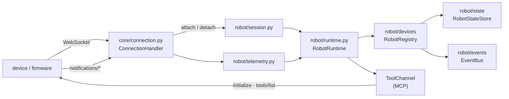

# Robot domain layer

The robot subsystem as it exists in the tree: typed models for a connected robot, a
registry that survives a reconnect, a state store, an event bus, and capability discovery
over the device MCP tool channel.

This is the **implemented** half of [robot-architecture.md](robot-architecture.md). There
is still no behaviour engine, no action executor and no safety policy: nothing here moves
a robot. It answers "which robots are connected, what can each one do, and what is each
one doing right now".

## What runs today

| Piece | Module | Status |
|---|---|---|
| Domain models (identity, capabilities, connection, telemetry, state) | `robot/state/models.py` | Implemented |
| State store interface plus an in-memory implementation | `robot/state/store.py` | Implemented |
| Typed events and the async in-process bus | `robot/events/` | Implemented |
| Robot registry (register, reconnect, supersede, teardown) | `robot/devices/registry.py` | Implemented |
| Tool and capability registries | `robot/devices/tools.py` | Implemented |
| MCP client, discovery, pagination, tool calls | `robot/devices/mcp.py` | Implemented |
| Control plane that wires the above together | `robot/runtime.py` | Implemented |
| Session seam onto the inherited connection handler | `robot/session.py` | Implemented |
| Device telemetry notifications turned into world state and events | `robot/telemetry.py` | Implemented |
| Route registry for the device protocol | `robot/protocol/` | Implemented (earlier) |
| Simulated robot that speaks the whole device protocol | `robot/simulator/` | Implemented ([robot-simulator.md](robot-simulator.md)) |
| Behaviour, actions, safety, world map, memory | — | Planned |



## Domain models

Every model in `robot/state/models.py` is a frozen pydantic model, so it can be published
on the bus, written to a future Redis or Postgres store, and compared in a test without a
server. Models that describe a measurement inherit `Timestamped` and carry the moment
they were written.

| Model | Holds |
|---|---|
| `RobotIdentity` | `device_id`, `robot_id`, `name`, `hardware_model`, `firmware_version`, `protocol_version`, `capabilities`, `connected_at`, `last_seen_at` |
| `RobotCapabilities` | `mcp`, `features`, `tools`, the MCP `protocol_version`, the device's server name and version, and how many tool definitions were malformed |
| `RobotConnection` | `session_id`, `status`, `protocol`, `transport`, `remote_address`, `connected_at`, `last_seen_at`, `disconnected_at`, `disconnect_reason`, `reconnect_count` |
| `RobotPose` | `x_m`, `y_m`, `theta_rad`, `frame` |
| `RobotMotionState` | `moving`, `linear_speed_mps`, `angular_speed_rps`, `action_id` |
| `RobotBatteryState` | `percent` (0-100), `charging`, `voltage_v`, and `is_low` |
| `RobotSensorState` | `cliff_detected`, `bump_detected`, `picked_up`, `touch_detected`, free-form `readings`, and `blocked` |
| `RobotAudioState` | `listening`, `speaking`, `volume_percent`, `sound_direction_deg` |
| `RobotVisionState` | `camera_active`, `faces_detected`, `tracked_target_id`, `last_frame_at` |
| `RobotExpressionState` | `emotion`, `intensity`, `display_text`, `animation` |
| `RobotActivityState` | `activity` (idle, listening, thinking, speaking, moving, charging, error), `detail`, `since` |
| `RobotTelemetry` | All of the above, each optional; `merge()` overlays a patch, `changed_fields()` says what moved |
| `RobotState` | `robot_id`, `identity`, `connection`, `telemetry` — the complete server-side picture |
| `RobotTool` | `name` (sanitized), `raw_name` (as the device published it), `description`, `input_schema`, `source` |
| `DeviceInfo` | What the transport and `hello` report; builds identity and connection so there is one construction path |

### Freshness is part of every read

The robot is authoritative and the server holds a cache
([robot-architecture.md](robot-architecture.md) Sect. 2.4), so a stale reading is a
different thing from a current one:

```python
sensors = state.telemetry.sensors
if sensors is not None and sensors.is_fresh(0.5):
    ...                       # act on it
sensors.require_fresh(0.5)    # or raise StaleStateError instead of acting on old data
```

`robot_id` is derived from the device id (`normalize_robot_id`), so a device whose id
differs only in case or separator is one robot and not two.

## The registry

`RobotRegistry` is the subsystem's first primitive, because the inherited server has no
session registry at all (robot-architecture R1). Every method is a coroutine guarded by
one lock, so concurrent connects, disconnects and telemetry updates cannot interleave.

| Method | Behaviour |
|---|---|
| `register(identity, connection)` | Registers a session. A second live session for the same robot **supersedes** the first: the old one gets a `RobotDisconnected` with reason `superseded`, not a silent drop. Re-registering the same `session_id` is idempotent |
| `unregister(robot_id, session_id=…, reason=…)` | Marks the robot disconnected and drops its live capabilities. Idempotent, and a **no-op when `session_id` names a superseded session** — a late teardown from an old session must not unregister the new one |
| `get(robot_id)` / `list(connected_only=True)` | Current state; `list` is sorted by robot id |
| `update_state(robot_id, telemetry)` | Merges a telemetry patch, refreshes liveness, and publishes `TelemetryUpdated` plus the per-field events for whatever changed |
| `update_last_seen(robot_id)` | Liveness without telemetry |
| `get_capabilities(robot_id)` / `get_tools(robot_id)` | What the robot can do, or `None` before discovery finishes |
| `set_capabilities(robot_id, capabilities)` | Records a discovery result, publishes `ToolDiscovered` for each new tool and one `CapabilitiesRefreshed`, and fills in identity fields the device reported about itself |

A reconnecting device keeps its robot id, its last known telemetry (stale, and timestamped
as such) and its previously discovered capabilities until discovery refreshes them, so it
is never briefly capability-less. `reconnect_count` counts the returns.

## The state store

`RobotStateStore` is an abstract base class with five coroutines — `get`, `put`, `mutate`,
`delete`, `list_states` — and one compound operation. `mutate` is read-modify-write under
a lock, which is what maps onto `WATCH`/`MULTI` in Redis or `SELECT … FOR UPDATE` in
Postgres; an implementation may call the change function more than once, so it must be
pure. `InMemoryRobotStateStore` is the implementation that ships. There is no module-level
instance: a store is constructed per runtime and per test.

## Telemetry from a device

`robot/telemetry.py` is the inbound half of the world model. A device reports itself as MCP
notifications — JSON-RPC with a `method` and no `id` — and
`robot/session.py:handle_notification` claims the telemetry methods out of the branch in
`core/providers/tools/device_mcp/mcp_handler.py` that otherwise logs the method name and
drops the frame:

| Method | Becomes |
|---|---|
| `notifications/telemetry` | Every slice of `RobotTelemetry` at once |
| `notifications/pose` | `RobotPose` |
| `notifications/battery` | `RobotBatteryState` |
| `notifications/sensor` | `RobotSensorState` |
| `notifications/motion_completed` | A `MotionCompleted` event, plus the pose it finished at |
| `notifications/motion_failed` | A `MotionFailed` event carrying the device's reason |

`notifications/motion`, `/audio`, `/vision`, `/expression` and `/activity` map to their own
slices too. Conversion from the device's integer millimetres, degrees and percentages into
the model's metres, radians and fractions happens here and nowhere else, and a malformed
field is dropped rather than raised on, so one bad number does not cost a whole frame.
`parse()` is pure and testable without a runtime; `ingest()` applies a frame and never
raises, because it runs from inherited code where a robot problem must not break a voice
session. The wire format is documented in [robot-simulator.md](robot-simulator.md).

## Events

`robot/events/types.py` holds the vocabulary — `RobotConnected`, `RobotDisconnected`,
`TelemetryUpdated`, `BatteryUpdated`, `PoseUpdated`, `SensorUpdated`, `MotionCompleted`,
`MotionFailed`, `ToolDiscovered`, `CapabilitiesRefreshed`, `ToolCallStarted`,
`ToolCallCompleted`, `ToolCallFailed` — each a frozen model with an `event_id`, a `robot_id`
and an `occurred_at`.

```python
bus = EventBus(queue_size=256)
subscription = bus.subscribe(BatteryUpdated, on_battery)   # or a tuple of types
await bus.publish(BatteryUpdated(robot_id="aa-bb", battery=battery))
await bus.drain()            # wait for delivery (tests, shutdown)
bus.unsubscribe(subscription)
await bus.aclose()
```

Four properties the bus is built for:

* **Per-subscriber queues and workers.** `publish` never awaits a handler, so a slow
  subscriber delays neither the publisher nor a fast peer.
* **Bounded, drop-oldest.** A full queue loses its oldest undelivered event and counts the
  drop — the freshest robot state is the one worth keeping. The inherited audio queue is
  unbounded and backlogs silently under load; this deliberately does not.
* **Isolated failures.** A handler that raises is logged, its subscription carries on, and
  the publisher never sees the exception.
* **Clean shutdown.** `aclose()` cancels every worker; `drain()` first if delivery matters.

Subscribing to `RobotEvent` receives everything, so a new event type is additive.

## Capability discovery over MCP

Capabilities are **discovered, never hardcoded**. On connection:

1. **Detect.** MCP support comes from the `hello` features block (`supports_mcp`). At
   connection time `hello` has not arrived yet, so the tool channel confirms support
   during discovery rather than the seam guessing.
2. **Initialize.** The MCP handshake, with the same protocol revision the inherited
   handshake sends, so firmware sees no skew.
3. **List.** `tools/list`, following `nextCursor` until the device stops paginating, with a
   hard page cap and a repeated-cursor check so a broken device cannot loop forever.
4. **Normalize.** Each definition becomes a `RobotTool`; the sanitized name is what the
   server uses and `raw_name` is what a `tools/call` carries. A malformed definition is
   skipped and counted, so one bad tool does not cost the device its other capabilities.
5. **Associate.** The result is written to the robot's `RobotCapabilities`, the per-robot
   `RobotToolRegistry` and the process-wide `RobotCapabilityRegistry`.
6. **Refresh.** A reconnect rediscovers, because firmware may have changed between
   sessions. New tools produce `ToolDiscovered`; every discovery produces
   `CapabilitiesRefreshed`.

Discovery always runs in its own task. The inherited read loop awaits every message
handler inline (robot-architecture R3), so anything that waits on a device would stall
ingestion of all later frames, audio included.

Two channel implementations satisfy the same `ToolChannel` protocol:

| Channel | Where | Used for |
|---|---|---|
| `RobotToolClient` | `robot/devices/mcp.py` | A channel the robot subsystem owns end to end: it sends `initialize`, `tools/list` and `tools/call` itself over any transport with a `send()` coroutine. Its request ids start at 1000, above the inherited handshake ids, so a shared channel cannot resolve the wrong future (R10). Every request carries an explicit, short timeout |
| `ConnectionToolChannel` | `robot/session.py` | A live device session: it waits for the handshake `core` already performs, reads the discovered tools from the inherited client, and dispatches calls through `call_mcp_tool` with an explicit short timeout instead of its 30-second default |

The session path reuses the inherited client on purpose — opening a second MCP handshake
on one WebSocket would duplicate the initialize and collide with its request ids.

## The seam onto a live session

`robot/session.py` is the only robot module that knows `ConnectionHandler` exists, and it
imports `core/` **lazily**, inside functions. Two entry points, both of which swallow their
own failures, because a robot problem must never break a voice session:

```python
await attach_connection(conn)    # after the headers are parsed
await detach_connection(conn)    # in handle_connection's finally
```

Robot state on the connection lives under exactly one namespaced attribute
(`robot/session.py:ROBOT_ATTR`), because the inherited handler has no fixed shape and
collects attributes from several modules (R12).

### Inherited-code changes

Three lines in one inherited file, which is the budget robot-architecture Sect. 4.2
allocated for session lifecycle:

| File | Change |
|---|---|
| `core/connection.py` | One import, `await robot_attach(self)` after `register_plugins_to_conn(self)`, and `await robot_detach(self)` at the top of `handle_connection`'s `finally` |

## Using it

```python
from robot.runtime import get_runtime
from robot.state import RobotBatteryState, RobotTelemetry

runtime = get_runtime()

for state in await runtime.registry.list():
    print(state.robot_id, state.identity.hardware_model, state.capabilities.tool_names)

await runtime.update_telemetry("aa-bb-cc", RobotTelemetry(battery=RobotBatteryState(percent=42)))

if await runtime.capabilities.has_tool("aa-bb-cc", "self_battery"):
    print(await runtime.call_tool("aa-bb-cc", "self_battery", timeout=2.0))
```

`get_runtime()` returns the process-wide control plane, created on first use;
`set_runtime()` replaces it. The class itself holds no module state, so a test builds its
own `RobotRuntime()` and two tests never share a registry, a bus or a store.

## Tests

`tests/robot/` runs against fakes only — no socket, no device, no external API, and none
of the heavy runtime dependencies:

| Module | Covers |
|---|---|
| `tests/robot/test_state.py` | Models, bounds, freshness and `StaleStateError`, telemetry merge, the store |
| `tests/robot/test_events.py` | Fan-out, type selection, unsubscribe, handler failure isolation, drop-oldest under a fast producer, a slow subscriber not blocking a fast one, shutdown |
| `tests/robot/test_registry.py` | Registration, duplicate connections, reconnect, stale teardown, state updates, capability refresh, and 25 robots connecting concurrently |
| `tests/robot/test_mcp.py` | Discovery, pagination, timeouts, malformed and duplicate definitions, protocol errors, tool calls and result unwrapping, request-id isolation |
| `tests/robot/test_session.py` | The runtime and the session seam end to end: attach, discover, call, reconnect, supersede, disconnect cleanup |
| `tests/robot/test_layering.py` | `robot/` imports with no config file and without pulling in `core/` |
| `tests/robot/test_protocol.py` | The route registry |
| `tests/robot/test_telemetry.py` | Notification parsing, unit conversion, malformed fields, motion events, ingestion, and the session seam |
| `tests/robot/test_simulator.py` | The simulator's clock, world, physics, camera, tool table and scenario runner — no socket |

`tests/robot/conftest.py` holds the fakes: `FakeMcpDevice` (a device that answers JSON-RPC
and can paginate, stall or fail), `FakeDeviceMcpClient` (the inherited client's shape) and
`FakeConnection` (the attributes the seam reads off a session).

## Related pages

[robot-architecture.md](robot-architecture.md) — the target architecture and the safety
rule · [robot-roadmap.md](robot-roadmap.md) — phases and acceptance criteria ·
[mcp.md](mcp.md) — the tool channel · [robot-simulator.md](robot-simulator.md) — the robot on
the other end of it · [testing.md](testing.md) — how the suite is run ·
[development.md](development.md) — lint, types, tests
