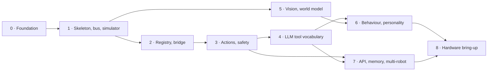

# Robot backend roadmap

Implementation phases and acceptance criteria for the architecture in
[robot-architecture.md](robot-architecture.md).

Nilo is a voice/vision session backend that has grown a robot subsystem. Phases 0 to 3 have
landed: the domain layer, the registry and session seam, the simulator, and the action and
safety layers ([robot-domain.md](robot-domain.md), [robot-simulator.md](robot-simulator.md),
[robot-actions.md](robot-actions.md)), and so have the world model and the behaviour engine
([robot-behavior.md](robot-behavior.md)), and personality, emotion and expressive animation
([robot-personality.md](robot-personality.md), [robot-animation.md](robot-animation.md))
robot vision ([robot-vision.md](robot-vision.md)) and robot memory with its admin API
([robot-memory.md](robot-memory.md)). The LLM seam is **not implemented**. This page is the plan, and the
honest boundary between what runs and what is design: each phase below says which half it is
in, and a **Delivered** note means the code is in the tree.

Each phase is independently shippable and leaves the repository green. A phase is done when
**every** acceptance criterion is met — criteria are written to be mechanically checkable,
not to be argued about. Phases are ordered by dependency, not by how interesting they are:
the boring ones early (safety, registry, simulator) exist so the interesting ones later
(behaviour, personality) can be tested without hardware.

**Notation.** A path in `backticks` is a file that exists in the tree today and can be
opened. A path in **bold** is a package this roadmap plans to create; it does not exist
yet. `python scripts/check_docs.py` fails on a backticked repository path that does not
exist, so the backticked half of that distinction is mechanical; the bold half is convention.

Two rules apply to every phase:

* **Inherited edit budget.** Most of `core/` is inherited from the upstream project and is
  re-synced (see [upstream.md](upstream.md)); every line changed there is a line that can
  conflict. The budget for the robot work is about 10 lines across 4 files
  (robot-architecture §4.2). A phase that wants to exceed it must say so in its PR
  description and justify it. Adding a file to a new directory is always free.
* **No hardware in CI.** Every test runs against the simulator. A test that needs a real
  robot is not a test, it is a bring-up procedure, and belongs with the Phase 8 bring-up
  notes.

---

## Phase 0 — Foundation

Make the repository able to enforce its own rules before any robot code exists.

### Done

The rebrand and the preceding audit closed most of this phase. Verified in the tree today:

| Item | Where |
|---|---|
| Server directory renamed to nilo-server; the Java manager modules are gone, so `main/` holds one component | `main/nilo-server`, [migration.md](migration.md) |
| Device protocol registry with one named protocol — `nilo` (`/nilo/v1/`, `/nilo/ota/`) — consumed by both servers instead of hard-coded paths, with `protocols.strict` (shipped `true`) rejecting any WebSocket path that matches no protocol | `robot/protocol/base.py:ProtocolRegistry`, `core/http_server.py:SimpleHttpServer._build_app`, `core/websocket_server.py:WebSocketServer._http_response` |
| `NILO_SERVER_HOST`, `NILO_SERVER_PORT`, `NILO_HTTP_PORT` and `NILO_LOG_LEVEL` override config keys, and `NILO_CONFIG` selects the user config file; no deprecated config aliases are left, so only the current key names load | `config/config_loader.py:ENV_OVERRIDES`, `config/config_loader.py:custom_config_path`, `config/config_loader.py:DEPRECATED_KEYS` |
| Module-level test skips removed. `pytest -q` collects and runs the suite; the only skips left are `pytest.importorskip` guards for the heavy runtime packages, so the dev-only dependency slice still runs | `tests/core/test_http_routes.py`, `tests/core/test_ws_path_gate.py`, `tests/plugins_func/test_loadplugins.py` |
| Tests no longer need a hand-written `data/.config.yaml`: `tests/conftest.py` points `NILO_CONFIG` at a committed fixture | `tests/conftest.py`, `tests/fixtures/test_config.yaml` |
| One Python version everywhere. CI runs 3.12 only, on `main`, `develop` and every PR, in four jobs: lint plus type-check plus docs check, full dependencies, the dev-only slice, and `docker compose config` | `.github/workflows/test.yml` |
| Repo-wide bug-only lint floor and strict mypy scoped to robot code | `.ruff.toml`, `mypy.ini` |
| `Makefile` targets: `test`, `lint`, `typecheck`, `check-docs`, `run`, `compose-validate`, `docker-build`, `smoke` | `Makefile` |
| `plugins/register.py` fixed (`FunctionRegistry.__init__` no longer calls an undefined `setup_logging()`); the registry contract and the `Action`/`ToolType` codes that `ServerPluginExecutor` dispatches on are pinned by tests | `plugins/register.py`, `tests/plugins/test_register.py` |
| Agent instructions rewritten: they name the robot subsystem, the docs, `pytest`, `ruff`, `mypy` and the no-inherited-edits rule, and every command in them runs | `main/nilo-server/CLAUDE.md` |
| The imperative `test_plugin.py` script at the server root is deleted, so widening `testpaths` for new test directories cannot abort a run | `pyproject.toml` |
| The archive of 26 unmerged upstream patches is pruned from the working tree | [migration.md](migration.md) |
| Branding and documentation are checked mechanically in CI: link resolution, backticked paths, `NILO_*` names, no Chinese text, legacy identifiers only where allowed | `scripts/check_docs.py`, `.github/workflows/test.yml` |

### Remaining

| # | Task | Why |
|---|---|---|
| 0.1 | Add a ruff config under **robot/** extending `.ruff.toml` with the full style/typing rule set, plus a `flake8-tidy-imports` banned-import rule enforcing the layering table in robot-architecture §7 — in particular that no LLM-facing module may import a motion primitive. | The central safety invariant is currently enforced by nothing mechanical. |
| 0.2 | Gate `.github/workflows/docker-image.yml` on the Tests workflow passing, not only on the base-image build. It already refuses to run when a `workflow_run` trigger reports a failed conclusion, but it still publishes to ghcr.io without running a test. | A release path that never runs tests will eventually ship a broken image. |
| 0.3 | Keep `make check-docs` at zero problems as pages are added and edited. It reports zero today and is already a required CI step. | A branding and link checker that is allowed to be red is not a check. |

### Acceptance criteria

* `make lint && make typecheck && make test && make check-docs` passes from a clean
  checkout after `pip install -r requirements-dev.txt`.
* CI runs lint, mypy, the docs check and the full pytest suite on **3.12** on both `main`
  and `develop` and on every PR.
* `pytest -q` reports zero module-level skips that are not `importorskip` guards on
  optional runtime packages.
* A ruff config under **robot/** exists and a deliberately-planted import of a motion
  primitive from an LLM-facing module fails lint. Prove it with a commit that adds the
  violation, shows the failure, and reverts it.
* No image is published from a commit whose Tests run did not pass.

---

## Phase 1 — Skeleton, config, event bus, world state, simulator

The smallest thing that can be tested end to end with no hardware and no LLM.
`robot/__init__.py` and `robot/protocol/` already exist and set the pattern.

**Build:** **robot/config.py**, `robot/logging.py`, `robot/events/`, `robot/state/`
(world model + freshness), **robot/simulator/** (a fake device that speaks the WebSocket
session protocol and device MCP), and tests under `tests/robot/`.

**Delivered** (see [robot-domain.md](robot-domain.md)): `robot/state/` (frozen domain models,
an age on every timestamped entry, `StaleStateError`, `RobotStateStore` plus an in-memory
implementation), `robot/events/` (typed events and a bounded drop-oldest async bus),
`robot/logging.py` (stdlib logging bridged into the server's sinks from `app.py`), and the
`tests/robot/` suite that covers them — including the subprocess test that proves `import
robot` needs no config file and pulls in no `core` module.

The **simulator is delivered** as well: `robot/simulator/` is a client that speaks the whole
device protocol — handshake, device MCP with paged `tools/list`, 15 published hardware
capabilities, motion that takes time, a configurable room with walls, obstacles, cliffs,
people and a dock, synthetic or fixture camera frames, telemetry notifications, failure
injection and a scenario runner on an accelerated or hand-driven clock. Its backend half,
`robot/telemetry.py`, turns `notifications/*` into world state and typed events. See
[robot-simulator.md](robot-simulator.md).

**Still open:** a robot config file and schema (**robot/config.py**), and typed robot protocol
messages with a version field and acks.

**Key constraints** (robot-architecture §4.1, §7):

* Robot code imports nothing from `core/` at module scope. The dependency runs the other
  way today — `config/logger.py` imports `robot.__version__` — so anything expensive at
  robot import time is paid by every process that logs.
* Robot logging uses stdlib logging; **never** call `setup_logging()` at module scope. That
  function reads the config file and configures loguru globally
  (`config/logger.py:setup_logging`).
* Robot config is its own file, not a slice of the server config dict. In manager-api mode
  the local config is replaced wholesale by the API response — only the `server` and
  `manager-api` blocks survive (`config/config_loader.py:get_config_from_api_async`) — so
  any speed, acceleration or geofence limit stored there would vanish in production.
* Every protocol message is a frozen Pydantic model with an explicit version field and an
  ack, in the style `robot/protocol/base.py:ProtocolSpec` already sets for route specs. A message of an unknown type is logged
  and dropped with no reply to the device
  (`core/handle/textMessageProcessor.py:TextMessageProcessor.process_message`), so without
  an ack, firmware skew is invisible from the device side.
* New message type names must not collide with the wire vocabulary already in use:
  `robot/protocol/nilo.py:RESERVED_MESSAGE_TYPES`.
* Event-bus queues are **bounded with drop-oldest**. The inherited audio queue is an
  unbounded `queue.Queue` (`core/connection.py:ConnectionHandler.__init__`, `asr_audio_queue`)
  and backlogs silently under load; do not copy that.
* No module-level mutable state. Every state object is constructible per test — the
  module-level dictionaries in `core/utils/output_counter.py` are what we are avoiding.

### Acceptance criteria

* `import robot` succeeds in a venv with **no** `data/.config.yaml`, no `NILO_CONFIG`, and
  no loguru configured. Asserted by a test that runs in a subprocess with a clean `cwd`.
* `mypy` passes at the strict `robot.*` settings, zero `# type: ignore`.
* **Done.** The simulator connects to a running `app.py`, completes the session handshake
  against the `nilo` route, answers `initialize` and `tools/list`, and appears in the server
  log as a device with tools — verified by `tests/integration/test_simulator_e2e.py`, not by
  hand.
* A protocol round-trip test: every message model serializes, deserializes, and rejects a
  wrong version with a typed error rather than an exception trace.
* An event-bus test proves drop-oldest under a producer faster than its consumer, and that
  a slow subscriber cannot block a fast one.
* World-state entries carry an age; a test proves that reading a stale entry past its
  freshness budget raises rather than returning stale data.

---

## Phase 2 — Device registry, session adapter, the bridge

Attach to the session server. First code that touches inherited files.

**Build:** `robot/devices/`, **plugins/robot_bridge/**. Spend the 2-line
`core/connection.py` budget: attach inside `ConnectionHandler.handle_connection` next to
the existing `register_plugins_to_conn(self)` call, detach in that method's `finally`
block, both `try/except`-wrapped.

**Delivered**: `robot/devices/` (the robot registry, the tool and capability registries and
MCP capability discovery), `robot/runtime.py` (the control plane) and `robot/session.py` (the
seam, which swallows its own failures instead of wrapping every call site). The
`core/connection.py` budget is spent: one import plus an `await` at each end of
`handle_connection`. Registration, reconnect, supersede and teardown are covered by
`tests/robot/test_registry.py` and `tests/robot/test_session.py`.

Telemetry ingestion landed with the simulator: `robot/telemetry.py` plus
`robot/session.py:handle_notification`, dispatched from the three-line hook in
`core/providers/tools/device_mcp/mcp_handler.py` that §4.2 budgeted, so device
`notifications/*` become world state and events instead of a log line.

**Still open:** the bridge plugin under **plugins/robot_bridge/** (nothing is registered with
the LLM yet, which is Phase 4), the weak-reference behaviour of the registry (state is held by
the store, not by a reference to the connection), and the compatibility regression test that
runs a full voice turn with the robot subsystem loaded.

**Key constraints** (robot-architecture §4.1, §4.2, R1–R5):

* All robot state on `conn` goes under **one** namespaced attribute. `ConnectionHandler`
  has no fixed shape and a long tail of attributes grafted on by other modules.
* The bridge **self-asserts** after registration. `plugins/__init__.py:_import_module_safe`
  catches every import exception and logs a warning, so a typo otherwise disables the whole
  robot subsystem while the server looks healthy.
* The bridge must not re-export any `BasePlugin` subclass:
  `plugins/__init__.py:register_plugins_to_conn` reflects over `dir(module)` with no dedup,
  so a re-exported class is instantiated once per module that names it.
* Use `if TYPE_CHECKING:` for `ConnectionHandler`, the way the inherited executors do
  (`core/providers/tools/server_plugins/plugin_executor.py`) — the class is not importable
  at plugin import time without a cycle.
* Never submit to `conn.executor` (a shared 5-worker pool), never assume `conn.tts` /
  `conn.asr` / `conn.func_handler` are non-`None`, and never cache `conn.logger` — it is
  replaced once the module string is known
  (`core/connection.py:ConnectionHandler._initialize_components`).
* The registry holds weak references and tolerates double-detach. `ConnectionHandler.close`
  is reachable from several call sites with no idempotency flag, and double teardown is the
  normal flow (`core/connection.py:ConnectionHandler.handle_connection`, `_save_and_close`).

### Acceptance criteria

* **Done.** Connecting two simulated robots yields exactly two registry entries with
  distinct device ids; disconnecting one leaves exactly one; disconnecting the same session
  twice is a no-op.
* **Done.** A test kills a simulated device without a clean close (drop the TCP connection)
  and the registry entry is gone within a bounded time.
* `git diff --stat` against the integration branch shows **at most 6 added lines** in
  `core/`, in two files: 3 in `core/connection.py` (an import plus attach and detach) and 3 in
  `core/providers/tools/device_mcp/mcp_handler.py` (the telemetry hook, which §4.2 budgeted at
  4). The whole budget is about 10 lines across 4 files.
* The bridge's self-assertion fails the server start (loudly, with a non-zero exit or a
  startup error) when a robot module is deliberately broken. Tested.
* A normal, non-robot client still completes a full voice turn with the bridge loaded — the
  compatibility regression test, run in CI from Phase 2 onward. See [testing.md](testing.md).

---

## Phase 3 — Action system and safety policy

The core of the design rule. No LLM involved yet; actions are driven from tests.

**Build:** **robot/actions/** (model, lifecycle, queue, resource claims), **robot/safety/**
(policy, limits, watchdog, e-stop).

**Delivered** (see [robot-actions.md](robot-actions.md)): `robot/actions/` — ten semantic
action specs, the lifecycle object, the priority queue and resource ledger, the registry
that correlates device completions, and the executor that is the only thing which calls a
device; `robot/safety/` — the deterministic policy, frozen configurable limits with an
optional YAML file, the sticky emergency-stop latch, and a watchdog on its own thread with
per-action deadlines plus a 500 ms supervisory sweep. `RobotRuntime.actions` and
`runtime.robot(id)` expose it, and `robot/simulator/` grew the `robot.follow.target` tool and
a `drop_motion_completion` fault so every behaviour above is testable without hardware.
[safety.md](safety.md) was rewritten in the same change: its "Planned" half is now "Motion
safety", with an explicit firmware contract naming what the robot must implement itself and
what each protection does when the Python process dies.

**Still open:** the LLM-facing bridge and its tool schemas (Phase 4), speech as an `AUDIO`
resource claim (Phase 6), and the stricter `robot/` ruff configuration (Phase 0.1) — the
layering table is enforced by `tests/robot/test_layering.py`, which parses every module under
`robot/`, rather than by a banned-import lint rule.

**Key constraints** (robot-architecture §2.8, §2.9, §3.1, R6, R7):

* Lifecycle is
  `PENDING → STARTING → RUNNING → SUCCEEDED | FAILED | CANCELLED | TIMED_OUT | REJECTED`.
  Illegal transitions raise.
* Resource claims over `DRIVE / HEAD / LIFT / DISPLAY / AUDIO / CAMERA`. Two actions
  claiming the same resource cannot run concurrently.
* Every semantic request is clamped against limits and sensor state **before** dispatch.
  The safety layer is a policy filter, not a guarantee — it does not replace firmware.
* Every dispatch to the device passes an **explicit short timeout** to `call_mcp_tool`. Its
  default is 30 seconds and the device executor never overrides it
  (`core/providers/tools/device_mcp/mcp_handler.py:call_mcp_tool`,
  `core/providers/tools/device_mcp/mcp_executor.py:DeviceMCPExecutor.execute`) — two orders
  of magnitude too long for a motion acknowledgement.
* The watchdog runs on the **robot's own loop or thread**, never the session event loop,
  which runs ONNX VAD inference (`core/providers/vad/silero.py`) and blocking HTTP. The
  periodic GC pass is dispatched to an executor but still walks `gc.get_objects()` twice
  and calls `gc.collect()` under the GIL every 300 seconds
  (`core/utils/gc_manager.py:GlobalGCManager._run_gc`, started from `app.py`), which stalls every
  Python thread in the process.
* Personality and behaviour sit **above** safety in the layering and cannot weaken it.

### Acceptance criteria

* **Done.** A property-based test over the lifecycle: no sequence of events reaches an
  illegal state or leaks a resource claim. `tests/robot/test_actions.py` enumerates all 64
  status pairs exhaustively (the space is small enough to prove rather than sample) and runs
  2000 seeded random walks; `tests/robot/test_queue.py` runs 1000 interleaved claims and
  releases asserting no subsystem is ever double-booked and no terminal action holds a claim.
* **Done.** A `move` beyond the configured limit is `REJECTED` with a typed reason, not
  clamped silently, and the rejection reaches the caller — with the number that failed in the
  message. `tests/robot/test_safety.py`, `tests/robot/test_executor.py`, and
  `tests/integration/test_actions_e2e.py` (which also asserts nothing reached the device).
* **Done.** A `move` with a cliff sensor asserted is `REJECTED` regardless of who requested
  it — parameterized over all five `ActionSource` values in both the unit and the integration
  suite, the latter driven by a cliff the *simulator* reports over the wire.
* **Done.** Watchdog: `tests/integration/test_actions_e2e.py` severs the link mid-action and
  the action is cancelled; a `drop_motion_completion` fault leaves a live, healthy session in
  which the device never reports completion, and the real threaded watchdog marks the action
  `TIMED_OUT` and a stop reaches the device. The clock is not mocked away:
  `tests/robot/test_watchdog.py` additionally shows a deadline firing while the event loop is
  blocked in a synchronous sleep.
* **Done.** E-stop: every queued and running action is `CANCELLED`, the robot itself stops,
  and no new action is accepted from any source until `clear_emergency_stop` is called.
* **Done.** A test asserts that the safety package imports nothing from the behaviour or
  personality packages — `tests/robot/test_layering.py` asserts the whole §7 import table by
  parsing the source, and separately that `robot/safety` imports only `robot/state`. It is
  not yet also a lint rule; Phase 0.1 remains open.
* **Done.** [safety.md](safety.md) is updated in the same change: which protections are
  duplicated in firmware, which exist only in the backend, and the failure mode of each when
  the Python process dies. Backend-only protections are, by definition, not guarantees.

---

## Phase 4 — Semantic action vocabulary (the LLM seam)

Expose actions to the LLM. This is where the critical design rule becomes real.

**Build:** the tool module inside **plugins/robot_bridge/**.

**Key constraints** (robot-architecture §4.1 seam ③, §3.3, R8, R9; see also [mcp.md](mcp.md)):

* `@register_function(name, schema, ToolType.IOT_CTL)`. `IOT_CTL` (code 5) is the **only**
  type auto-exposed to the LLM without editing `config.yaml`
  (`core/providers/tools/server_plugins/plugin_executor.py:ServerPluginExecutor.get_tools`),
  and one of the two branches that pass `conn`; `async def` handlers are awaited
  (`ServerPluginExecutor.execute`). Import `ToolType` from `plugins/register.py`, **not**
  from `core/providers/tools/base/tool_types.py` — same name, different enum.
* Every tool is namespaced `robot_*`. The tool namespace is flat, and executors are
  registered server-plugins-first, device-MCP-later
  (`core/providers/tools/unified_tool_handler.py`), so a device tool of the same name
  overwrites the guarded one in `core/providers/tools/unified_tool_manager.py:ToolManager.get_all_tools`
  with nothing worse than a logged warning.
* Every handler validates, clamps through the safety layer, enqueues, and **returns
  immediately** — `Action.NONE` for silent execution, `Action.RECORD` to log into history
  without a second LLM round-trip. Never block on hardware: tool futures are awaited
  sequentially, each bounded by `tool_call_timeout` (default 30 s), with no cancellation
  (`core/connection.py`, the `futures_with_data` loop in `chat`).
* Deployments select the function-call intent module (`selected_module.Intent: function_call`,
  whose `Intent.function_call.type` is `function_call`). The intent LLM provider renders its tool
  prompt once and caches it on the instance
  (`core/providers/intent/intent_llm/intent_llm.py:IntentProvider.detect_intent`, the
  `self.promot` guard), so a second robot with different hardware can be offered the first
  robot's tools.
* Vocabulary is integers with the unit in the parameter name (`distance_mm`, `angle_deg`,
  `speed_mmps`), allowed string values enumerated in the description, defaults on
  everything optional. The server imposes no argument-type restriction of its own — it
  forwards the device's `properties` object to the LLM unchanged ([mcp.md](mcp.md)) — so the
  narrow boolean/integer/string vocabulary is a firmware property the robot tools have to
  respect rather than something the server will catch.

### Acceptance criteria

* `robot_move`, `robot_turn`, `robot_look_at`, `robot_play_animation`, `robot_follow` and
  `robot_stop` appear in `func_handler.get_functions()` on a fresh connection **with no
  `config.yaml` edit**. Asserted by a test that builds a
  `core/providers/tools/unified_tool_handler.py` handler against a fake conn.
* A test enumerates every registered robot tool schema and asserts that no parameter name
  or description matches a raw-actuator denylist (`pwm`, `duty`, `servo_us`, `wheel_speed`,
  `voltage`, …). This is the mechanical form of the design rule.
* A test asserts that no robot tool schema contains a `number` type — nothing in the server
  rejects one and the firmware vocabulary cannot express it, so a float parameter is a latent
  bug.
* Every tool handler returns in **under 10 ms** with the motion layer stalled. Measured,
  not assumed.
* A collision test: when the simulated device advertises a tool named `robot_move`, the
  bridge detects the collision at session start and refuses, loudly, rather than letting
  the device tool shadow the guarded one.
* The simulator's robot tool set is advertised across as many `tools/list` pages as the
  device-side page budget requires, and the server assembles all of them
  (`core/providers/tools/device_mcp/mcp_handler.py:send_mcp_tools_list_continue_request`).
* An end-to-end test with a scripted fake LLM: utterance in → tool call → clamped action →
  simulator executes → completion event → world state updated. No real LLM, no network.

---

## Phase 5 — Vision and world model

**Build:** `robot/vision/`, extend `robot/state/`.

**Delivered, world-model half** (see [robot-behavior.md](robot-behavior.md)):
`robot/state/world.py` — entities (`robot`, `person`, `face`, `object`, `location`,
`obstacle`) with `first_seen`, `last_seen`, `confidence` and either a metric `position` or
a normalized 0.0–1.0 `image_point`; attention, interactions and an environment block; a
documented per-kind TTL and confidence half-life, applied by `WorldState.decay`.
`robot/state/world_model.py` is the single writer: it folds connection and telemetry events
off the bus into immutable snapshots, and `runtime.world` is the one instance.

**Delivered, vision half** (see [robot-vision.md](robot-vision.md)): `robot/vision/` —
five provider protocols (frame source, provider, object detector, face detector, face
recognizer) plus a tracker, each replaceable on its own; a snapshot pipeline that decodes,
preprocesses, detects, recognizes, tracks, writes the world model and publishes seven typed
events; a face registry that holds embeddings in one place and hands out references;
configurable frame retention that defaults to keeping nothing; and per-robot latency
metrics. OpenCV and Ultralytics are optional and imported lazily; the defaults
(`HeaderVisionProvider`, `NullDetector`) need nothing installed. `robot/behavior/tracking.py`
turns coordinates into rate-limited look-at and deterministic, bounded following, and the
simulator grew three perception scenarios plus eight committed fixture frames under
`main/nilo-server/tests/robot/fixtures/vision/`.

**Still open:** the vision *language model* seam — asking a VLLM about a frame — which is
what the `core/api/vision_handler.py` and auth-token constraints below are about.

**Key constraints** (robot-architecture §2.4, R11):

* Coordinates are normalized 0.0–1.0 so tracking is resolution-independent.
* Do **not** route robot perception through `core/api/vision_handler.py`: it deep-copies
  the config and builds a VLLM provider per request, and runs the model call inside the
  aiohttp handler. Call `core/utils/vllm.py:create_instance` once from robot code and run
  `response()` in an executor.
* Copy the short-circuit convention in
  `core/providers/tools/device_mcp/mcp_executor.py:DeviceMCPExecutor.execute` for
  low-latency perception replies: a JSON result carrying an `action` field is turned
  straight into an `ActionResponse` and skips the second LLM pass.
* The vision auth token is minted per connection and carries a fixed lifetime
  (`core/utils/auth.py:AuthToken.generate_token`, one hour, never refreshed), so a session
  older than an hour holds an expired token. Either refresh it or document the ceiling.

### Acceptance criteria

* **Done.** Tracking tests run against recorded frames in a committed fixtures directory
  under `main/nilo-server/tests/robot/fixtures/vision/`; no camera, no cloud, no network in
  CI, and the eight frames are rendered by the simulator's own camera.
* **Done.** A target persists across frames with a stable id and decays out of the world
  model on a documented schedule; `tests/robot/test_vision.py` proves the track timeout and
  `tests/robot/test_world.py` the entity decay.
* Vision never blocks the session event loop: a test asserts a voice turn completes within
  budget while a perception request is in flight. (The heavyweight detector already runs in
  a thread; the end-to-end assertion belongs with the LLM seam.)
* A session older than the token lifetime either still works (refresh implemented) or fails
  with a typed, logged error — not a bare 401 swallowed somewhere.

---

## Phase 6 — Behaviour engine and personality

**Build:** `robot/behavior/`, `robot/personality/`, `robot/animation/`.

**Delivered, behaviour half** (see [robot-behavior.md](robot-behavior.md)):
`robot/behavior/` — `tuning.py` (every number the engine compares against, loadable from
YAML, with a test that parses the behaviours to prove none of them hides a constant),
`base.py` (the `Behavior` contract, the context, the four autonomy modes), `scheduler.py`
(filtering, seeded scoring, banded arbitration, preemption, minimum and maximum runtimes,
and the decision record), `builtins.py` (the sixteen behaviours), `engine.py` (the
assembly) and `explain.py` plus `__main__.py` (`python -m robot.behavior explain`, which
scores and can never command). Five structured debug events — `BehaviorEvaluated`,
`BehaviorSelected`, `BehaviorStarted`, `BehaviorCompleted`, `BehaviorInterrupted` — carry
the whole decision, losers included. `runtime.behavior(robot_id)` wires an engine onto the
action layer with `ActionSource.BEHAVIOR`.

**Delivered, personality and animation halves** (see
[robot-personality.md](robot-personality.md) and [robot-animation.md](robot-animation.md)):
`robot/personality/` — six stable traits with presets and a YAML file, seven internal
control variables that decay exponentially towards trait-derived baselines and are nudged
by named stimuli, the event wiring that keeps them current, and a per-robot JSON store
that persists the traits on change and the variables only coarsely and occasionally.
`robot/animation/` — animations as YAML data (five channels mapped onto the resource
ledger, offsets rather than cumulative delays), a library loader where a deployment
directory may replace a shipped animation by name, thirteen starter animations, and an
engine with play, cancel, priority, looping, transitions, resource ownership and the
low-energy gate. Both are wired in by `runtime.behavior(robot_id)`.

**Still open:** nothing in this phase. The animation ``audio`` channel is declared but
skipped until speech becomes an ``AUDIO`` resource claim.

**Key constraints** (robot-architecture §2.6, §7):

* Utility scoring must be **deterministic** given the same world state — seeded, no wall
  clock, no ambient randomness. Behaviour tests that flake are worse than no tests.
* The engine runs with **no LLM available**. This is a hard requirement, not a fallback.
* Animations are data-driven YAML; adding one requires no Python change.
* Personality influences scoring. It cannot influence safety. Enforced by layering.
* Emotion is an internal control signal. The inherited emoji-scrape
  (`core/utils/textUtils.py:get_emotion`) picks the first emoji in the reply, defaults to
  `happy`, and is emitted at most once per turn — treat it as one weak input, never the
  source of truth.

### Acceptance criteria

* **Done.** Nothing under `robot/behavior/` imports an LLM provider, and nothing it calls
  does: `tests/robot/test_behaviors.py` runs the whole set against world snapshots with no
  model, no network and no device. The full-session form of this is Phase 8's.
* **Done.** Given a fixed world state and a fixed seed, the engine selects the same
  behaviour 1000 times out of 1000 — asserted literally, a thousand evaluations in
  `tests/robot/test_behavior_scheduler.py`, which also proves registration order and two
  different seeds change nothing and something respectively.
* **Done.** A new animation is added in a PR that touches **only** a YAML file, and it
  plays — asserted by a test that writes a YAML file to a temporary directory, loads it and
  plays it, and by a second that proves the shipped set comes from the files alone.
* **Done.** A test sweeps every personality trait across its full range with a cliff
  asserted, and the action is `REJECTED` in every case — thirty parameterized cases in
  `tests/robot/test_personality.py`, each one also asserting nothing reached the device.
* **Done.** Four autonomy modes (`OFF / PASSIVE / NORMAL / FULL`) are implemented, and
  `tests/robot/test_autonomy.py` asserts the whole table — every built-in behaviour against
  every mode — plus that lowering the mode cancels what it would not have started.

---

## Phase 7 — Management API, memory, multi-robot

**Build:** `robot/api/`, `robot/memory/`. Spend the 3-line `app.py` budget.

**Delivered, memory and inspection halves** (see [robot-memory.md](robot-memory.md)):
`robot/memory/` — four stores (working, episodic, semantic, person), a `MemoryStore`
interface with a stdlib-`sqlite3` implementation behind it, ordered migrations recorded in
a `schema_version` table, an optional `EmbeddingProvider` (the robot works with embeddings
disabled, and a test proves it), token-budgeted ranked retrieval that explains every item
it returns, a deterministic consolidation job that writes provenance and never lets a
proposer overwrite a fact it is less confident about, and the privacy operations: delete a
memory, delete a person and everything about them, clear a robot. `robot/api/` — an aiohttp
admin app on its own port with its own constant-time-compared token, serving memory
inspection, recall, consolidation, the delete paths and the behaviour engine's
`why` explanation; it has no endpoint that can move a robot, and a test asserts that.

**Still open:** binding the API into `app.py` (the 3-line budget) with the done-callback
escalation — `robot/api/server.py:supervise` is written and unused until then — the
per-device TTS/LLM construction, and the two-robot concurrency proof.

**Key constraints** (robot-architecture §4.2, §4.3, R5, R11, R12):

* Own aiohttp app on its own port. Do **not** add routes to
  `core/http_server.py:SimpleHttpServer._build_app`: that table is built from the protocol
  registry and serves device traffic, and every route added there is an inherited-file edit
  plus an admin surface on the device port.
* The robot task gets a done-callback that escalates into the safety layer. `app.py` creates
  the WebSocket and HTTP tasks and never inspects them, so a port conflict degrades the
  server silently.
* Robot admin credentials are **distinct** from the device-token signing key. The OTA
  endpoint is unauthenticated and, when auth is enabled, mints a valid token for whatever
  device id the caller asks for (`core/api/ota_handler.py:OTAHandler.handle_post`,
  `core/auth.py:AuthManager`), so "the caller holds a valid device token" never authorizes
  actuation. See [safety.md](safety.md).
* Construct TTS/LLM/memory **per device**; never call
  `core/utils/modules_initialize.py:initialize_modules` with `init_tts=True` from robot
  code. Sharing one TTS pipeline between two robots shares its queues, its threads and its
  `close()`.
* Robot persistence is its own locked, durable store with a real shutdown await — not the
  pattern in `core/providers/memory/mem_local_short/mem_local_short.py`, which
  read-modify-writes one shared YAML file.
* Do not reuse `config/manage_api_client.py:ManageApiClient`. It is a process-wide
  singleton, and after `safe_close()` every later call raises rather than reconnecting.

### Acceptance criteria

* **Partly done.** The API enumerates connected robots and reports per-robot state, and
  every endpoint it has is tested. It deliberately does **not** accept a semantic action or
  an e-stop yet: actuation from an admin surface is a second path to the hardware, and it
  needs the authentication story finished first.
* **Done.** An unauthenticated request to every endpoint except `/health` is rejected, as
  is a wrong token; an API with no token configured fails closed. The admin credential is
  separate from the device-token signing key by construction — nothing in `robot/api/`
  can see or mint one.
* Two simulated robots run a full session concurrently with **no** cross-talk: separate TTS
  pipelines, separate memory ids, separate world state. Asserted, because R5 says the naive
  path fails exactly here.
* Killing the robot API task causes a logged escalation and a safe state, not a silently
  degraded server.
* **Done.** Robot state survives a server restart; `tests/robot/test_memory.py` writes,
  closes the store, opens a new one over the same file and reads back — including that
  consolidation does not re-derive what it already folded in.

---

## Phase 8 — Hardware bring-up

Out of CI scope by definition. Tracked here so the boundary is explicit. The bring-up
procedure is written as part of this phase — there is no bring-up page today, and writing
one before the safety layer exists would document intentions as instructions.

* Ship a bring-up document with this phase: the firmware tool vocabulary, the calibration
  procedure, and the safety checklist to run before the first powered motion test. Add it
  to `scripts/check_docs.py` coverage like every other page.
* Calibration knobs are **config, not constants**. The inherited audio path already shows
  the pattern and the hazard: `AUDIO_FRAME_DURATION` and `PRE_BUFFER_COUNT` in
  `core/handle/sendAudioHandle.py` are module constants tuned for one class of device.
  Wheel diameter, gear ratio, servo trims and sensor offsets all drift on real hardware; a
  model that cannot be tuned is wrong on the bench.
* First powered test is on blocks, wheels off the ground, with a physical power cutoff
  within reach.

### Acceptance criteria

* Every firmware-side protection listed in [safety.md](safety.md) is demonstrated on
  hardware and the result recorded: cliff, collision, acceleration limit, watchdog timeout
  on link loss, e-stop.
* Link loss during motion halts the robot with the backend process **killed with
  `SIGKILL`** — proving the guarantee does not depend on Python cleanup.

---

## Ordering and what can run in parallel

Phase 5 needs only Phase 1's world model — **robot/vision** imports protocol, events and
state and nothing else (robot-architecture §7) — so it can run alongside Phases 2–4. Phase 6
needs both 4 and 5. Phase 7 needs 3 for e-stop and 4 for the action vocabulary.

## Risks carried forward

| Risk | Phase it bites | Current mitigation |
|---|---|---|
| Robot firmware may not speak the device MCP dialect the action layer assumes | 2, 4 | The protocol registry already supports adding a named protocol with its own routes (`robot/protocol/base.py:ProtocolSpec`). A robot-specific protocol is a new spec plus a route, not a fork of the session server. With `protocols.strict` shipped `true`, a device on an unregistered path is refused with 404 rather than quietly accepted, so the spec has to land before the firmware can connect. |
| Inherited code restructures `plugins/` or the tool registry on the next upstream sync | 2 | Bridge self-assertion fails loudly rather than silently; the compatibility regression test catches it in CI. See [upstream.md](upstream.md). |
| Device tools silently shadow guarded robot tools in the flat namespace | 4 | Collision detection at session start (Phase 4), because `ToolManager.get_all_tools` only logs a warning. |
| Provider instance sharing between two robots (R5) | 7 | Per-device construction, asserted by the two-robot concurrency test. |
| `os._exit(0)` restart path fires mid-motion (`core/connection.py:ConnectionHandler.handle_restart`) (R6) | 3, 8 | Firmware watchdog. Proven in Phase 8 with `SIGKILL`. |
| Actions are disabled by default and stay disabled until Phases 3–4 land; nothing in the tree can command motion today | ongoing | Unchanged by the migration, and deliberate. [safety.md](safety.md) states the boundary. |
| Upstream merge conflicts in the inherited files the robot work edits | ongoing | About 10 lines total, all `try/except`-wrapped, all documented in robot-architecture §4.2 with the rationale, so a conflict is resolvable without re-deriving the reasoning. |
