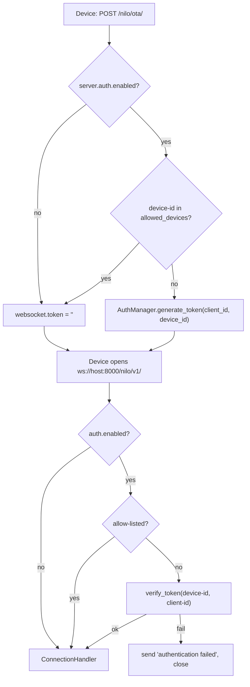
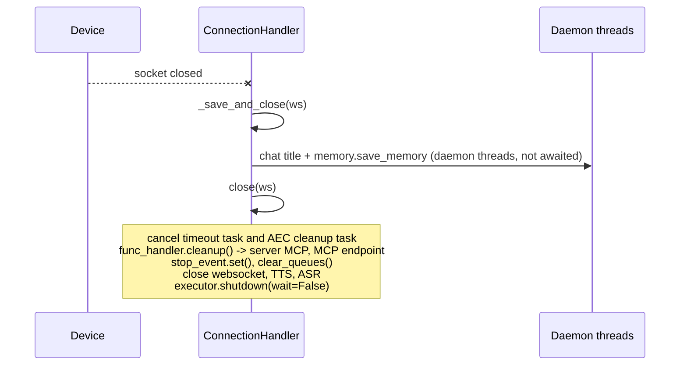
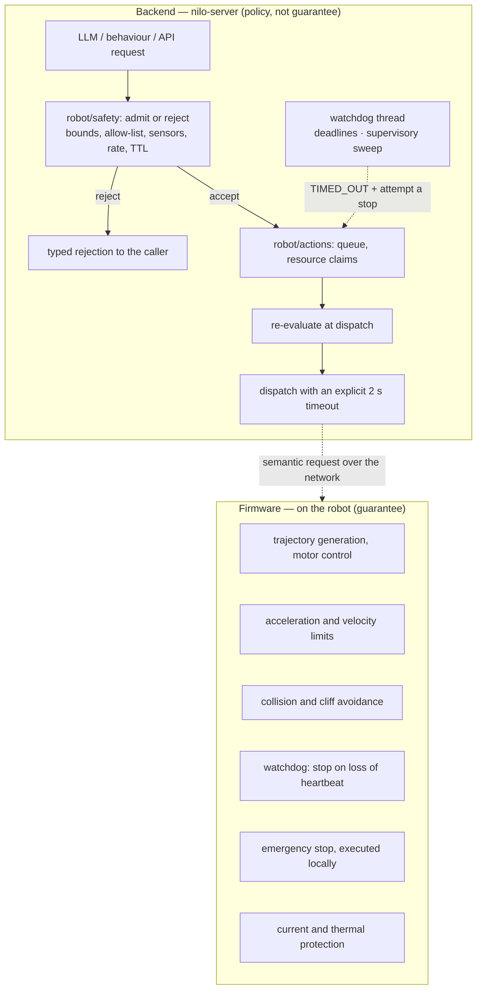

# Safety

Nilo is a backend for robots that move. This page separates what the code does **today**
from what the design **intends to do later**, because confusing the two is itself a safety
problem.

Read the split literally:

* [Implemented today](#implemented-today) — behaviour you can find in `main/nilo-server`
  right now. It is all *session* safety: who may connect and on which paths, which secrets
  are usable, which files may be downloaded, and how long anything is allowed to take.
  There is no actuation in this code path, so none of it is motion safety.
* [Motion safety](#motion-safety) — the action and safety layers, which **now exist**:
  `robot/actions/` and `robot/safety/` hold the lifecycle, the resource ledger, the
  deterministic policy, the emergency-stop latch and the supervisory watchdog (Phase 3). It
  is a *policy filter*. It rejects and supervises; it does not guarantee.
* [The firmware contract](#the-firmware-contract) — what the robot must implement itself,
  independently, and what each of those protections does when this process dies. Read it
  before connecting a machine that can hurt someone. **Backend safety is a second layer
  only.**

The design rule that all of it serves, stated once:

> **The backend is the weaker of two safety layers.** It rejects and supervises; it never
> guarantees. Every guarantee — collision avoidance, cliff detection, acceleration limits,
> the dead-man watchdog, emergency stop — belongs in firmware, because the Python process
> can be killed, stalled, or disconnected at any instant. The reasons are specific and
> documented in [Why the backend cannot guarantee real time](#why-the-backend-cannot-guarantee-real-time).

Nothing that follows softens that. The backend layer being implemented makes it a *better*
first filter; it does not make it a second guarantee.

---

# Implemented today

## Device authentication

Authentication is **off by default** (`server.auth.enabled: false`, `config.yaml`). When
enabled, `core/websocket_server.py:WebSocketServer._handle_auth` runs before a
`ConnectionHandler` is constructed, and a failure sends the text `authentication failed`
and closes the socket.

Two ways to pass the gate:

| Path | Condition | Code |
|---|---|---|
| Allow-list | `device-id` is in `server.auth.allowed_devices` **and that list is non-empty** | `core/websocket_server.py:WebSocketServer._handle_auth` |
| Token | `Authorization: Bearer <token>` verifies against the connection's `device-id` and `client-id` | `core/auth.py:AuthManager.verify_token` |

The token is issued by the OTA endpoint and is a detached HMAC, not a bearer blob carrying
identity:

```
token = urlsafe_b64( HMAC-SHA256(server.auth_key, "{client_id}|{device_id}|{ts}") ) + "." + ts
```

* `client_id` and `device_id` are never inside the token — they arrive as separate headers
  and are re-signed at verification time (`core/auth.py:AuthManager._sign`).
* Comparison uses `hmac.compare_digest`, so verification is constant time.
* Expiry is `server.auth.expire_seconds`, checked against the `ts` suffix. The key is not
  present in the shipped `config.yaml`, and `AuthManager.__init__` falls back to **30 days**
  for a missing, zero, or negative value.

When the `device-id` header is missing, `_handle_connection` falls back to the URL query
string: `device-id`, and alongside it `client-id` and `authorization`, are copied into the
header map before the auth check. That fallback is all-or-nothing — with a `device-id`
header present, query parameters are never read. A connection with no `device-id` in either
place gets a one-line text notice and is closed.



### The signing key

One key signs everything: `server.auth_key`. `app.py:resolve_auth_key` resolves it once at
startup, in order:

1. `server.auth_key`, if set and not a placeholder,
2. `manager-api.secret`, if set and not a placeholder,
3. a fresh `uuid4().hex` for this process.

Case 3 is a working default, not a secure one: every token and every vision JWT becomes
invalid the moment the process restarts, and every replica of the server signs with a
different key. Set `server.auth_key` explicitly for any deployment with more than one
process or any expectation that tokens survive a restart. See
[configuration.md](configuration.md) and [deployment.md](deployment.md).

### What authentication does *not* cover

These are properties of the current code, not recommendations:

* **The OTA POST endpoint is unauthenticated and it mints tokens.** `OTAHandler.handle_post`
  requires only `device-id` and `client-id` headers and, when auth is enabled, returns a
  valid token for exactly that pair (`core/api/ota_handler.py:OTAHandler.handle_post`), on
  the WebSocket branch — the one taken whenever `server.mqtt_gateway` is unset, as it ships.
  Anyone who can reach the HTTP port can therefore obtain a WebSocket credential for a
  device id of their choosing. Do not expose the OTA port to an untrusted network.
* **An authenticated session is not an authorization to actuate.** Nothing in the current
  code distinguishes "this device may talk" from "this device may move". The action layer
  gates *what* may be commanded and under which conditions ([Motion safety](#motion-safety));
  it does not authorise a device, and per-robot actuation authorisation remains unbuilt.
* **CORS is fully open** on every HTTP handler: `Access-Control-Allow-Origin: *` with
  `Allow-Credentials: true` (`core/api/base_handler.py:BaseHandler._add_cors_headers`).
* **There is no session registry.** `ConnectionHandler` is a local variable in
  `_handle_connection`; nothing can enumerate connected devices or reach one out-of-band,
  so there is no server-side way to broadcast a stop.

## Placeholder detection

The shipped `config.yaml` contains fill-me-in values such as
`ws://<your-host-or-domain>:<port>/nilo/v1/`. `config/placeholders.py:is_placeholder`
treats any string containing `<your` — or the legacy marker `你` inherited from the
upstream config — as unset, so an unedited template is never used as a real secret or URL.

| Call site | Effect when the value is still a placeholder |
|---|---|
| `app.py:resolve_auth_key` | falls through to `manager-api.secret`, then to a random per-process key |
| `app.py` (`mcp_endpoint`) | the endpoint is skipped instead of dialled |
| `core/utils/util.py:get_vision_url` | the vision URL is generated from the local IP and `server.http_port` |
| `core/api/ota_handler.py:OTAHandler._get_websocket_url`, `core/http_server.py:SimpleHttpServer._get_websocket_url` | the advertised WebSocket URL is generated from the protocol registry |
| `core/utils/util.py:check_model_key` | returns a "configuration error" message that the provider logs at error level (e.g. `core/providers/llm/openai/openai.py`) |
| `config/manage_api_client.py` | a placeholder `manager-api.secret` is rejected |

## Vision endpoint authentication

`POST /mcp/vision/explain` is the one HTTP endpoint that runs a model on device-supplied
data, and it is authenticated (`core/api/vision_handler.py:VisionHandler.handle_post`):

1. `Authorization: Bearer <jwt>` is required; anything else is HTTP 401 with
   `{"success": false, ...}`.
2. The JWT is verified by `core/utils/auth.py:AuthToken.verify_token` — HS256 over
   `server.auth_key`, wrapping an AES-256-GCM-encrypted payload whose key is derived with
   PBKDF2-HMAC-SHA256 (100 000 iterations). The outer JWT carries nothing but the
   encrypted blob and no `exp` claim, so its signature is all that is checked there; the
   expiry sits inside the encrypted payload and is checked after decryption.
3. The `Device-Id` header must equal the `device_id` inside the token, so a token cannot be
   replayed for a different device.
4. Uploads are capped at 5 MB (`MAX_FILE_SIZE`) and must pass
   `core/utils/util.py:is_valid_image_file`.

Tokens are minted per session in `core/providers/tools/device_mcp/mcp_handler.py` when the
device advertises `features.mcp`, and expire after one hour
(`core/utils/auth.py:AuthToken.generate_token`). See [mcp.md](mcp.md).

**The test bypass is gone.** The inherited code returned "authenticated" unconditionally for
any request carrying `Client-Id: web_test_client`, trusting a client-supplied `Device-Id`.
`_verify_auth_token` now has exactly one path: `Bearer` prefix, then
`AuthToken.verify_token`. Two caveats that remain in the code: the PBKDF2 salt is a fixed
constant (`core/utils/auth.py:AuthToken._derive_key`), and `GET /mcp/vision/explain` is an
unauthenticated liveness page that prints the configured vision URL.

## OTA firmware download sandboxing

`GET {ota_path}download/{filename}` streams files from `data/bin`, and is registered once
per enabled protocol (`core/http_server.py:SimpleHttpServer._build_app`). Four checks run
in order in `core/api/ota_handler.py:OTAHandler.handle_download`:

| Check | Code | Failure |
|---|---|---|
| Strip any path component | `_safe_basename` (`os.path.basename`) | traversal segments are discarded |
| Whitelist the name | `re.match(r"^[A-Za-z0-9\.\-_]+\.bin$", fname)` | HTTP 400 |
| Confirm the resolved path stays inside the directory | `os.path.realpath(file_path).startswith(realpath(bin_dir) + os.sep)` | HTTP 403 |
| Confirm it is a regular file | `os.path.isfile` | HTTP 404 |

The `realpath` step is what makes this a sandbox rather than a string filter: a symlink
inside `data/bin` pointing outside it is rejected, not followed. Note that `bin_dir` is
`os.path.join(os.getcwd(), "data", "bin")`, so it follows the working directory the server
was started from — run `python app.py` from `main/nilo-server`, as
[deployment.md](deployment.md) describes.

The download route is **not** authenticated. Only `.bin` files you deliberately place in
`data/bin` are reachable, but they are reachable by anyone who can reach the port.

## Protocol route gating

Every protocol route comes from the protocol registry
(`robot/protocol/base.py:ProtocolRegistry`), so disabling a protocol removes its routes
rather than hiding them. There is one protocol, `nilo`: WebSocket `/nilo/v1/`, OTA
`/nilo/ota/` and `/nilo/ota/download/{filename}`. The vision endpoint is not protocol-scoped
and is registered once whatever the `protocols` block says. See [protocol.md](protocol.md).

| `protocols` config | WebSocket path that matches an enabled protocol | Path that matches a disabled protocol | Unknown path |
|---|---|---|---|
| `strict: true` (shipped default) | accepted | rejected, HTTP 404 | rejected, HTTP 404 |
| `strict: false` | accepted | rejected, HTTP 404 | accepted |

The decision is `ProtocolRegistry.ws_accepts`, called from
`core/websocket_server.py:WebSocketServer._http_response` during the handshake, before any
connection state is built. A plain HTTP request to the WebSocket port (no `Upgrade`) gets a
200 liveness line instead.

**Strict rejection is what makes a retired route actually gone.** `ProtocolRegistry.strict`
defaults to `true` (`config.yaml`, `protocols.strict`), so a path no enabled protocol claims
is refused with a 404 at the handshake rather than opening a session on an unrouted path —
a device aimed at an address this server does not serve fails immediately and visibly.
`tests/robot/test_protocol.py` and `tests/core/test_ws_path_gate.py` assert that retired and
unknown paths stay rejected. Setting `protocols.strict: false` restores the old permissive
behaviour, and is the only switch that widens this surface.

## Timeouts and resource bounds

Everything time-bounded in the session path, with the value that ships:

| Bound | Default | Where | What happens when it fires |
|---|---|---|---|
| `close_connection_no_voice_time` | 120 s | `core/handle/receiveAudioHandle.py:no_voice_close_connect` | speaks a closing line, then closes; reached only while audio frames are arriving |
| `close_connection_no_voice_time + 60` | 180 s | `core/connection.py:ConnectionHandler._check_timeout` | silent hard close; polls every 10 s |
| `tool_call_timeout` | 30 s | `core/connection.py`, `core/handle/intentHandler.py` | the pool thread blocks on `future.result(timeout=...)` for a tool coroutine scheduled on the session loop, then gives up on it |
| `tts_timeout` | 15 s | `core/providers/tts/base.py:TTSProviderBase` | the provider request for that utterance is abandoned; a non-positive or non-finite value raises at construction |
| Device MCP tool call | 30 s | `core/providers/tools/device_mcp/mcp_handler.py:call_mcp_tool` (`timeout: int = 30`) | `TimeoutError`, and the pending future is removed by `cleanup_call_result` |
| Server MCP initialisation | 10 s | `core/providers/tools/server_mcp/mcp_manager.py` | that MCP server's tools are skipped; the session continues |
| Server MCP shutdown | 20 s | `core/providers/tools/server_mcp/mcp_manager.py` | cleanup is abandoned |
| Per-connection worker pool | 5 threads | `core/connection.py` (`ThreadPoolExecutor(max_workers=5)`) | blocking work queues behind the five workers |

Three consequences worth stating plainly:

* **The idle timers assume a conversation.** Both are driven by `conn.last_activity_time`,
  refreshed by incoming voice, outgoing TTS packets, and `listen` messages. A device that
  is connected but silent is closed after roughly three minutes. `ping` also refreshes it,
  but only when `enable_websocket_ping` is true, and it ships `false`; protocol-level
  keepalive is off as well (`websockets.serve(..., ping_interval=None)`).
* **30 s is the device-call default and nothing overrides it.**
  `core/providers/tools/device_mcp/mcp_executor.py:DeviceMCPExecutor.execute` calls
  `call_mcp_tool` without a `timeout` argument. For a chat tool that is merely slow; for a
  motion acknowledgement it is two orders of magnitude too long, which is why the planned
  action layer passes an explicit short timeout on every dispatch.
* **The pool is per connection, so one device cannot starve another** — but within one
  connection, a tool that blocks pins one of five workers for up to `tool_call_timeout`.

## What happens on network failure today

When the WebSocket drops, the `async for` loop in
`core/connection.py:ConnectionHandler.handle_connection` exits and the `finally` block runs
`_save_and_close`:



Precise behaviour:

* **Memory is saved, asynchronously.** `_save_and_close` starts daemon threads for the chat
  title and `memory.save_memory`, then closes immediately without waiting for them. A save
  that outlives the process is lost.
* **Session tasks are cancelled and resources released.** `close()` cancels the timeout task
  and the AEC cache task, calls `func_handler.cleanup()`, sets `stop_event`, drains the TTS
  and report queues, closes the socket and the TTS/ASR providers, and shuts the thread pool
  down with `wait=False`. The whole body is wrapped in `try/except` because `close()` is
  reachable from several call sites and double teardown is normal.
* **In-flight device tool calls are not cancelled.** `UnifiedToolHandler.cleanup` closes the
  server-side MCP clients and the MCP endpoint client, but never touches
  `conn.mcp_client.call_results`. A pending device call resolves only through its own 30 s
  timeout, and no message is sent telling the device to abort what it is doing.
* **The device side is the firmware's job.** The server sends nothing on disconnect — it
  cannot; the socket is gone. Anything a robot must do when the link drops has to be
  implemented in firmware, on a local watchdog.

`client_abort` — set by an `abort` message (`core/handle/abortHandle.py:handleAbortMessage`)
— is a cooperative flag polled inside the LLM streaming loop. It stops speech, not motion,
and it only works while the session is alive.

## Rate limiting

**There is effectively none.** No rate limiter, throttle, connection cap or backoff guards
any endpoint: not the WebSocket handshake, not OTA POST (which mints tokens), not firmware
download, not the vision endpoint, and not tool calls. The single quota in the tree is a
per-device daily TTS-character counter (`core/utils/output_counter.py`, checked in
`core/handle/receiveAudioHandle.py`), and it is dormant in any standalone deployment:
`conn.max_output_size` stays 0 unless the deprecated remote config supplies
`device_max_output_size` (`core/connection.py`). It bounds characters spoken per day, not
request rate, so it is no substitute either way. Put Nilo behind a reverse proxy that
enforces limits if it is reachable from anywhere you do not control. See [deployment.md](deployment.md).

---

# Motion safety

Everything below **exists in the tree** as of Phase 3: `main/nilo-server/robot/actions/`
and `main/nilo-server/robot/safety/`. The reference for how to use it is
[robot-actions.md](robot-actions.md); this section is the safety argument.



## What the backend layer does

`robot/safety/policy.py` is a **deterministic** filter applied identically no matter who
asked — LLM, behaviour engine, management API. It is a pure function of its arguments: no
clock is read inside it, no counter is held, no global is consulted. The current instant,
how long a request has waited and how many motions were admitted recently all arrive in a
`SafetyContext`, which is what makes a decision replayable after an incident.

* **Bounded parameters.** Distance, angle, speed and duration are validated against
  configured limits. A request beyond a limit is `REJECTED` with a typed reason **and the
  number that failed**, not silently clamped to the maximum — silent clamping hides the bug
  that produced a 40-metre "move" until the day the ceiling is wrong.
* **Allow-lists, not deny-lists.** Only the tools a robot's discovered capability record
  actually publishes are dispatchable. A robot that has not finished discovery can do
  nothing, rather than everything.
* **Rate limits per action class**, so a looping behaviour or a confused model cannot emit
  motion commands faster than the device can retire them.
* **Sensor-state gating.** A drive request with a cliff asserted is rejected regardless of
  origin, as is one with the robot reporting itself off the ground, one whose sensor frame
  is older than the freshness budget, and one where the robot has never reported sensors at
  all. Forward motion additionally checks the bumper and the front distance reading;
  reversing away from an obstacle stays allowed, because refusing it would strand the robot
  against the thing it hit.
* **Action TTL.** A request that waited longer than the configured TTL between submission
  and dispatch is rejected rather than executed. A "come here" that sat twenty seconds
  behind a queue is not the same request any more.
* **Stop on disconnect, as an intent.** The executor cancels queued and running actions and
  attempts a stop when a session drops. This is best effort *by construction*: if the link
  is gone, the message cannot arrive, and the log says so rather than reporting success.
  The guarantee is the firmware watchdog.
* **No layer above may weaken it.** Personality and behaviour sit above safety and can only
  narrow what is requested. `robot/safety/` imports `robot/state/` and nothing else from the
  subsystem — it cannot reach the action machinery it judges, or behaviour and personality at
  all. `tests/robot/test_layering.py` parses the source and asserts it.

Limits live in their own frozen model, constructed per runtime, optionally loaded from a
small YAML file. **Not** in the server config dict: in manager-api mode the local config is
replaced wholesale by the API response and only the `server` and `manager-api` blocks
survive (`config/config_loader.py`), so a speed ceiling stored there would vanish in exactly
the deployment with the most robots in it.

## The firmware contract

**Backend safety is a second layer only. Do not pretend network safety is sufficient.**

The firmware must implement each of the following **independently**, with no dependency on
the backend being alive, connected, or unpaused. The third column is not hypothetical: it is
what actually happens the instant this Python process stops running.

| Firmware must implement | Why it cannot live in the backend | What happens when the Python process dies |
|---|---|---|
| **Cliff protection** | sensor-to-stop latency must be bounded, and a network round trip is not | The backend stops rejecting moves. Nothing else changes — the robot must already refuse to drive off an edge on its own sensors, mid-command. |
| **Motor watchdog** | it must fire *because* the backend went silent | No heartbeat arrives. The motors must stop on their own timer; the last command must not continue to completion. |
| **Current / thermal protection** where the hardware exposes it | the backend never speaks in amps or degrees, and cannot react in a control loop | No supervision from this side at all. There is no telemetry path to a dead process, and nothing here was ever fast enough anyway. |
| **Physical motion bounds** | the mechanical envelope is a property of the machine, not of a config file | The configured ceilings stop being applied. The mechanical stops and the firmware's own bounds are the only ones left. |
| **Acceleration constraints** | they must hold during a network stall, within a deterministic control loop | Unenforced from here at *any* time, alive or dead — the backend commands a destination, never a trajectory. |
| **Local emergency stop** | it must execute with no round trip | The latch in this process is gone, along with every queued action it was refusing. A physical or firmware stop must still work. |

So cliff avoidance, collision avoidance, acceleration limits, the watchdog and e-stop are
implemented **twice**, and the firmware copy fails safe on loss of heartbeat — not on a
Python cleanup callback that may never run.

### Why the backend cannot guarantee real time

Three properties of the current process, each verifiable in the tree today:

1. **The process can vanish mid-action.** `core/connection.py:ConnectionHandler.handle_restart`
   calls `os._exit(0)` from a daemon thread after spawning a replacement process — skipping
   every `finally` block, every cleanup handler, and any stop the backend intended to send.
   The path is gated on `read_config_from_api` and a secret compared with a plain `!=`, but
   the capability exists in the code.
2. **The event loop stalls for unbounded periods.** `core/utils/gc_manager.py` runs
   `gc.collect()` plus two full `gc.get_objects()` walks every 300 s by default. It hands
   that work to a thread (`loop.run_in_executor`), which does not save the loop: the walks
   hold the GIL for as long as they take. VAD inference runs on the loop itself
   (`conn.vad.is_vad` in `core/handle/receiveAudioHandle.py:handleAudioMessage`), as do
   several blocking provider calls.
3. **In-flight device calls cannot be cancelled.** A pending `call_mcp_tool` future is not
   rejected when the socket drops, and no abort message exists for a device-side tool call.
   The action layer marks such an action `TIMED_OUT` and attempts a stop; it cannot recall
   the command the device already accepted.

A stop that depends on any of those is not a stop. It is a hope.

Note that the backend watchdog runs on **its own thread** precisely because of point 2 —
and that this still does not make it authoritative. The GIL stalls that thread too, and a
killed process supervises nothing at all.

## Network failure behaviour

* **Device:** the firmware watchdog stops motion when the session heartbeat lapses. This is
  the only mechanism that actually stops a robot, and it must be tested by severing the
  link, not by mocking a clock. `tests/integration/test_actions_e2e.py` severs it.
* **Backend:** a dropped session means **world state unknown**. Cached pose, sensor readings
  and action status carry an explicit age; the server does not assume the robot finished,
  stopped, or stayed where it was. Every action for that robot is cancelled — an observable
  transition, not a silent drop — and a stop is attempted and logged honestly when it cannot
  be delivered. On reconnect, state is re-synchronised from the device rather than resumed
  from the cache.

## Motion command validation

Every semantic request is checked before it is queued, **and again before it is dispatched**,
because the world changes while an action waits:

* schema validation on typed models, with units in the parameter names (`distance_mm`,
  `angle_deg`, `speed_mmps`) — the device MCP type system carries only booleans, integers and
  strings, so a float parameter is a latent bug, and a test enumerates every spec field to
  keep one out;
* bounds checks against the configured limits and the current world state, producing a
  typed rejection rather than a clamped request;
* resource claims over `DRIVE / HEAD / LIFT / DISPLAY / AUDIO / CAMERA`, so two actions
  cannot drive the same hardware concurrently — the ledger maps a resource to its single
  owner, which *is* the mutual exclusion;
* an explicit, short per-dispatch timeout (2 s), never the inherited 30 s default;
* a lifecycle
  (`PENDING → STARTING → RUNNING → SUCCEEDED | FAILED | CANCELLED | TIMED_OUT | REJECTED`)
  in which illegal transitions **raise** rather than being ignored.

## Watchdogs

Two, at different levels and with different authority:

* **Firmware watchdog** — authoritative. Stops motion on loss of heartbeat. Fails safe.
* **Backend watchdog** — supervisory, and implemented in `robot/safety/watchdog.py`. It arms
  a deadline per action, marks an action that never reports completion `TIMED_OUT`, and
  attempts a stop; a 500 ms sweep additionally cancels running motion when the link drops,
  the heartbeat lapses, a cliff appears or sensor data goes stale. It runs on **its own
  thread**, never the session event loop, for the reasons above — a watchdog that shares a
  loop with a garbage-collection pause is not a watchdog.

## Emergency stop

Three rules, non-negotiable in the design and literal in the code:

1. **Stop is always accepted.** It is never gated on authentication state, queue state,
   capability negotiation, whether another action is running, or whether a sensor says
   motion would be unsafe. A robot that will not stop because a cliff sensor is asserted is
   exactly the wrong failure.
2. **Stop is never queued.** It bypasses the action queue entirely, cancelling whatever
   holds the drive; anything else makes its latency a function of queue depth.
3. **Stop is executed locally.** The device stops on its own authority. A backend-originated
   stop is a request to do sooner what the watchdog would do anyway.

`executor.emergency_stop(robot_id)` cancels every queued and running action and refuses new
ones until it is explicitly cleared. The latch is sticky — no timeout lifts it, because a
stop that expires on its own is a stop nobody decided to end.

## LLM restrictions

The language model is the least predictable source of action requests, so its surface is
the narrowest:

* **No raw actuator tools, ever.** No PWM, duty cycle, servo microseconds, wheel speed or
  voltage appears in any action spec or tool schema the model can see. The vocabulary is
  ten semantic actions; a test enumerates every spec field against a raw-actuator denylist.
* **The LLM cannot override a safety rejection.** The policy's answer does not depend on the
  source: `tests/robot/test_safety.py` parameterizes almost every rejection over all five
  `ActionSource` values, and `tests/robot/test_executor.py` asserts that the same over-limit
  request is refused identically whoever submits it. There is no path from an action request
  to a cleared emergency stop.
* **Namespacing.** Every robot tool is named `robot_*`. This matters because the tool
  namespace is flat and a collision only logs a warning before the later executor wins
  (`core/providers/tools/unified_tool_manager.py:ToolManager.get_all_tools`), with
  device-advertised tools iterated after server plugins.
* **A startup collision assertion.** At session start the bridge asserts that no
  device-advertised tool collides with a `robot_*` name and refuses loudly if one does. This
  is Phase 4, with the bridge. Silence here is dangerous:
  `plugins/__init__.py:_import_module_safe` downgrades any plugin import failure to a
  warning and continues, so a typo can disable a whole subsystem while the server still
  looks healthy.
* **A layering rule** prevents LLM-facing modules from importing motion primitives, and
  prevents safety from importing anything above it. `tests/robot/test_layering.py` parses
  every module under `robot/` and enforces the import table of
  [robot-architecture.md](robot-architecture.md) §7 mechanically.
* **Tool handlers never block on hardware.** They validate, clamp, enqueue and return; the
  model is told what was accepted, not what the hardware finished doing.

See [robot-actions.md](robot-actions.md) for the API, [testing.md](testing.md) for how these
are verified, and [robot-roadmap.md](robot-roadmap.md) for what lands next.
