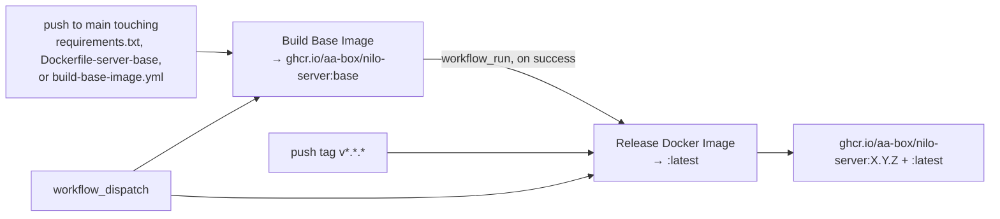

# Testing

Everything on this page is **Implemented** — it exists in the tree today and the commands were run
against it. The test suite covers the Python backend, `nilo-server`, only. There is no Java, mobile
or frontend code in the repository and therefore no test suite for any of those
([migration.md](migration.md) lists what was removed).

Current state: **all passing**, in `main/nilo-server/tests`, plus a lint pass, a
`robot/`-scoped type check, a Compose validation and a runtime smoke script. The simulator
added three files: two socket-free suites and the end-to-end one
([robot-simulator.md](robot-simulator.md) Sect. 13).

## Running the tests

Tests live in `main/nilo-server/tests` and pytest is configured in
`main/nilo-server/pyproject.toml` (`testpaths = ["tests"]`, `asyncio_mode = "auto"`,
`addopts = "-ra"`). All commands below assume `main/nilo-server` as the working directory unless
stated otherwise.

```bash
cd main/nilo-server
pip install -r requirements-dev.txt     # tooling + the small runtime slice the tests import
pytest -q                               # 113 passed, 6 skipped on this slice
```

| Command | Where | What it does |
|---|---|---|
| `pytest -q` | `main/nilo-server` | Runs the whole suite |
| `make test` | repository root | `cd main/nilo-server && python -m pytest -q`; override the interpreter with `make test PY=.venv/bin/python` |
| `pytest -q tests/robot` | `main/nilo-server` | One directory |
| `pytest -q tests/robot/test_protocol.py` | `main/nilo-server` | One file |
| `pytest -k "strict or retired"` | `main/nilo-server` | Select by test-name substring |
| `pytest -x -q` | `main/nilo-server` | Stop at the first failure |
| `pytest -q -rs` | `main/nilo-server` | Print the reason for every skip — useful on the dev-only slice |

`asyncio_mode = "auto"` means `async def test_*` functions run without an explicit
`@pytest.mark.asyncio`; `pytest-asyncio` is in `requirements-dev.txt`. Tests that drive async code
from a sync test call `asyncio.run(...)` directly (for example `tests/core/test_ws_path_gate.py`).

## What the suite covers

| File | Tests | Covers |
|---|---:|---|
| `tests/test_smoke.py` | 2 | pytest collects from the directory; `tmp_path` is writable |
| `tests/test_imports.py` | 36 | Walks `config`, `core`, `plugins`, `plugins_func`, `robot` with `pkgutil.walk_packages` and imports every module found — catches broken renames. A `ModuleNotFoundError` is treated as a missing optional dependency and skipped, not failed. The count is dynamic: one parameter per module discovered. Discovery stops at directories without an `__init__.py`, so the namespace packages `core/utils/`, `core/providers/`, `core/handle/`, `core/api/` and `plugins_func/functions/` are never walked |
| `tests/test_compose.py` | 2 | Parses `docker-compose.yml` with PyYAML (no Docker daemon): the only service is `nilo-server`, image `ghcr.io/aa-box/nilo-server:latest`, ports `8000`/`8003`, the four `NILO_*` variables are present, `./data` is mounted at `/opt/nilo-server/data`; and the file carries none of the retired upstream service names (the legacy server, `manager`, `xinnan`) |
| `tests/config/test_config_loader.py` | 7 | `config/config_loader.py:merge_configs` — override, add, recursive and deep-recursive merge, dict↔scalar replacement, and that the defaults dict is not mutated |
| `tests/config/test_nilo_config.py` | 6 | `apply_env_overrides` (the `NILO_SERVER_HOST`/`PORT`, `NILO_HTTP_PORT`, `NILO_LOG_LEVEL` mapping, ignoring unset/empty values, creating a missing section), `apply_deprecated_aliases` now being a no-op because `config_loader.DEPRECATED_KEYS` is empty, `custom_config_path()` honouring `NILO_CONFIG` and falling back to `data/.config.yaml`, and one end-to-end `load_config()` that proves a user `hello:` override and an env override land in the merged config alongside `protocols.nilo.enabled` and `protocols.strict` |
| `tests/core/test_http_routes.py` | 5 | `core/http_server.py:SimpleHttpServer._build_app` — the route table is `/nilo/ota/`, `/nilo/ota/download/{filename}` and `/mcp/vision/explain`, and no retired route is registered alongside them; disabling `protocols.nilo` or setting `read_config_from_api: true` leaves only `/mcp/vision/explain`; `_get_websocket_url` advertises `ws://host:port/nilo/v1/` unless `server.websocket` overrides it |
| `tests/core/test_ws_path_gate.py` | 4 | `core/websocket_server.py:WebSocketServer._http_response` — the pre-handshake gate accepts `/nilo/v1/` (including with a query string and a `keep-alive, Upgrade` connection header), returns `404` for retired and unknown paths, accepts an unknown path again once `protocols.strict` is false, and answers a plain HTTP probe with `200` and a body naming `nilo-server`. The server object is built with `__new__` to skip VAD/ASR model loading |
| `tests/core/utils/test_current_time.py` | 7 | `core/utils/current_time.py` under `freezegun` — `HH:MM` and ISO date formatting, the English `WEEKDAY_MAP` (all seven days), the four-tuple from `get_current_time_info()`, and the `cnlunar` lunar string |
| `tests/core/utils/test_dialogue.py` | 11 | `core/utils/dialogue.py` — `Message` defaults (`uniq_id`, `is_temporary`, `tool_call_id`), `Dialogue.put`/`get_llm_dialogue`, `update_system_message` replacing rather than appending, and `<memory></memory>` substitution in `get_llm_dialogue_with_memory` |
| `tests/core/utils/test_instance_creators.py` | 6 | The `create_instance` factories in `core/utils/{intent,llm,memory}.py` raise `ValueError` ("Unsupported…") for an unknown provider name and accept `*args`/`**kwargs` |
| `tests/core/utils/test_output_counter.py` | 7 | `core/utils/output_counter.py` — per-device character accumulation, isolation between devices, `check_device_output_limit` at/over/under the limit, empty and `None` device ids, and `reset_device_output` |
| `tests/core/utils/test_textUtils.py` | 11 | `core/utils/textUtils.py` — `is_emoji`, `is_punctuation_or_emoji`, `get_string_no_punctuation_or_emoji`, `check_emoji` |
| `tests/plugins/test_register.py` | 20 | `plugins/register.py` — `FunctionRegistry` is constructible (regression: it used to raise `NameError: setup_logging`), register/unregister/lookup, fallback to `all_function_registry`, the `@register_function` decorator populating `module_func_map`, and the numeric codes of every `Action` and `ToolType` member, which executors branch on |
| `tests/plugins_func/test_loadplugins.py` | 1 | Imports `plugins_func/functions/get_time.py` as `plugins_func.functions.get_time` and checks the attribute is there — the plugin subpackage still imports and its `@register_function` decorator (which registers `get_lunar`) runs at import time |
| `tests/robot/test_protocol.py` | 13 | `robot/protocol/` — the `nilo` route constants, `nilo` being the only entry in `ALL_PROTOCOLS`, `ProtocolSpec` rejecting unslashed paths, `registry_from_config` enabling `nilo` by default and raising `RuntimeError` once it is disabled, WebSocket path matching that ignores query strings and trailing slashes, `strict` defaulting to true so retired and unknown paths are rejected (and accepted again when it is false), a malformed `protocols:` block raising `ValueError`, and `RESERVED_MESSAGE_TYPES` covering the wire vocabulary |

| `tests/robot/test_state.py` | 16 | `robot/state/` — robot-id normalisation, frozen models, bounded fields, the age carried by every timestamped entry and `require_fresh` raising `StaleStateError` rather than returning stale data, telemetry merge and change detection, and the in-memory store including its read-modify-write `mutate` |
| `tests/robot/test_events.py` | 12 | `robot/events/` — fan-out to multiple subscribers, selection by type and by a tuple of types, sync and async handlers, unsubscribe, a handler that raises being isolated from the publisher and its peers, drop-oldest under a producer faster than its consumer, a slow subscriber not blocking a fast one, `publish` never waiting on a handler, and shutdown refusing further use |
| `tests/robot/test_registry.py` | 19 | `robot/devices/registry.py` — registration and its event, connected-only listing, a second session superseding the first, an idempotent re-register, a reconnect keeping telemetry and capabilities until discovery refreshes them, disconnect clearing live capabilities, double teardown and a teardown from a superseded session both being no-ops, telemetry merge with per-field events, liveness refresh, capability refresh with `ToolDiscovered`/`CapabilitiesRefreshed`, identity fields filled in from what the device reported, and 25 robots connecting, reporting and disconnecting concurrently |
| `tests/robot/test_mcp.py` | 21 | `robot/devices/mcp.py` against a fake device — the handshake, `tools/list` with and without pagination, a repeated cursor rejected instead of looping, a silent device timing out with no pending request left behind, malformed and duplicate definitions skipped and counted, protocol errors, tool calls and result unwrapping, device-reported tool errors, request ids starting above the inherited handshake ids, foreign responses ignored, and close rejecting in-flight requests |
| `tests/robot/test_session.py` | 23 | `robot/runtime.py` and `robot/session.py` end to end over fakes — attach, background discovery, discovery timeout, tool calls with their start/complete/fail events, a tool the robot never published being refused before it reaches the device, disconnect cleanup, reconnect rediscovery, a duplicate connection closing the superseded channel, runtime shutdown, and the session seam on a fake ConnectionHandler (attach, detach, no device id, a hostile connection object, a device without MCP, and the short explicit call timeout) |
| `tests/robot/test_layering.py` | 2 | `robot/` imports in a subprocess with a clean working directory and no `NILO_CONFIG`, and importing it pulls in no `core`, `config` or `plugins` module — the lazy-import rule of [robot-architecture.md](robot-architecture.md) Sect. 7 |
| `tests/robot/test_simulator.py` | 107 | `robot/simulator/` without a socket, on a hand-driven clock: the manual and accelerated clocks, ray-cast distance sensors, cliff regions, walls blocking a path, field-of-view visibility, the dock, a move that takes exactly its duration rather than teleporting, turns, cancellation, supersede, obstacle and cliff and motor and flat-battery outcomes, battery drain and charging, seeded sensor noise, the PNG the camera writes, the fixture camera, every published tool schema against the no-float and no-raw-actuator rules, every tool handler, the scenario runner's once-and-in-order guarantee, scenario files, and a scenario that replays byte-identically twice |
| `tests/robot/test_telemetry.py` | 24 | `robot/telemetry.py` — which notification methods are claimed, millimetres and degrees and millivolts converted to the world model's units, readings filtered to numbers, an unknown activity recorded as idle, a composite frame filling every slice, four shapes of malformed field falling back instead of raising, `MotionCompleted` / `MotionFailed` and a motion notification with no action id producing no event, ingestion into a runtime with its events, an unregistered robot, and the session seam claiming only telemetry and never raising on a hostile payload |
| `tests/integration/test_simulator_e2e.py` | 17 | The simulator against a server started in-process over a real socket: registration, two robots being two entries, capability discovery (15 tools, dotted names sanitized, raw names preserved) including across several `tools/list` pages, telemetry landing in the world state, a tool call round trip, a camera frame the server's own image sniffer accepts, an unpublished tool refused before it reaches the device, a move reporting `moving` then `MotionCompleted`, cancellation, an obstacle and a cliff appearing mid-move, an injected tool timeout and tool error and motor failure, an abrupt disconnect clearing the entry, and a reconnect that rediscovers. See [robot-simulator.md](robot-simulator.md) |

The action vocabulary, behaviour engine, personality, robot memory and safety policy described
in [robot-architecture.md](robot-architecture.md) and [robot-roadmap.md](robot-roadmap.md) are
**Planned** — there is no code and no test for them. The simulator is not: see
[robot-simulator.md](robot-simulator.md).
What the robot tests do cover is described in [robot-domain.md](robot-domain.md).

## Dependency slices

The suite is deliberately runnable against `requirements-dev.txt` alone, so a contributor working
on config, protocol or utility code never has to install `torch`, `funasr` or `modelscope`.

| Slice | Install | Result |
|---|---|---|
| Dev only | `pip install -r requirements-dev.txt` | 113 passed + 6 skipped — the tests needing the full runtime skip themselves |
| Full | `pip install -r requirements.txt -r requirements-dev.txt` | 126 passed |

`requirements-dev.txt` pins the tooling (`pytest`, `pytest-asyncio`, `freezegun`, `ruff`, `mypy`,
and `types-PyYAML` because `mypy` is strict over `robot/` and the scenario loader reads YAML)
plus the minimal runtime slice the tests import: `PyYAML`, `httpx`, `cnlunar`, `pydantic`,
`loguru`.

Three files guard themselves with `pytest.importorskip` at module level. When the import is
missing, the whole module is reported as one skip and contributes no collected tests:

| File | Guarded on |
|---|---|
| `tests/core/test_http_routes.py` | `aiohttp`, `opuslib_next`, `numpy`, `pydub` |
| `tests/core/test_ws_path_gate.py` | `websockets`, `opuslib_next`, `numpy` |
| `tests/plugins_func/test_loadplugins.py` | `opuslib_next`, `numpy` |
| `tests/integration/conftest.py` | `websockets`, `opuslib_next`, `numpy` — the guard sits in the conftest, so the whole directory skips as one |

`robot/simulator/` imports `websockets` lazily, inside the session, so
`tests/robot/test_simulator.py` runs on the dev slice even though the simulator cannot connect
there.

`tests/test_imports.py` skips at a finer grain: each parametrised module that raises
`ModuleNotFoundError` is skipped individually with the missing dependency named, so a module that
needs a package outside the dev slice (`core.websocket_server` without `websockets`, for example)
does not fail the run.

## `tests/conftest.py` and `NILO_CONFIG`

`main/nilo-server/tests/conftest.py` runs before any test imports project code and does exactly
two things:

1. Inserts the `main/nilo-server` directory at the front of `sys.path`, so the implicit top-level
   imports the inherited code uses (`from core.utils.textUtils import ...`) resolve regardless of
   where pytest was started.
2. `os.environ.setdefault("NILO_CONFIG", <tests/fixtures/test_config.yaml>)`.

`tests/fixtures/test_config.yaml` is a committed file containing `{}` — an empty override. This
matters because several modules call `setup_logging()` at import time, which loads the
configuration; without the fixture the suite would read (and depend on) the developer's own
`data/.config.yaml`. Because it is `setdefault`, an explicit `NILO_CONFIG` in your environment
still wins. Individual tests that need a different file set it with
`monkeypatch.setenv("NILO_CONFIG", ...)` and clear the config cache entry first — see
`tests/config/test_nilo_config.py:test_load_config_applies_alias_and_env`.

`NILO_CONFIG` is one of the five environment variables the server understands; the rest are
described in [configuration.md](configuration.md).

## Lint and type check

```bash
cd main/nilo-server
ruff check .     # All checks passed!
mypy             # Success: no issues found in 4 source files
```

From the repository root: `make lint` and `make typecheck` run the same two commands, and
`make check-docs` runs the docs/branding validator that CI's `lint` job runs as its last step.

Both tools are configured in files separate from the vendored `pyproject.toml`, so upstream syncs
do not conflict with them ([upstream.md](upstream.md)):

| Tool | Config | Scope |
|---|---|---|
| Ruff | `main/nilo-server/.ruff.toml` | Whole server, `py312`, line length 120, excluding `data`, `tmp`, `models`, `libs`, `.venv`. The rule set is deliberately bug-only (`E9`, `F63`, `F7`, `F82`, `F811`, `PLE`, `B002`, `B011`, `B018`) so it passes on ~30k lines of inherited Python and can gate CI today |
| mypy | `main/nilo-server/mypy.ini` | `files = robot` — strict (`disallow_untyped_defs`, `disallow_any_generics`, `warn_return_any`, …) for Nilo-owned code only. `core.*`, `config.*`, `plugins.*` and `plugins_func.*` are `ignore_errors` + `follow_imports = skip`, because the inherited tree is untyped |

Bare `mypy` with no arguments is correct — the `files` key in `mypy.ini` supplies the target. A
stricter `robot/.ruff.toml` for new code is planned with the first non-protocol robot code
([robot-roadmap.md](robot-roadmap.md)); it does not exist yet.

## Runtime smoke check

`scripts/smoke_check.py` (repository root) is not part of the pytest suite: it exercises a
**running** server over the network, using only the standard library plus `websockets`.

```bash
python scripts/smoke_check.py --host 127.0.0.1 --ws-port 8000 --http-port 8003
```

or, from the repository root, `make smoke` (which reads `HOST`, `WS_PORT` and `HTTP_PORT` from the
environment and defaults to the same values).

For the one protocol — `nilo` (`/nilo/v1/`, `/nilo/ota/`) — it performs three checks with
`device-id: 00:11:22:33:44:55` and `client-id: smoke-check` headers:

1. `GET {ota_path}` returns `200` with a `ws://` or `wss://` URL in the body.
2. `POST {ota_path}` with `{}` returns `200` and a body containing `"websocket"`.
3. A WebSocket connection to `{ws_path}` completes the handshake, sends a `hello` frame
   (Opus, 16 kHz, mono, 60 ms) and gets a `hello` frame back.

It then probes the two retired routes (named in [migration.md](migration.md)) and *fails* unless
they are gone: the retired OTA route must answer `404` and the retired WebSocket handshake must be
rejected. Finally it probes `/not-a-protocol/` and reports what happened, which tells you whether
`protocols.strict` is still on.

| Flag | Default | Meaning |
|---|---|---|
| `--host` | `127.0.0.1` | Server host |
| `--ws-port` | `8000` | WebSocket port (`server.port`) |
| `--http-port` | `8003` | HTTP port (`server.http_port`) |
| `--expect-disabled` | empty | Comma-separated protocol names (only `nilo` exists today) that **must** be rejected. For a listed protocol, the check passes only when the OTA route returns `404` and the WebSocket handshake is rejected |

Output against a stock server (the retired paths are elided here; the script prints them in full):

```
[PASS] nilo            GET /nilo/ota/ -> 200; POST -> 200; ws /nilo/v1/ -> ok
[PASS] retired <ws path>       ws -> rejected (404)
[PASS] retired <ota path>      GET -> 404
[info] unknown ws path -> rejected (404) (rejected unless protocols.strict is false)
```

Exit code is `0` when every route matched expectations — the `nilo` routes answering and the retired
routes gone — and `1` otherwise, so it works as a deployment gate. Route semantics are described in
[protocol.md](protocol.md).

## Docker validation

```bash
make compose-validate     # cd main/nilo-server && docker compose -f docker-compose.yml config --quiet
                          # -> docker-compose.yml OK
make docker-build         # builds ghcr.io/aa-box/nilo-server:base then :latest from the root context
```

`make compose-validate` only parses and resolves the Compose file; it needs the `docker` CLI but
never starts a container. `make docker-build` builds `Dockerfile-server-base` (python:3.12-slim +
`libopus0` + `ffmpeg` + `requirements.txt`) and then `Dockerfile-server` (application code on top),
and does need a working Docker daemon. `tests/test_compose.py` asserts the *content* of the Compose
file with PyYAML and needs neither. Deployment itself is covered in
[deployment.md](deployment.md).

## Continuous integration

Three workflows live in `.github/workflows/`.

### `test.yml` — "Tests"

Triggers on pushes to `main` and `develop` and on every pull request, with in-progress runs for the
same ref cancelled. Every job runs on `ubuntu-latest` with `working-directory: main/nilo-server`;
the three Python jobs pin Python 3.12 (the `docker` job needs no interpreter).

| Job | Installs | Runs |
|---|---|---|
| `lint` — "Lint and type-check" | `requirements-dev.txt` | `ruff check .`, `mypy`, then `python scripts/check_docs.py` (that step runs from the repository root) |
| `test` — "Python 3.12, full dependencies" | `requirements.txt` then `requirements-dev.txt` (pip cache keyed on `requirements*.txt`) | `pytest -q` |
| `test-dev-slice` — "Python 3.12, dev dependencies only" | `requirements-dev.txt` (pip cache keyed on `requirements-dev.txt`) | `pytest -q` — the heavy tests skip themselves |
| `docker` — "Docker Compose validates" | nothing | `docker compose -f docker-compose.yml config --quiet` |

The `test` / `test-dev-slice` pair is what keeps the `importorskip` guards honest: a test that
quietly grew a `torch` dependency fails the dev-slice job.

### `build-base-image.yml` and `docker-image.yml`



* **`build-base-image.yml` ("Build Base Image")** — pushes to `main` that touch
  `main/nilo-server/requirements.txt`, `Dockerfile-server-base` or the workflow itself, plus manual
  `workflow_dispatch`. Builds `Dockerfile-server-base` for `linux/amd64,linux/arm64` and pushes
  `ghcr.io/aa-box/nilo-server:base`, using a GitHub Actions cache scoped to `server-base`.
* **`docker-image.yml` ("Release Docker Image")** — `v*.*.*` tags, `workflow_dispatch`, or a
  `workflow_run` completion of "Build Base Image" (the job is skipped unless that run succeeded).
  Builds `Dockerfile-server` with `BASE_IMAGE=ghcr.io/aa-box/nilo-server:base` for both
  architectures. On a version tag it pushes `:X.Y.Z` and `:latest`; otherwise `:latest` only.

Neither image workflow runs any test.

### CI runs, and what it catches that a local run does not

GitHub Actions is enabled and the Tests workflow runs on every pull request. Run
`ruff check .`, `mypy`, `pytest -q` and `make compose-validate` locally first anyway, but note
two things a local run will not reproduce:

* **The `lint` job installs `requirements-dev.txt` only.** A development machine usually has the
  full requirements, so `mypy` there resolves imports that CI cannot. `robot/simulator/` imports
  `websockets` from the full requirements, which is why `mypy.ini` carries an
  `ignore_missing_imports` entry for it. Reproduce the lint environment with a second virtualenv
  that has the dev slice alone.
* **CI runners are slower and more contended.** A test that waits on an event has to subscribe
  before the thing that emits it starts, not merely before the assertion — on an accelerated
  simulator clock, a scenario step two simulated seconds in fires while the handshake is still
  finishing. `tests/integration/test_simulator_e2e.py:recording` exists for exactly that.

## What is not tested

* **No end-to-end audio test.** Nothing in the suite starts a server, streams Opus or exercises a
  VAD → ASR → LLM → TTS turn. `scripts/smoke_check.py` gets as far as the `hello` exchange.
  See [audio.md](audio.md).
* **No provider integration tests.** No test imports a vendor adapter under `core/providers/`:
  `tests/test_imports.py` never reaches them (no `__init__.py`, so `walk_packages` skips the
  directory), and only the provider base classes come along transitively when `core.connection`
  is imported. Nothing calls a vendor API. See [architecture.md](architecture.md).
* **The device MCP transport is now exercised**, by `tests/integration/test_simulator_e2e.py`:
  the handshake, paged `tools/list` and `tools/call` all run over a real WebSocket. What is
  still untested is *server-side* MCP (remote endpoints, server MCP servers) and tool
  registration beyond the registry level (`tests/plugins/test_register.py`). See
  [mcp.md](mcp.md).
* **`performance_tester/` is not a test suite.** `main/nilo-server/performance_tester/` holds six
  standalone benchmark scripts — `performance_tester_asr.py`, `_stream_asr.py`, `_llm.py`,
  `_tts.py`, `_stream_tts.py`, `_vllm.py`. They load real credentials through the normal config
  path, must be run with `main/nilo-server` as the working directory, and are excluded from pytest
  by `testpaths = ["tests"]`. They measure providers; they assert nothing.

## Adding a test

* Put it under the directory mirroring the module you are testing (`tests/robot/…` for `robot/…`).
  Every test directory has an `__init__.py`; add one for a new directory. A test that opens a
  socket or starts a server goes under `tests/integration/`, not `tests/robot/` — that package
  is socket-free by contract, which is what keeps it fast.
* Do not add a `conftest.py` to set `sys.path` or `NILO_CONFIG` — the root `tests/conftest.py`
  already does both.
* If the test needs anything outside `requirements-dev.txt` (`aiohttp`, `numpy`, `opuslib_next`,
  `pydub`, `websockets`, `torch`, …), open the module with
  `pytest.importorskip("<package>")` and a `# noqa: E402` on the imports that follow, so the
  dev-slice CI job stays green.
* If the test touches the config cache, delete the entry before and after:
  `cache_manager.delete(CacheType.CONFIG, "main_config")`.
* New code under `robot/` must be fully annotated — `mypy` is strict there.

Conventions for the code itself are in [development.md](development.md).
